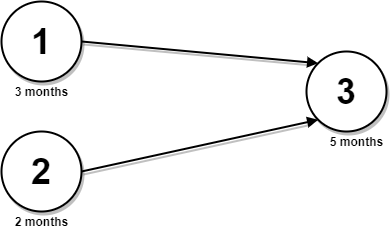
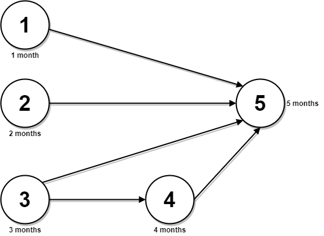

2050. Parallel Courses III

You are given an integer `n`, which indicates that there are `n` courses labeled from `1` to `n`. You are also given a 2D integer array `relations` where `relations[j] = [prevCoursej, nextCoursej]` denotes that course `prevCoursej` has to be completed **before** course `nextCoursej` (prerequisite relationship). Furthermore, you are given a **0-indexed** integer array `time` where `time[i]` denotes how many **months** it takes to complete the `(i+1)`th course.

You must find the **minimum** number of months needed to complete all the courses following these rules:

* You may start taking a course at **any time** if the prerequisites are met.
* **Any number of courses** can be taken at the same time.

Return the **minimum** number of months needed to complete all the courses.

**Note:** The test cases are generated such that it is possible to complete every course (i.e., the graph is a directed acyclic graph).

 

**Example 1:**


```
Input: n = 3, relations = [[1,3],[2,3]], time = [3,2,5]
Output: 8
Explanation: The figure above represents the given graph and the time required to complete each course. 
We start course 1 and course 2 simultaneously at month 0.
Course 1 takes 3 months and course 2 takes 2 months to complete respectively.
Thus, the earliest time we can start course 3 is at month 3, and the total time required is 3 + 5 = 8 months.
```

**Example 2:**


```
Input: n = 5, relations = [[1,5],[2,5],[3,5],[3,4],[4,5]], time = [1,2,3,4,5]
Output: 12
Explanation: The figure above represents the given graph and the time required to complete each course.
You can start courses 1, 2, and 3 at month 0.
You can complete them after 1, 2, and 3 months respectively.
Course 4 can be taken only after course 3 is completed, i.e., after 3 months. It is completed after 3 + 4 = 7 months.
Course 5 can be taken only after courses 1, 2, 3, and 4 have been completed, i.e., after max(1,2,3,7) = 7 months.
Thus, the minimum time needed to complete all the courses is 7 + 5 = 12 months.
```

**Constraints:**

* `1 <= n <= 5 * 10^4`
* `0 <= relations.length <= min(n * (n - 1) / 2, 5 * 104)`
* `relations[j].length == 2`
* `1 <= prevCoursej, nextCoursej <= n`
* `prevCoursej != nextCoursej`
* All the pairs `[prevCoursej, nextCoursej]` are **unique**.
* `time.length == n`
* `1 <= time[i] <= 10^4`
* The given graph is a directed acyclic graph.

# Submissions
---
**Solution 1: (BFS, topological sort)**
```
Runtime: 2060 ms
Memory Usage: 43.4 MB
```
```python
class Solution:
    def minimumTime(self, n: int, relations: List[List[int]], time: List[int]) -> int:
        graph = defaultdict(list)
        inDegree = [0] * n
        for prv, nxt in relations:
            prv, nxt = prv - 1, nxt - 1  # convert into zero-based index
            graph[prv].append(nxt)
            inDegree[nxt] += 1

        q = deque([])
        dist = [0] * n
        for u in range(n):
            if inDegree[u] == 0:
                q.append(u)
                dist[u] = time[u]

        while q:
            u = q.popleft()
            for v in graph[u]:
                dist[v] = max(dist[u] + time[v], dist[v])  # Update `dist[v]` using the maximum dist of the predecessor nodes
                inDegree[v] -= 1
                if inDegree[v] == 0:
                    q.append(v)
        return max(dist)
```

**Solution 2: (BFS, topological sort)**
```
Runtime: 352 ms
Memory Usage: 131.4 MB
```
```c++
class Solution {
public:
    int minimumTime(int n, vector<vector<int>>& relations, vector<int>& time) {
        vector<int> inDegree(n);
        vector<vector<int>> graph(n, vector<int>());
        for (auto& edge : relations) {
            int prev = edge[0] - 1, next = edge[1] - 1;
            graph[prev].push_back(next);
            inDegree[next]++;
        }
        
        vector<int> dist(n);
        queue<int> q;
        for (int u = 0; u < n; ++u) {
            if (inDegree[u] == 0) {
                q.push(u);
                dist[u] = time[u];
            }
        }
        while (!q.empty()) {
            int u = q.front(); q.pop();
            for (int v : graph[u]) {
                dist[v] = max(dist[v], dist[u] + time[v]); // Update `dist[v]` using the maximum dist of the predecessor nodes
                if (--inDegree[v] == 0) 
                    q.push(v);
            }
        }
        return *max_element(dist.begin(), dist.end());
    }
};
```
