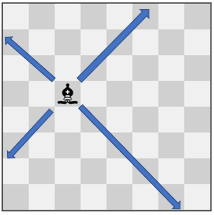

2056. Number of Valid Move Combinations On Chessboard

There is an `8 x 8` chessboard containing `n` pieces (rooks, queens, or bishops). You are given a string array `pieces` of length `n`, where `pieces[i]` describes the type (rook, queen, or bishop) of the `i`th piece. In addition, you are given a 2D integer array positions also of length `n`, where `positions[i] = [ri, ci]` indicates that the `i`th piece is currently at the **1-based** coordinate `(ri, ci)` on the chessboard.

Each piece on the chessboard can be moved **at most once** according to the type of piece. In a **move**, you may choose the **direction** the piece moves and the **number of squares** it travels without moving the piece outside the chessboard. The pieces are allowed to move as follows:

* A rook can move **horizontally or vertically** from `(r, c)` to the direction of `(r+1, c)`, `(r-1, c)`, `(r, c+1)`, or `(r, c-1)`.
* A queen can move **horizontally**, **vertically**, or **diagonally** from (r, c) to the direction of `(r+1, c)`, `(r-1, c)`, `(r, c+1)`, `(r, c-1`), `(r+1, c+1)`, `(r+1, c-1)`, `(r-1, c+1)`, `(r-1, c-1)`.
* A bishop can move **diagonally** from `(r, c)` to the direction of `(r+1, c+1)`, `(r+1, c-1)`, `(r-1, c+1)`, `(r-1, c-1)`.

**A move combination** consists of all the **moves** performed on all the given pieces. Every second, each piece will instantaneously travel **one square** towards their destination if they are not already at it. All pieces start traveling at the `0`th second. A move combination is **invalid** if, at a given time, **two or more** pieces occupy the same square.

Return the number of **valid** move combinations​​​​​​.

**Notes:**

* **No two pieces** will start in the **same** square.
* It is possible that a piece is not moved in a move combination.
* If two pieces are **directly adjacent** to each other, it is valid for them to **move past each other** and swap positions in one second.
 

**Example 1:**


```
Input: pieces = ["rook"], positions = [[1,1]]
Output: 15
Explanation: The image above shows the possible squares the piece can move to.
```

**Example 2:**


```
Input: pieces = ["queen"], positions = [[1,1]]
Output: 22
Explanation: The image above shows the possible squares the piece can move to.
```

**Example 3:**


```
Input: pieces = ["bishop"], positions = [[4,3]]
Output: 12
Explanation: The image above shows the possible squares the piece can move to.
```

**Example 4:**


```
Input: pieces = ["rook","rook"], positions = [[1,1],[8,8]]
Output: 223
Explanation: There are 15 moves for each rook which results in 15 * 15 = 225 move combinations.
However, there are two invalid move combinations:
- Move both rooks to (8, 1), where they collide.
- Move both rooks to (1, 8), where they collide.
Thus there are 225 - 2 = 223 valid move combinations.
Note that there are two valid move combinations that would result in one rook at (1, 8) and the other at (8, 1).
Even though the board state is the same, these two move combinations are considered different since the moves themselves are different.
```

**Example 5:**


```
Input: pieces = ["queen","bishop"], positions = [[5,7],[3,4]]
Output: 281
Explanation: There are 12 * 24 = 288 move combinations.
However, there are several invalid move combinations:
- If the queen stops at (6, 7), it blocks the bishop from moving to (6, 7) or (7, 8).
- If the queen stops at (5, 6), it blocks the bishop from moving to (5, 6), (6, 7), or (7, 8).
- If the bishop stops at (5, 2), it blocks the queen from moving to (5, 2) or (5, 1).
Of the 288 move combinations, 281 are valid.
```

**Constraints:**

* `n == pieces.length`
* `n == positions.length`
* `1 <= n <= 4`
* pieces only contains the strings `"rook"`, `"queen"`, and `"bishop"`.
* There will be at most one queen on the chessboard.
* `1 <= xi, yi <= 8`
* Each `positions[i]` is distinct.

# Submissions
---
**Solution 1: (DFS, Brute Force)**
```
Runtime: 6083 ms
Memory Usage: 38.1 MB
```
```python
class Solution:
    def countCombinations(self, pieces: List[str], positions: List[List[int]]) -> int:
        positions = [tuple(x) for x in positions]
        self.ans = set()

        def dfs(pos, dirs, stopped_mask):   
            if stopped_mask == 0: return
            self.ans.add(tuple(pos))
            for active in range(1<<len(dirs)):
                if stopped_mask & active != active: continue
                new_pos = list(pos)
                new_mask = stopped_mask ^ active

                for i in range(len(new_pos)):
                    new_pos[i] = (new_pos[i][0] + dirs[i][0]*((new_mask>>i)&1), new_pos[i][1] + dirs[i][1]*((new_mask>>i)&1))

                if len(Counter(new_pos)) < len(dirs): continue
                all_c = list(chain(*new_pos))
                if min(all_c) <= 0 or max(all_c) > 8: continue
                dfs(new_pos, dirs, new_mask)

        poss = {}
        poss["rook"] = ((1, 0), (-1, 0), (0, 1), (0, -1))
        poss["bishop"] = ((1, 1), (1, -1), (-1, 1), (-1, -1))
        poss["queen"] = ((1, 0), (-1, 0), (0, 1), (0, -1), (1, 1), (1, -1), (-1, 1), (-1, -1))

        for dirs in product(*(poss[i] for i in pieces)):
            dfs(positions, dirs, (1<<len(pieces)) - 1)

        return len(self.ans)
```
