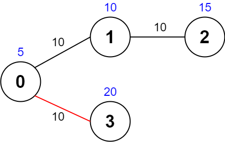
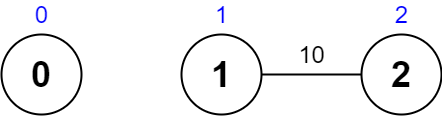

2065. Maximum Path Quality of a Graph

There is an **undirected** graph with `n` nodes numbered from `0` to `n - 1` (**inclusive**). You are given a **0-indexed** integer array `values` where `values[i]` is the value of the `i`th node. You are also given a **0-indexed** 2D integer array `edges`, where each `edges[j] = [uj, vj, timej]` indicates that there is an undirected edge between the nodes `uj` and `vj`, and it takes `timej` seconds to travel between the two nodes. Finally, you are given an integer `maxTime`.

A **valid path** in the graph is any path that starts at node `0`, ends at node `0`, and takes **at most** `maxTime` seconds to complete. You may visit the same node multiple times. The **quality** of a valid path is the **sum** of the values of the **unique nodes** visited in the path (each node's value is added **at most once** to the sum).

Return the **maximum** quality of a valid path.

**Note:** There are **at most four** edges connected to each node.

 

**Example 1:**


```
Input: values = [0,32,10,43], edges = [[0,1,10],[1,2,15],[0,3,10]], maxTime = 49
Output: 75
Explanation:
One possible path is 0 -> 1 -> 0 -> 3 -> 0. The total time taken is 10 + 10 + 10 + 10 = 40 <= 49.
The nodes visited are 0, 1, and 3, giving a maximal path quality of 0 + 32 + 43 = 75.
```

**Example 2:**


```
Input: values = [5,10,15,20], edges = [[0,1,10],[1,2,10],[0,3,10]], maxTime = 30
Output: 25
Explanation:
One possible path is 0 -> 3 -> 0. The total time taken is 10 + 10 = 20 <= 30.
The nodes visited are 0 and 3, giving a maximal path quality of 5 + 20 = 25.
```

**Example 3:**


```
Input: values = [1,2,3,4], edges = [[0,1,10],[1,2,11],[2,3,12],[1,3,13]], maxTime = 50
Output: 7
Explanation:
One possible path is 0 -> 1 -> 3 -> 1 -> 0. The total time taken is 10 + 13 + 13 + 10 = 46 <= 50.
The nodes visited are 0, 1, and 3, giving a maximal path quality of 1 + 2 + 4 = 7.
```

**Example 4:**


```
Input: values = [0,1,2], edges = [[1,2,10]], maxTime = 10
Output: 0
Explanation: 
The only path is 0. The total time taken is 0.
The only node visited is 0, giving a maximal path quality of 0.
```

**Constraints:**

* `n == values.length`
* `1 <= n <= 1000`
* `0 <= values[i] <= 10^8`
* `0 <= edges.length <= 2000`
* `edges[j].length == 3`
* `0 <= uj < vj <= n - 1`
* `10 <= timej, maxTime <= 100`
* All the pairs `[uj, vj]` are **unique**.
* There are **at most four** edges connected to each node.
* The graph may not be connected.

# Submissions
---
**Solution 1: (DFS)**
```
Runtime: 2292 ms
Memory Usage: 17.4 MB
```
```python
class Solution:
    def maximalPathQuality(self, values: List[int], edges: List[List[int]], maxTime: int) -> int:
        G = defaultdict(list)
        for x, y, w in edges:
            G[x].append((y, w))
            G[y].append((x, w))
            
        def dfs(node, visited, gain, cost):
            if node == 0: self.ans = max(self.ans, gain)
            for neib, w in G[node]:
                if w <= cost:
                    dfs(neib, visited | set([neib]), gain + (neib not in visited) * values[neib], cost - w)

        self.ans = 0
        dfs(0, set([0]), values[0], maxTime)
        return self.ans
```

**Solution 2: (DFS)**
```
Runtime: 176 ms
Memory Usage: 20.5 MB
```
```c++
class Solution {
public:
    int maximalPathQuality(vector<int>& values, vector<vector<int>>& edges, int maxTime) {
        int n = values.size();
        int res = values[0];
        vector<vector<pair<int,int>>> graph(n);
        for(int i=0;i<edges.size();i++)
        {
            graph[edges[i][0]].push_back({edges[i][1], edges[i][2]});
            graph[edges[i][1]].push_back({edges[i][0], edges[i][2]});
        }
        
        vector<int> visited(n, 0);
        dfs(graph, values, visited, res, 0, 0, 0, maxTime);
        return res;
    }
    
    void dfs(vector<vector<pair<int,int>>>& graph, vector<int>& values, vector<int>& visited, int& res, int node, int score, int time, int& maxTime)
    {
        if(time > maxTime)
            return;
        
        if(visited[node] == 0)
            score += values[node];
        
        visited[node]++;
		
      
        if(node == 0)
            res = max(res, score);
        
        for(auto it : graph[node])
        {
            int neigh = it.first;
            int newTime = time + it.second;
            dfs(graph, values, visited, res, neigh, score, newTime, maxTime);
        }
        
        visited[node]--;
    }
};
```
