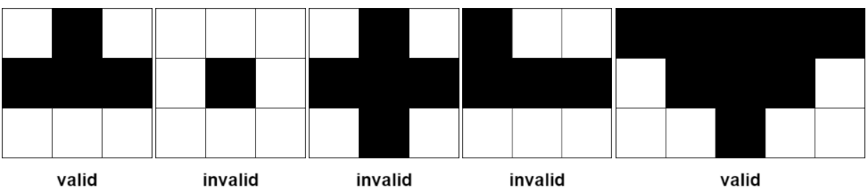
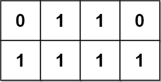
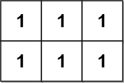
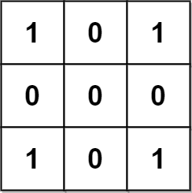
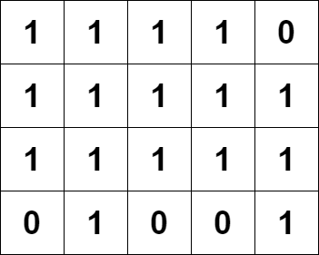

2088. Count Fertile Pyramids in a Land

A farmer has a **rectangular grid** of land with `m` rows and `n` columns that can be divided into unit cells. Each cell is either **fertile** (represented by a `1`) or **barren** (represented by a `0`). All cells outside the grid are considered barren.

A **pyramidal plot** of land can be defined as a set of cells with the following criteria:

1. The number of cells in the set has to be **greater than** `1` and all cells must be **fertile**.
1. The **apex** of a pyramid is the **topmost** cell of the pyramid. The **height** of a pyramid is the number of rows it covers. Let `(r, c)` be the apex of the pyramid, and its height be `h`. Then, the plot comprises of cells `(i, j)` where `r <= i <= r + h - 1` and `c - (i - r) <= j <= c + (i - r)`.

An **inverse pyramidal plot** of land can be defined as a set of cells with similar criteria:

1. The number of cells in the set has to be **greater than** `1` and all cells must be **fertile**.
1. THE **apex** of an inverse pyramid is the **bottommost** cell of the inverse pyramid. The **height** of an inverse pyramid is the number of rows it covers. Let `(r, c)` be the apex of the pyramid, and its height be `h`. Then, the plot comprises of cells `(i, j)` where `r - h + 1 <= i <= r` **and** `c - (r - i) <= j <= c + (r - i)`.

Some examples of valid and invalid pyramidal (and inverse pyramidal) plots are shown below. Black cells indicate fertile cells.


Given a **0-indexed** `m x n` binary matrix `grid` representing the farmland, return the **total number** of pyramidal and inverse pyramidal plots that can be found in `grid`.

 

**Example 1:**


```
Input: grid = [[0,1,1,0],[1,1,1,1]]
Output: 2
Explanation:
The 2 possible pyramidal plots are shown in blue and red respectively.
There are no inverse pyramidal plots in this grid. 
Hence total number of pyramidal and inverse pyramidal plots is 2 + 0 = 2.
```

**Example 2:**


```
Input: grid = [[1,1,1],[1,1,1]]
Output: 2
Explanation:
The pyramidal plot is shown in blue, and the inverse pyramidal plot is shown in red. 
Hence the total number of plots is 1 + 1 = 2.
```

**Example 3:**


```
Input: grid = [[1,0,1],[0,0,0],[1,0,1]]
Output: 0
Explanation:
There are no pyramidal or inverse pyramidal plots in the grid.
```

**Example 4:**


```
Input: grid = [[1,1,1,1,0],[1,1,1,1,1],[1,1,1,1,1],[0,1,0,0,1]]
Output: 13
Explanation:
There are 7 pyramidal plots, 3 of which are shown in the 2nd and 3rd figures.
There are 6 inverse pyramidal plots, 2 of which are shown in the last figure.
The total number of plots is 7 + 6 = 13.
```

Constraints:

* `m == grid.length`
* `n == grid[i].length`
* `1 <= m, n <= 1000`
* `1 <= m * n <= 10^5`
* `grid[i][j]` is either `0` or `1`.

# Submissions
---
**Solution 1: (DP To0-Down)**
```
Runtime: 2032 ms
Memory Usage: 115.4 MB
```
```python
class Solution:
    def countPyramids(self, grid: List[List[int]]) -> int:
        m, n, ans = len(grid), len(grid[0]), 0
        
        @lru_cache(None)
        def dp(i, j, dr):
            if grid[i][j] == 1 and 0 <= i + dr < m and j > 0 and j + 1 < n and grid[i+dr][j] == 1:
                return min(dp(i+dr, j-1, dr), dp(i+dr, j+1, dr)) + 1
            return grid[i][j]
        
        for i, j in product(range(m), range(n)):
            ans += max(0, dp(i, j, 1) - 1)
            ans += max(0, dp(i, j, -1) - 1)
        
        return ans
```

**Solution 2: (DP Bottom-Up)**
```
Runtime: 92 ms
Memory Usage: 39.8 MB
```
```c++
class Solution {
public:
    int count(vector<vector<int>> grid){
        int i, j, n = grid.size(), m = grid[0].size(), ans = 0;
        for(i = 1; i < n; i++){
            for(j = 1; j < m - 1; j++){
                if(grid[i][j] && grid[i - 1][j]){ // check if current cell can be a tip of pyramid or not.
                    grid[i][j] = min(grid[i - 1][j - 1], grid[i - 1][j + 1]) + 1; // if its a pyramid, find the height.
                    ans += grid[i][j] - 1;
					// pyramid of size n contributes n - 1 times to the answer.
                }
            }
        }
        return ans;
    }
    int countPyramids(vector<vector<int>>& grid) {
        int ans = count(grid); // this will count inverse pyramid.
        reverse(grid.begin(), grid.end());  
        ans += count(grid); // this will count simple pyramid.
        return ans;
    }
};
```
