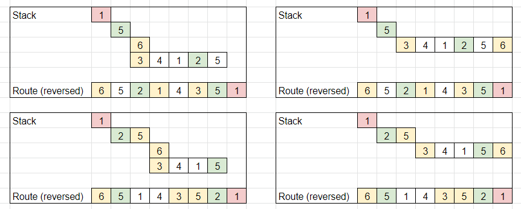

2097. Valid Arrangement of Pairs

You are given a **0-indexed** 2D integer array `pairs` where `pairs[i] = [starti, endi]`. An arrangement of pairs is **valid** if for every index `i` where `1 <= i < pairs.length`, we have `endi-1 == starti`.

Return any valid arrangement of `pairs`.

**Note:** The inputs will be generated such that there exists a valid arrangement of `pairs`.

 

**Example 1:**
```
Input: pairs = [[5,1],[4,5],[11,9],[9,4]]
Output: [[11,9],[9,4],[4,5],[5,1]]
Explanation:
This is a valid arrangement since endi-1 always equals starti.
end0 = 9 == 9 = start1 
end1 = 4 == 4 = start2
end2 = 5 == 5 = start3
```

**Example 2:**
```
Input: pairs = [[1,3],[3,2],[2,1]]
Output: [[1,3],[3,2],[2,1]]
Explanation:
This is a valid arrangement since endi-1 always equals starti.
end0 = 3 == 3 = start1
end1 = 2 == 2 = start2
The arrangements [[2,1],[1,3],[3,2]] and [[3,2],[2,1],[1,3]] are also valid.
```

**Example 3:**
```
Input: pairs = [[1,2],[1,3],[2,1]]
Output: [[1,2],[2,1],[1,3]]
Explanation:
This is a valid arrangement since endi-1 always equals starti.
end0 = 2 == 2 = start1
end1 = 1 == 1 = start2
```

**Constraints:**

* `1 <= pairs.length <= 10^5`
* `pairs[i].length == 2`
* `0 <= starti, endi <= 10^9`
* `starti != endi`
* No two pairs are exactly the same.
* There exists a valid arrangement of `pairs`.

# Submissions
---
**Solution 1: (DFS)**

This problem is very tricky if you are not familiar with Eulerian Path and Hierholzer's algorithm.

1. You first need to find the head of the arrangement.
    * Head is connected to n other numbers, but only n-1 numbers are linked to the head.
    * We may not have a head if a sequence is a loop; in this case, we pick any start number as a head.
1. Starting from the head, we just greedily follow links and push numbers into a stack.
1. A number can be linked to more than one number; we pick any, and remove it from the list of linked numbers.
1. Once we reach the tail, we go back by popping numbers from the stack, and adding them to the resulting path.
1. If a popped number still has additional linked numbers, we repeat steps 2-5.
    * Note that this additional "branch" will end with the number popped from the stack.
    * This is property of a valid Euler's path, and so two branches "connect".

Let's look at this example: [[1,2],[2,5],[5,3],[3,4],[4,1],[1,5],[5,6]]. We put links into a map, and we get 1: {2, 5}, 5: {3,6}, 2: {5}, 3: {4}, 6:{}.

We determine that 1 is the head, and pictures below show different ways we can explore connections, generating valid arrangements.



```
Runtime: 645 ms
Memory: 275.2 MB
```
```c++
class Solution {
    void dfs(int i, unordered_map<int, vector<int>> &m, vector<vector<int>>& res) {
        while (m[i].size()) {
            auto j = m[i].back();
            m[i].pop_back();
            dfs(j, m, res);
            res.push_back({i, j});
        }
    }
public:
    vector<vector<int>> validArrangement(vector<vector<int>>& pairs) {
        unordered_map<int, vector<int>> m;
        unordered_map<int, int> cnt;
        vector<vector<int>> res;
        for (auto &p : pairs) {
            m[p[0]].push_back(p[1]);
            ++cnt[p[0]];
            --cnt[p[1]];
        }
        auto head = find_if(begin(cnt), end(cnt), [](const auto &p){ return p.second > 0; });
        dfs(head != end(cnt) ? head->first : pairs[0][0], m, res);
        reverse(begin(res), end(res));
        return res;
    }
};
```

**Solution 2: (Hierholzer's Algorithm (Iterative))**
```
Runtime: 495 ms
Memory: 433.62 MB
```
```c++
class Solution {
public:
    vector<vector<int>> validArrangement(vector<vector<int>>& pairs) {
        unordered_map<int, deque<int>> adjacencyMatrix;
        unordered_map<int, int> inDegree, outDegree;

        // Build the adjacency list and track in-degrees and out-degrees
        for (const auto& pair : pairs) {
            int start = pair[0], end = pair[1];
            adjacencyMatrix[start].push_back(end);
            outDegree[start]++;
            inDegree[end]++;
        }

        vector<int> result;

        // Find the start node (outDegree == inDegree + 1)
        int startNode = -1;
        for (const auto& entry : outDegree) {
            int node = entry.first;
            if (outDegree[node] == inDegree[node] + 1) {
                startNode = node;
                break;
            }
        }

        // If no such node exists, start from the first pair's first element
        if (startNode == -1) {
            startNode = pairs[0][0];
        }

        stack<int> nodeStack;
        nodeStack.push(startNode);

        // Iterative DFS using stack
        while (!nodeStack.empty()) {
            int node = nodeStack.top();
            if (!adjacencyMatrix[node].empty()) {
                // Visit the next node
                int nextNode = adjacencyMatrix[node].front();
                adjacencyMatrix[node].pop_front();
                nodeStack.push(nextNode);
            } else {
                // No more neighbors to visit, add node to result
                result.push_back(node);
                nodeStack.pop();
            }
        }

        // Reverse the result since we collected nodes in reverse order
        reverse(result.begin(), result.end());

        // Construct the result pairs
        vector<vector<int>> pairedResult;
        for (int i = 1; i < result.size(); ++i) {
            pairedResult.push_back({result[i - 1], result[i]});
        }

        return pairedResult;
    }
};

```

**Solution 3: (DFS, post order)**
```
Runtime: 425 ms
Memory: 285.06 MB
```
```c++
class Solution {
    void dfs(int v, unordered_map<int,vector<int>> &g, vector<int> &dp) {
        int nv;
        while (g[v].size()) {
            nv = g[v].back();
            g[v].pop_back();
            dfs(nv, g, dp);
        }
        dp.push_back(v);
    }
public:
    vector<vector<int>> validArrangement(vector<vector<int>>& pairs) {
        unordered_map<int,vector<int>> g;
        unordered_map<int,int> in, out;
        int i = -1;
        vector<int> dp;
        vector<vector<int>> ans;
        for (auto p: pairs) {
            g[p[0]].push_back(p[1]);
            in[p[0]] += 1;
            out[p[1]] += 1;
        }
        for (auto [v, c]: in) {
            if (out[v] == c-1) {
                i = v;
                break;
            }
        }
        if (i == -1) {
            i = pairs[0][0];
        }
        dfs(i, g, dp);
        while (dp.size() >= 2) {
            ans.push_back({dp[dp.size()-1], dp[dp.size()-2]});
            dp.pop_back();
        }
        return ans;
    }
};
```

**Solution 4: (DFS, post order, iterative)**
```
Runtime: 346 ms
Memory: 263.28 MB
```
```c++
class Solution {
public:
    vector<vector<int>> validArrangement(vector<vector<int>>& pairs) {
        unordered_map<int,vector<int>> g;
        unordered_map<int,int> deg;
        int i, j;
        vector<int> dp;
        vector<vector<int>> ans;
        for (auto p: pairs) {
            g[p[0]].push_back(p[1]);
            deg[p[0]] += 1;
            deg[p[1]] -= 1;
        }
        i = pairs[0][0];
        for (auto [v, c]: deg) {
            if (c == 1) {
                i = v;
                break;
            }
        }
        stack<int> stk;
        stk.push(i);
        while (stk.size()) {
            i = stk.top();
            if (g[i].size()) {
                j = g[i].back();
                g[i].pop_back();
                stk.push(j);
            } else {
                dp.push_back(i);
                stk.pop();
            }
        }
        i = dp.size()-1;
        while (i) {
            ans.push_back({dp[i], dp[i-1]});
            i -= 1;
        }
        return ans;
    }
};
```
