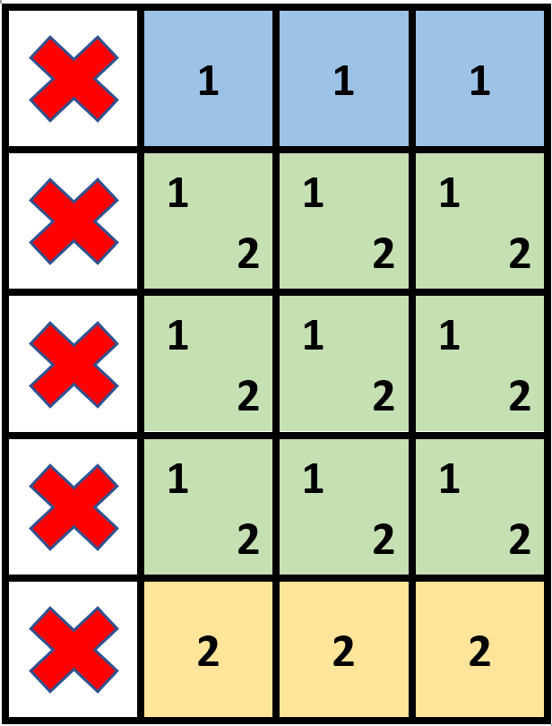
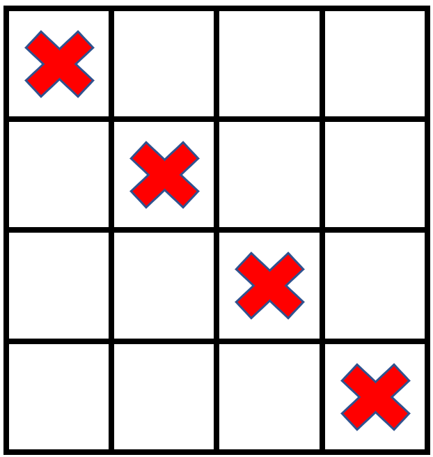

2132. Stamping the Grid

You are given an `m x n` binary matrix `grid` where each cell is either `0` (empty) or `1` (occupied).

You are then given stamps of size `stampHeight x stampWidth`. We want to fit the stamps such that they follow the given restrictions and requirements:

* Cover all the empty cells.
* Do not cover any of the occupied cells.
* We can put as many stamps as we want.
* Stamps can overlap with each other.
* Stamps are not allowed to be rotated.
* Stamps must stay completely inside the grid.

Return `true` if it is possible to fit the stamps while following the given restrictions and requirements. Otherwise, return `false`.

 

**Example 1:**


```
Input: grid = [[1,0,0,0],[1,0,0,0],[1,0,0,0],[1,0,0,0],[1,0,0,0]], stampHeight = 4, stampWidth = 3
Output: true
Explanation: We have two overlapping stamps (labeled 1 and 2 in the image) that are able to cover all the empty cells.
```

**Example 2:**


```
Input: grid = [[1,0,0,0],[0,1,0,0],[0,0,1,0],[0,0,0,1]], stampHeight = 2, stampWidth = 2 
Output: false 
Explanation: There is no way to fit the stamps onto all the empty cells without the stamps going outside the grid.
```

**Constraints:**

* `m == grid.length`
* `n == grid[r].length`
* `1 <= m, n <= 10^5`
* `1 <= m * n <= 2 * 10^5`
* `grid[r][c]` is either `0` or `1`.
* `1 <= stampHeight, stampWidth <= 10^5`

# Submissions
---
**Solution 1: (Calulate the sub-matrix sum twice)**

__Intitution__
M[i][j] can be coverd by any stamp with right-bottom point
in the sub-matrix from (i,j) to (i + h - 1, j + w - 1).

A stamp with right-bottom point at (i,j) can fit,
if the sub the sub-matrix from (i - h + 1, j - w + 1) to (i,j) is all empty.

So we just need to calulate the sub-matrix sum twice.


__Explanation__
M is the input matrix.

A[i][j] means the total empty points in the rectangle,
with top-left at (0, 0) and right-bottom at (i - 1, j - 1).

good[i][j] means it fits a stamp with stamp right-bottom at (i, j)

B[i][j] means the sub-martix is all empty,
with top-left at (0, 0) and right-bottom at (i - 1, j - 1)

M[i][j] can be coverd by any stamp with right-bottom point
in the sub-matrix from (i,j) to (i + w - 1, j + h - 1).


__Complexity__
* Time O(mn)
* Space O(mn)

```
Runtime: 507 ms
Memory: 205.5 MB
```
```c++
class Solution {
public:
    bool possibleToStamp(vector<vector<int>>& grid, int stampHeight, int stampWidth) {
        int m = grid.size(), n = grid[0].size();
        vector<vector<int>> A(m + 1, vector<int>(n + 1)), B(m + 1, vector<int>(n + 1)), good(m, vector<int>(n));
        for (int i = 0; i < m; ++i) {
            for (int j = 0; j < n; ++j) {
                A[i + 1][j + 1] = A[i + 1][j] + A[i][j + 1] - A[i][j] + (1 - grid[i][j]);
                if (i + 1 >= stampHeight && j + 1 >= stampWidth) {
                    int x = i + 1 - stampHeight, y = j + 1 - stampWidth;
                    if (A[i + 1][j + 1] - A[x][j + 1] - A[i + 1][y] + A[x][y] == stampWidth * stampHeight)
                        good[i][j]++;
                }
            }
        }
        for (int i = 0; i < m; ++i)
            for (int j = 0; j < n; ++j)
                B[i + 1][j + 1] = B[i + 1][j] + B[i][j + 1] - B[i][j] + good[i][j];
        for (int i = 0; i < m; ++i) {
            for (int j = 0; j < n; ++j) {
                int x = min(i + stampHeight, m), y = min(j + stampWidth, n);
                if (grid[i][j] == 0 && B[x][y] - B[i][y] - B[x][j] + B[i][j] == 0)
                    return false;
            }
        }
        return true;
    }
};
```

**Solution 2: (Prefix Sum, Calulate the sub-matrix empty cell sum twice)**

pre[i][j]: the total empty points in the rectangle with top-left at (0, 0) and right-bottom at (i - 1, j - 1)
good[i][j]: it fits a stamp with stamp right-bottom at (i, j)
pre_good[i][j]: the sub-martix is all empty with top-left at (0, 0) and right-bottom at (i - 1, j - 1)

grid =        [[1, 0, 0, 0],
               [1, 0, 0, 0],
               [1, 0, 0, 0],
               [1, 0, 0, 0],
               [1, 0, 0, 0]], stampHeight = 4, stampWidth = 3

pre  =       0  0  0  0  0
             0     1  2  3
             0     2  4  6
             0     3  6  9
             0     4  8 12
             0     5 10 15 

good =          0  0  0  0  
                0         
                0         
                0        1
                0        1

pre_good =   0  0  0  0  0
             0
             0
             0
             0
             0           1
             0           2

```
Runtime: 160 ms, Beats 33.67%
Memory: 209.70 MB, Beats 26.53%
```
```c++
class Solution {
public:
    bool possibleToStamp(vector<vector<int>>& grid, int stampHeight, int stampWidth) {
        int m = grid.size(), n = grid[0].size(), i, j, pi, pj, ni, nj;
        vector<vector<int>> pre(m + 1, vector<int>(n + 1)), pre_good(m + 1, vector<int>(n + 1)), good(m, vector<int>(n));
        for (i = 0; i < m; i ++) {
            for (j = 0; j < n; j ++) {
                pre[i + 1][j + 1] = pre[i + 1][j] + pre[i][j + 1] - pre[i][j] + (1 - grid[i][j]);
                if (i + 1 >= stampHeight && j + 1 >= stampWidth) {
                    pi = i + 1 - stampHeight, pj = j + 1 - stampWidth;
                    if (pre[i + 1][j + 1] - pre[pi][j + 1] - pre[i + 1][pj] + pre[pi][pj] == stampWidth * stampHeight)
                        good[i][j] += 1;
                }
            }
        }
        for (i = 0; i < m; i ++) {
            for (j = 0; j < n; j ++) {
                pre_good[i + 1][j + 1] = pre_good[i + 1][j] + pre_good[i][j + 1] - pre_good[i][j] + good[i][j];
            }
        }
        for (i = 0; i < m; i ++) {
            for (j = 0; j < n; j ++) {
                ni = min(i + stampHeight, m), nj = min(j + stampWidth, n);
                if (grid[i][j] == 0 && pre_good[ni][nj] - pre_good[i][nj] - pre_good[ni][j] + pre_good[i][j] == 0) {
                    return false;
                }
            }
        }
        return true;
    }
};
```
