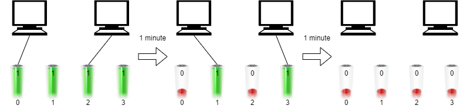

2141. Maximum Running Time of N Computers

You have n computers. You are given the integer `n` and a **0-indexed** integer array `batteries` where the `i`th battery can **run** a computer for `batteries[i]` minutes. You are interested in running all n computers **simultaneously** using the given batteries.

Initially, you can insert **at most one battery** into each computer. After that and at any integer time moment, you can remove a battery from a computer and insert another battery **any number of times**. The inserted battery can be a totally new battery or a battery from another computer. You may assume that the removing and inserting processes take no time.

Note that the batteries cannot be recharged.

Return the **maximum** number of minutes you can run all the `n` computers simultaneously.

 

**Example 1:**


```
Input: n = 2, batteries = [3,3,3]
Output: 4
Explanation: 
Initially, insert battery 0 into the first computer and battery 1 into the second computer.
After two minutes, remove battery 1 from the second computer and insert battery 2 instead. Note that battery 1 can still run for one minute.
At the end of the third minute, battery 0 is drained, and you need to remove it from the first computer and insert battery 1 instead.
By the end of the fourth minute, battery 1 is also drained, and the first computer is no longer running.
We can run the two computers simultaneously for at most 4 minutes, so we return 4.
```

**Example 2:**


```
Input: n = 2, batteries = [1,1,1,1]
Output: 2
Explanation: 
Initially, insert battery 0 into the first computer and battery 2 into the second computer. 
After one minute, battery 0 and battery 2 are drained so you need to remove them and insert battery 1 into the first computer and battery 3 into the second computer. 
After another minute, battery 1 and battery 3 are also drained so the first and second computers are no longer running.
We can run the two computers simultaneously for at most 2 minutes, so we return 2.
```

**Constraints:**

* `1 <= n <= batteries.length <= 10^5`
* `1 <= batteries[i] <= 10^9`

# Submissions
---
**Solution 1: (Sort)**
```
Runtime: 873 ms
Memory Usage: 28.4 MB
```
```python
class Solution:
    def maxRunTime(self, n: int, batteries: List[int]) -> int:
        batteries.sort()
        su = sum(batteries)
        while batteries[-1] > su / n:
            n -= 1
            su -= batteries.pop()
        return su // n 
```

**Solution 2: (Sort)**
```
Runtime: 179 ms
Memory Usage: 55.6 MB
```
```c++
class Solution {
public:
    long long maxRunTime(int n, vector<int>& batteries) {
        sort(batteries.begin(), batteries.end());
        long long sum = accumulate(batteries.begin(), batteries.end(), 0L);
        int k = 0, na = batteries.size();
        while (batteries[na - 1 - k] > sum / (n - k))
            sum -= batteries[na - 1 - k++];
        return sum / (n - k);
    }
};
```
