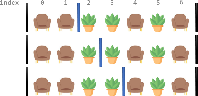
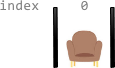

2147. Number of Ways to Divide a Long Corridor

Along a long library corridor, there is a line of seats and decorative plants. You are given a **0-indexed** string `corridor` of length `n` consisting of letters `'S'` and `'P'` where each `'S'` represents a seat and each `'P'` represents a plant.

One room divider has **already** been installed to the left of index `0`, and another to the right of index `n - 1`. Additional room dividers can be installed. For each position between indices `i - 1` and `i` (`1 <= i <= n - 1`), at most one divider can be installed.

Divide the corridor into non-overlapping sections, where each section has **exactly two** seats with any number of plants. There may be multiple ways to perform the division. Two ways are **different** if there is a position with a room divider installed in the first way but not in the second way.

Return the number of ways to divide the corridor. Since the answer may be very large, return it **modulo** `10^9 + 7`. If there is no way, return `0`.

 

**Example 1:**


```
Input: corridor = "SSPPSPS"
Output: 3
Explanation: There are 3 different ways to divide the corridor.
The black bars in the above image indicate the two room dividers already installed.
Note that in each of the ways, each section has exactly two seats.
```

**Example 2:**


```
Input: corridor = "PPSPSP"
Output: 1
Explanation: There is only 1 way to divide the corridor, by not installing any additional dividers.
Installing any would create some section that does not have exactly two seats.
```

**Example 3:**


```
Input: corridor = "S"
Output: 0
Explanation: There is no way to divide the corridor because there will always be a section that does not have exactly two seats.
```

**Constraints:**

* `n == corridor.length`
* `1 <= n <= 10^5`
* `corridor[i]` is either `'S'` or `'P'`.

# Submissions
---
**Solution 1: (Top-Down Dynamic Programming)**
```
Runtime: 198 ms
Memory: 40 MB
```
```c++
class Solution {
    // Store 1000000007 in a variable for convenience
    const int MOD = 1e9 + 7;
    
    // Count the number of ways to divide from "index" to the last index
    // with "seats" number of "S" in the current section
    int count(int index, int seats, string& corridor, int cache[][3]) {
        // If we have reached the end of the corridor, then
        // the current section is valid only if "seats" is 2
        if (index == corridor.length()) {
            return seats == 2 ? 1 : 0;
        }

        // If we have already computed the result of this sub-problem,
        // then return the cached result
        if (cache[index][seats] != -1) {
            return cache[index][seats];
        }

        // Result of the sub-problem
        int result = 0;

        // If the current section has exactly 2 "S"
        if (seats == 2) {
            // If the current element is "S", then we have to close the
            // section and start a new section from this index. Next index
            // will have one "S" in the current section
            if (corridor[index] == 'S') {
                result = count(index + 1, 1, corridor, cache);
            } else {
                // If the current element is "P", then we have two options
                // 1. Close the section and start a new section from this index
                // 2. Keep growing the section
                result = (count(index + 1, 0, corridor, cache) + count(index + 1, 2, corridor, cache)) % MOD;  
            }
        } else {
            // Keep growing the section. Increment "seats" if present
            // element is "S"
            if (corridor[index] == 'S') {
                result = count(index + 1, seats + 1, corridor, cache);
            } else {
                result = count(index + 1, seats, corridor, cache);
            }
        }

        // Memoize the result, and return it
        cache[index][seats] = result;
        return cache[index][seats];
    }
public:
    int numberOfWays(string corridor) {
        // Cache the result of each sub-problem
        int cache[corridor.length()][3];
        memset(cache, -1, sizeof(cache));

        // Call the count function
        return count(0, 0, corridor, cache);
    }
};
```

**Solution 2: (Bottom-up Dynamic Programming)**
```
Runtime: 135 ms
Memory: 32.5 MB
```
```c++
class Solution {
public:
    int numberOfWays(string corridor) {
        // Store 1000000007 in a variable for convenience
        const int MOD = 1e9 + 7;

        // Initialize the array to store the result of each sub-problem
        int count[corridor.length() + 1][3];

        // Base cases
        count[corridor.length()][0] = 0;
        count[corridor.length()][1] = 0;
        count[corridor.length()][2] = 1;

        // Fill the array in a bottom-up fashion
        for (int index = corridor.length() - 1; index >= 0; index--) {
            if (corridor[index] == 'S') {
                count[index][0] = count[index + 1][1];
                count[index][1] = count[index + 1][2];
                count[index][2] = count[index + 1][1];
            } else {
                count[index][0] = count[index + 1][0];
                count[index][1] = count[index + 1][1];
                count[index][2] = (count[index + 1][0] + count[index + 1][2]) % MOD;
            }
        }

        // Return the result
        return count[0][0];
    }
};
```

**Solution 3: (Space-Optimized Bottom-up Dynamic Programming)**
```
Runtime: 120 ms
Memory: 30.9 MB
```
```c++
class Solution {
public:
    int numberOfWays(string corridor) {
        // Store 1000000007 in a variable for convenience
        const int MOD = 1e9 + 7;

        // Initial values of three variables
        int zero = 0;
        int one = 0;
        int two = 1;

        // Compute using derived equations
        for (char thing : corridor) {
            if (thing == 'S') {
                zero = one;
                swap(one, two);
            } else {
                two = (two + zero) % MOD;
            }
        }

        // Return the result
        return zero;
    }
};
```
**Solution 4: (Combinatorics)**
```
Runtime: 131 ms
Memory: 55.9 MB
```
```c++
class Solution {
public:
    int numberOfWays(string corridor) {
        // Store 1000000007 in a variable for convenience
        const int MOD = 1e9 + 7;

        // Store indices of S in an array
        vector<int> indices;
        for (int index = 0; index < corridor.length(); index++) {
            if (corridor[index] == 'S') {
                indices.push_back(index);
            }
        }

        // When division is not possible
        if (indices.size() == 0 || indices.size() % 2 == 1) {
            return 0;
        }

        // Total number of ways
        long count = 1;

        // Take product of non-paired neighbors
        int previousPairLast = 1;
        int currentPairFirst = 2;
        while (currentPairFirst < indices.size()) {
            count *= (indices[currentPairFirst] - indices[previousPairLast]);
            count %= MOD;
            previousPairLast += 2;
            currentPairFirst += 2;
        }

        // Return the number of ways
        return (int) count;
    }
};
```
**Solution 5: (Combinatorics, Space Optimized)**
```
Runtime: 107 ms
Memory: 31 MB
```
```c++
class Solution {
public:
    int numberOfWays(string corridor) {
        // Store 1000000007 in a variable for convenience
        const int MOD = 1e9 + 7;

        // Total number of ways
        long count = 1;

        // Number of seats in the current section
        int seats = 0;

        // Tracking Index of last S in the previous section
        int previousPairLast = -1;

        // Keep track of seats in corridor
        for (int index = 0; index < corridor.length(); index++) {
            if (corridor[index] == 'S') {
                seats += 1;

                // If two seats, then this is the last S in the section
                // Update seats for the next section
                if (seats == 2) {
                    previousPairLast = index;
                    seats = 0;
                }

                // If one seat, then this is the first S in the section
                // Compute product of non-paired neighbors
                else if (seats == 1 && previousPairLast != -1) {
                    count *= (index - previousPairLast);
                    count %= MOD;
                }
            }
        }

        // If odd seats, or zero seats
        if (seats == 1 || previousPairLast == -1) {
            return 0;
        }

        // Return the number of ways
        return (int) count;
    }
};
```

**Solution 6: (Math)**
```
Runtime: 537 ms
Memory Usage: 19 MB
```
```python
class Solution:
    def numberOfWays(self, corridor: str) -> int:
        a = [i for i,c in enumerate(corridor) if c == 'S']
        res = 1
        for i in range(1,len(a) - 1,2):
            res *= a[i+1] - a[i]
        return res % (10**9+7) * (len(a) % 2 == 0 and len(a) >= 2) 
```

**Solution 7: (Math)**
```
Runtime: 130 ms
Memory Usage: 30.5 MB
```
```c++
class Solution {
public:
    int numberOfWays(string corridor) {
        long res = 1, j = 0, k = 0, mod = 1e9 + 7;
        for (int i = 0; i < corridor.size(); ++i) {
            if (corridor[i] == 'S') {
                if (++k > 2 && k % 2 == 1)
                    res = res * (i - j) % mod;
                j = i;
            }
        }
        return k % 2 == 0 && k > 0 ? res : 0;
    }
};
```
