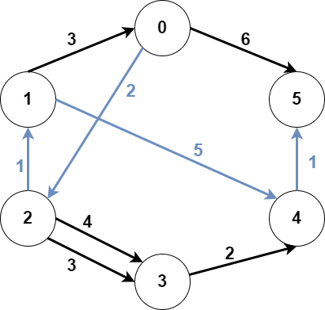

2203. Minimum Weighted Subgraph With the Required Paths

You are given an integer `n` denoting the number of nodes of a **weighted directed** graph. The nodes are numbered from `0` to `n - 1`.

You are also given a 2D integer array `edges` where `edges[i] = [fromi, toi, weighti]` denotes that there exists a **directed** edge from `fromi` to `toi` with weight `weighti`.

Lastly, you are given three distinct integers `src1`, `src2`, and `dest` denoting three distinct nodes of the graph.

Return the **minimum weight** of a subgraph of the graph such that it is **possible** to reach `dest` from both `src1` and `src2` via a set of edges of this subgraph. In case such a subgraph does not exist, return `-1`.

A **subgraph** is a graph whose vertices and edges are subsets of the original graph. The **weight** of a subgraph is the sum of weights of its constituent edges.

 

**Example 1:**


```
Input: n = 6, edges = [[0,2,2],[0,5,6],[1,0,3],[1,4,5],[2,1,1],[2,3,3],[2,3,4],[3,4,2],[4,5,1]], src1 = 0, src2 = 1, dest = 5
Output: 9
Explanation:
The above figure represents the input graph.
The blue edges represent one of the subgraphs that yield the optimal answer.
Note that the subgraph [[1,0,3],[0,5,6]] also yields the optimal answer. It is not possible to get a subgraph with less weight satisfying all the constraints.
```

**Example 2:**


```
Input: n = 3, edges = [[0,1,1],[2,1,1]], src1 = 0, src2 = 1, dest = 2
Output: -1
Explanation:
The above figure represents the input graph.
It can be seen that there does not exist any path from node 1 to node 2, hence there are no subgraphs satisfying all the constraints.
```

**Constraints:**

* `3 <= n <= 10^5`
* `0 <= edges.length <= 10^5`
* `edges[i].length == 3`
* `0 <= fromi, toi, src1, src2, dest <= n - 1`
* `fromi != toi`
* `src1`, `src2`, and `dest` are pairwise distinct.
* `1 <= weight[i] <= 10^5`

# Submissions
---
**Solution 1: (3 Dijkstras)**

The idea is the following: paths from s1 to dest and from s2 to destcan have common pointx`. Then we need to reach:

1. From s1 to x, for this we use Dijkstra
1. From s2 to x, same.
1. From x to dest, for this we use Dijkstra on the reversed graph.
1. Finally, we check all possible x.

**Remark**

In python it was quite challenging to get AC, and I need to look for faster implementation of Dijkstra, however complexity is still the same, it depends on implementation details.

**Complexity**

It is O(n*log E) for time and O(n) for space.

```
Runtime: 3300 ms
Memory Usage: 98.8 MB
```
```python
class Solution:
    def minimumWeight(self, n: int, edges: List[List[int]], src1: int, src2: int, dest: int) -> int:
        G1 = defaultdict(list)
        G2 = defaultdict(list)
        for a, b, w in edges:
            G1[a].append((b, w))
            G2[b].append((a, w))

        def Dijkstra(graph, K):
            q, t = [(0, K)], {}
            while q:
                time, node = heappop(q)
                if node not in t:
                    t[node] = time
                    for v, w in graph[node]:
                        heappush(q, (time + w, v))
            return [t.get(i, float("inf")) for i in range(n)]
        
        arr1 = Dijkstra(G1, src1)
        arr2 = Dijkstra(G1, src2)
        arr3 = Dijkstra(G2, dest)
        
        ans = float("inf")
        for i in range(n):
            ans = min(ans, arr1[i] + arr2[i] + arr3[i])
        
        return ans if ans != float("inf") else -1
```

**Solution 2: (3 Dijkstras)**

**Intuition:** At some point, paths from both sources will reach some common node.

Say, this common node is i. The weight of the graph will be the sum of:

* Minimum distance from first source to i.
* Minimum distance from second source to i.
* Minimum distance from i to the destination.

We run Dijkstra 3 times from both sources and destination. Note that to find smallest distance from all nodes to the destination, we run Dijkstra in reverse from the destination.

```
Runtime: 971 ms
Memory Usage: 139.6 MB
```
```c++
class Solution {
public:
    long long minimumWeight(int n, vector<vector<int>>& edges, int src1, int src2, int dest) {
        long long max_val = 10000000000, res = LLONG_MAX;
        vector<vector<pair<int, int>>> al(n), ral(n);
        vector<long long> dd(n, max_val), s1d(n, max_val), s2d(n, max_val);
        dd[dest] = s1d[src1] = s2d[src2] = 0;
        for (auto &e : edges) {
            al[e[0]].push_back({e[1], e[2]});
            ral[e[1]].push_back({e[0], e[2]});            
        }
        bfs(dest, ral, dd);
        bfs(src1, al, s1d);
        bfs(src2, al, s2d);
        if (dd[src1] == max_val || dd[src2] == max_val)
            return -1;
        for (int i = 0; i < n; ++i)
            res = min(res, dd[i] + s1d[i] + s2d[i]);
        return res;
    }
    
    void bfs(int st, vector<vector<pair<int, int>>> &al, vector<long long>& visited) {
        priority_queue<pair<long long, int>, vector<pair<long long, int>>, greater<pair<long long, int>>> pq;
        pq.push({0, st});
        while (!pq.empty()) {
            auto [dist, i] = pq.top(); pq.pop();
            if (visited[i] != dist)
                continue;
            for (auto [j, w] : al[i]) {
                if (visited[j] > dist + w) {
                    visited[j] = dist + w;
                    pq.push({visited[j], j});
                }
            }
        }
    }
};
```
