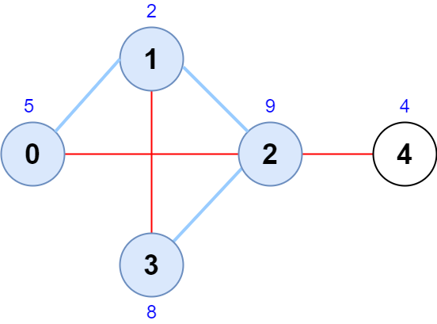
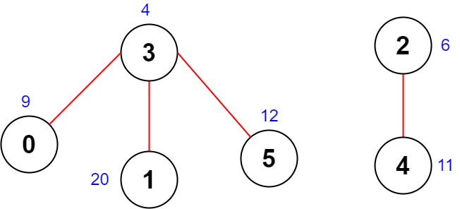

2242. Maximum Score of a Node Sequence

There is an undirected graph with `n` nodes, numbered from `0` to `n - 1`.

You are given a **0-indexed** integer array `scores` of length `n` where `scores[i]` denotes the score of node `i`. You are also given a 2D integer array `edges` where `edges[i] = [ai, bi]` denotes that there exists an undirected edge connecting nodes `ai` and `bi`.

A node sequence is valid if it meets the following conditions:

* There is an edge connecting every pair of **adjacent** nodes in the sequence.
* No node appears more than once in the sequence.

The score of a node sequence is defined as the **sum** of the scores of the nodes in the sequence.

Return the **maximum score** of a valid node sequence with a length of `4`. If no such sequence exists, return `-1`.

 

**Example 1:**


```
Input: scores = [5,2,9,8,4], edges = [[0,1],[1,2],[2,3],[0,2],[1,3],[2,4]]
Output: 24
Explanation: The figure above shows the graph and the chosen node sequence [0,1,2,3].
The score of the node sequence is 5 + 2 + 9 + 8 = 24.
It can be shown that no other node sequence has a score of more than 24.
Note that the sequences [3,1,2,0] and [1,0,2,3] are also valid and have a score of 24.
The sequence [0,3,2,4] is not valid since no edge connects nodes 0 and 3.
```

**Example 2:**


```
Input: scores = [9,20,6,4,11,12], edges = [[0,3],[5,3],[2,4],[1,3]]
Output: -1
Explanation: The figure above shows the graph.
There are no valid node sequences of length 4, so we return -1.
```

**Constraints:**

* `n == scores.length`
* `4 <= n <= 5 * 10^4`
* `1 <= scores[i] <= 10^8`
* `0 <= edges.length <= 5 * 10^4`
* `edges[i].length == 2`
* `0 <= ai, bi <= n - 1`
* `ai != bi`
* There are no duplicate edges.

# Submissions
---
**Solution 1: (top 3 neighbors)**
```
Runtime: 2566 ms
Memory Usage: 43.9 MB
```
```python
class Solution:
    def maximumScore(self, scores: List[int], edges: List[List[int]]) -> int:
        n = len(scores)
        
        # Store the top 3 neighbors of a node.
        top3 = collections.defaultdict(list)
        
        def func(a, b, e):
            bisect.insort_left(top3[a], [e, b])
            if len(top3[a]) > 3:
                top3[a].pop(0)
        
        # Update the information of top 3 neighbors of each node
        for a, b in edges:
            func(a, b, scores[b])
            func(b, a, scores[a])
        
        ans = -1
        for a, b in edges:
            # If there is less than 2 neighbors of a node, skip this pair.
            if len(top3[a]) < 2 or len(top3[b]) < 2:
                continue
            for c in top3[a]:
                for d in top3[b]:
                    # Find the maximum score of two non-duplicated neighbors of a and b.
                    if c[1] not in [a, b] and d[1] not in [a, b] and c[1] != d[1]:
                        ans = max(ans, scores[a] + scores[b] + c[0] + d[0])
        return ans
```

**Solution 2: ([O(E)] Try every edge + find 2 more best nodes (one per each edge side))**
```
Runtime: 538 ms
Memory Usage: 135.8 MB
```
```c++
\class Solution {
public:
    int maximumScore(vector<int>& scores, vector<vector<int>>& edges) {
        const int n = scores.size();
        vector<vector<int>> adj(n);
        for (const vector<int>& edge : edges) {
            adj[edge[0]].push_back(edge[1]);
            adj[edge[1]].push_back(edge[0]);
        }
        for (vector<int>& a : adj) {
            sort(a.begin(), a.end(), [&scores](const int l, const int r) { return scores[l] > scores[r]; });
        }
        
        int result = -1;
        for (const vector<int>& edge : edges) {
            int u = edge[0];
            int v = edge[1];
            int base = scores[u] + scores[v];
            for (int i = 0; i < min(3, (int)adj[u].size()); ++i) {
                int x = adj[u][i];
                
                if (x == v) continue; // intersection - not allowed, continue
                
                for (int j = 0; j < min(3, (int)adj[v].size()); ++j) {
                    int y = adj[v][j];
                    
                    if (y == u || x == y) continue; // intersection - not allowed, continue
                    
                    result = max(result, base + scores[x] + scores[y]);
                }
            }
        }
        
        return result;
    }
};
```
