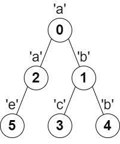
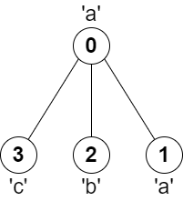

2246. Longest Path With Different Adjacent Characters

You are given a **tree** (i.e. a connected, undirected graph that has no cycles) **rooted** at node `0` consisting of `n` nodes numbered from `0` to `n - 1`. The tree is represented by a **0-indexed** array `parent` of size `n`, where `parent[i]` is the parent of node `i`. Since node `0` is the root, `parent[0] == -1`.

You are also given a string `s` of length `n`, where `s[i]` is the character assigned to node `i`.

Return the length of the **longest path** in the tree such that no pair of **adjacent** nodes on the path have the same character assigned to them.

 

**Example 1:**


```
Input: parent = [-1,0,0,1,1,2], s = "abacbe"
Output: 3
Explanation: The longest path where each two adjacent nodes have different characters in the tree is the path: 0 -> 1 -> 3. The length of this path is 3, so 3 is returned.
It can be proven that there is no longer path that satisfies the conditions. 
```

**Example 2:**


```
Input: parent = [-1,0,0,0], s = "aabc"
Output: 3
Explanation: The longest path where each two adjacent nodes have different characters is the path: 2 -> 0 -> 3. The length of this path is 3, so 3 is returned.
```

**Constraints:**

* `n == parent.length == s.length`
* `1 <= n <= 10^5`
* `0 <= parent[i] <= n - 1 for all i >= 1`
* `parent[0] == -1`
* `parent` represents a valid tree.
* `s` consists of only lowercase English letters.

# Submissions
---
**Solution 1: (DFS)**
```
Runtime: 2653 ms
Memory Usage: 151.8 MB
```
```python
class Solution:
    def longestPath(self, parent: List[int], s: str) -> int:
        children = [[] for i in range(len(s))]
        for i,j in enumerate(parent):
            if j >= 0:
                children[j].append(i)
        
        res = [0]
        def dfs(i):
            candi = [0, 0]
            for j in children[i]:
                cur = dfs(j)
                if s[i] != s[j]:
                    candi.append(cur)
                    
            candi = nlargest(2, candi)
            res[0] = max(res[0], candi[0] + candi[1] + 1)
            return max(candi) + 1
        
        dfs(0)
        return res[0]
```

**Solution 2: (DFS)**
```
Runtime: 392 ms
Memory Usage: 181.2 MB
```
```c++
class Solution {
    int dfs(vector<vector<int>>& children, string& s, int& res, int i) {
        int big1 = 0, big2 = 0;
        for (int& j : children[i]) {
            int cur = dfs(children, s, res, j);
            if (s[i] == s[j]) continue;
            if (cur > big2) big2 = cur;
            if (big2 > big1) swap(big1, big2);
        }
        res = max(res, big1 + big2 + 1);
        return big1 + 1;
    }
public:
    int longestPath(vector<int>& parent, string s) {
        int n = s.size(), res = 0;
        vector<vector<int>> children(n, vector<int>());
        for (int i = 1; i < n; ++i)
            children[parent[i]].push_back(i);
        dfs(children, s, res, 0);
        return res;
    }
};
```

**Solution 3: (DFS)**
```
Runtime: 1863 ms
Memory: 152.9 MB
```
```python
class Solution:
    def longestPath(self, parent: List[int], s: str) -> int:
        ans = 0
        child = collections.defaultdict(list)
        for i, p in enumerate(parent):
            child[p] += [i]

        def dfs(v, p):
            nonlocal ans
            rst = 0
            mx1 = mx2 = 0
            for nv in child[v]:
                cur = dfs(nv, v)
                if cur > mx1:
                    mx2 = max(mx2, mx1)
                    mx1 = cur
                elif cur > mx2:
                    mx2 = cur
            rst = mx1+mx2+1
            ans = max(ans, rst)
            rst = mx1+1
            if s[v] == s[p]:
                rst = 0
            return rst

        dfs(0, -1)
        return ans
```

**Solution 4: (DFS, return one branch upward and try use two branches locally)**
```
Runtime: 166 ms, Beats 69.06%
Memory: 161.84 MB, Beats 80.79%
```
```c++
class Solution {
    int ans = 1;
    int dfs(int u, vector<vector<int>> &g, string& s) {
        int best1 = 0;
        int best2 = 0;
        for (int v : g[u]) {
            int len = dfs(v, g, s);
            if (s[v] == s[u]) {
                continue;
            }
            if (len > best1) {
                best2 = best1;
                best1 = len;
            } else if (len > best2) {
                best2 = len;
            }
        }
        ans = max(ans, best1 + best2 + 1);
        return best1 + 1;
    }
public:
    int longestPath(vector<int>& parent, string s) {
        int n = parent.size();
        vector<vector<int>> g(n);
        for (int i = 1; i < n; i++) {
            g[parent[i]].push_back(i);
        }
        dfs(0, g, s);
        
        return ans;
    }
};
```
