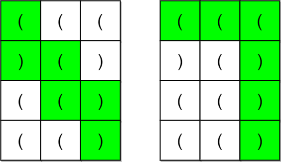
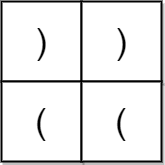

2267. Check if There Is a Valid Parentheses String Path

A parentheses string is a **non-empty** string consisting only of `'('` and `')'`. It is **valid** if **any** of the following conditions is **true**:

* It is `()`.
* It can be written as `AB` (`A` concatenated with `B`), where `A` and `B` are valid parentheses strings.
* It can be written as `(A)`, where `A` is a valid parentheses string.

You are given an `m x n` matrix of parentheses grid. A valid parentheses string path in the grid is a path satisfying all of the following conditions:

The path starts from the upper left cell `(0, 0)`.
The path ends at the bottom-right cell `(m - 1, n - 1)`.
The path only ever moves **down** or **right**.
The resulting parentheses string formed by the path is **valid**.

Return `true` if there exists a **valid parentheses string path** in the `grid`. Otherwise, return `false`.

 

**Example 1:**


```
Input: grid = [["(","(","("],[")","(",")"],["(","(",")"],["(","(",")"]]
Output: true
Explanation: The above diagram shows two possible paths that form valid parentheses strings.
The first path shown results in the valid parentheses string "()(())".
The second path shown results in the valid parentheses string "((()))".
Note that there may be other valid parentheses string paths.
```

**Example 2:**


```
Input: grid = [[")",")"],["(","("]]
Output: false
Explanation: The two possible paths form the parentheses strings "))(" and ")((". Since neither of them are valid parentheses strings, we return false.
```

**Constraints:**

* `m == grid.length`
* `n == grid[i].length`
* `1 <= m, n <= 100`
* `grid[i][j]` is either `'('` or `')'`.

# Submissions
---
**Solution 1: (DP Top-Down)**
```
Runtime: 318 ms
Memory Usage: 22.1 MB
```
```c++
class Solution {
    int n, m;
    int dp[100][100][205];
    bool solve(vector<vector<char>>& grid, int i, int j, int k)
    {
        if(i>=n || j>=m)
            return 0;
        
        if(grid[i][j]=='(')
            k++;
        else
            k--;
        
        if(k<0)
            return 0;
        
        if(i==n-1 && j==m-1)
            return (k==0);
        
        if(dp[i][j][k]!=-1)
            return dp[i][j][k];
        
        return dp[i][j][k]=(solve(grid, i+1, j, k) | solve(grid, i, j+1, k));
    }
public:
    bool hasValidPath(vector<vector<char>>& grid) {
        n=grid.size();
        m=grid[0].size();
        memset(dp, -1, sizeof(dp));
        return solve(grid, 0, 0, 0);
    }
};
```
