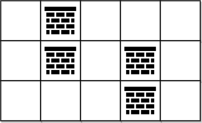

2290. Minimum Obstacle Removal to Reach Corner

You are given a **0-indexed** 2D integer array `grid` of size `m x n`. Each cell has one of two values:

* `0` represents an **empty** cell,
* `1` represents an **obstacle** that may be removed.

You can move up, down, left, or right from and to an empty cell.

Return the **minimum** number of **obstacles** to remove so you can move from the upper left corner `(0, 0)` to the lower right corner `(m - 1, n - 1)`.

 

**Example 1:**


```
Input: grid = [[0,1,1],[1,1,0],[1,1,0]]
Output: 2
Explanation: We can remove the obstacles at (0, 1) and (0, 2) to create a path from (0, 0) to (2, 2).
It can be shown that we need to remove at least 2 obstacles, so we return 2.
Note that there may be other ways to remove 2 obstacles to create a path.
```

**Example 2:**


```
Input: grid = [[0,1,0,0,0],[0,1,0,1,0],[0,0,0,1,0]]
Output: 0
Explanation: We can move from (0, 0) to (2, 4) without removing any obstacles, so we return 0.
```

**Constraints:**

* `m == grid.length`
* `n == grid[i].length`
* `1 <= m, n <= 10^5`
* `2 <= m * n <= 10^5`
* `grid[i][j]` is either `0` **or** `1`.
* `grid[0][0] == grid[m - 1][n - 1] == 0`

# Submissions
---
**Solution 1: (Dijkstra)**
```
Runtime: 5372 ms
Memory Usage: 38 MB
```
```python
class Solution:
    def minimumObstacles(self, grid: List[List[int]]) -> int:
        m, n = map(len, (grid, grid[0]))
        dist = [[inf] * n for _ in range(m)]
        dist[0][0] = grid[0][0]
        hp = [(dist[0][0], 0, 0)]
        while hp:
            o, r, c = heappop(hp)
            if (r, c) == (m - 1, n - 1):
                return o
            for i, j in (r + 1, c), (r - 1, c), (r, c + 1), (r, c - 1):
                if m > i >= 0 <= j < n and grid[i][j] + o < dist[i][j]:
                    dist[i][j] = grid[i][j] + o
                    heappush(hp, (dist[i][j], i, j))
```

**Solution 2: (Dijkstra)**
```
Runtime: 1404 ms
Memory Usage: 104.2 MB
```
```c++
class Solution {
public:
    int minimumObstacles(vector<vector<int>>& grid) {
        int n = grid.size(), m = grid[0].size();
        vector<vector<int>> dp(n, vector<int>(m, 1e5 + 1));
        priority_queue<tuple<int, int, int>, vector<tuple<int, int, int>>, greater<tuple<int, int, int>>> pq;
        
        pq.push({grid[0][0], 0, 0});
        int dirs[4][2] = {{0, 1},{-1, 0},{1, 0},{0, -1}};
        while (!pq.empty()) {
            auto [c, i, j] = pq.top();
            pq.pop();
            
            if (i == n - 1 && j == m - 1) {
                return c;
            }
            
            for (auto &d: dirs) {
                int x = d[0] + i;
                int y = d[1] + j;
                
                if (x < 0 || y < 0 || x >= n || y >= m)
                    continue;
                
                if (dp[x][y] > grid[x][y] + c) {
                    dp[x][y] = grid[x][y] + c;
                    pq.push({grid[x][y] + c, x, y});
                }
            }
        }
        
        return -1;
    }
};
```
