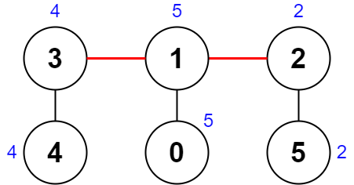

2322. Minimum Score After Removals on a Tree

There is an undirected connected tree with `n` nodes labeled from `0` to `n - 1` and `n - 1` edges.

You are given a **0-indexed** integer array `nums` of length `n` where `nums[i]` represents the value of the `i`th node. You are also given a 2D integer array `edges` of length `n - 1` where `edges[i] = [ai, bi]` indicates that there is an edge between nodes `ai` and `bi` in the tree.

Remove two **distinct** edges of the tree to form three connected components. For a pair of removed edges, the following steps are defined:

* Get the XOR of all the values of the nodes for **each** of the three components respectively.
* The **difference** between the **largest** XOR value and the **smallest** XOR value is the **score** of the pair.
* For example, say the three components have the node values: `[4,5,7]`, `[1,9]`, and `[3,3,3]`. The three XOR values are `4 ^ 5 ^ 7 = 6`, `1 ^ 9 = 8`, and `3 ^ 3 ^ 3 = 3`. The largest XOR value is `8` and the smallest XOR value is `3`. The score is then `8 - 3 = 5`.

Return the **minimum** score of any possible pair of edge removals on the given tree.

 

**Example 1:**


```
Input: nums = [1,5,5,4,11], edges = [[0,1],[1,2],[1,3],[3,4]]
Output: 9
Explanation: The diagram above shows a way to make a pair of removals.
- The 1st component has nodes [1,3,4] with values [5,4,11]. Its XOR value is 5 ^ 4 ^ 11 = 10.
- The 2nd component has node [0] with value [1]. Its XOR value is 1 = 1.
- The 3rd component has node [2] with value [5]. Its XOR value is 5 = 5.
The score is the difference between the largest and smallest XOR value which is 10 - 1 = 9.
It can be shown that no other pair of removals will obtain a smaller score than 9.
```

**Example 2:**


```
Input: nums = [5,5,2,4,4,2], edges = [[0,1],[1,2],[5,2],[4,3],[1,3]]
Output: 0
Explanation: The diagram above shows a way to make a pair of removals.
- The 1st component has nodes [3,4] with values [4,4]. Its XOR value is 4 ^ 4 = 0.
- The 2nd component has nodes [1,0] with values [5,5]. Its XOR value is 5 ^ 5 = 0.
- The 3rd component has nodes [2,5] with values [2,2]. Its XOR value is 2 ^ 2 = 0.
The score is the difference between the largest and smallest XOR value which is 0 - 0 = 0.
We cannot obtain a smaller score than 0.
```

**Constraints:**

* `n == nums.length`
* `3 <= n <= 1000`
* `1 <= nums[i] <= 108`
* `edges.length == n - 1`
* `edges[i].length == 2`
* `0 <= ai, bi < n`
* `ai != bi`
* `edges` represents a valid tree.

# Submissions
---
**Solution 1: (BFS)**
```
Runtime: 4827 ms
Memory Usage: 25.4 MB
```
```python
class Solution:
    def minimumScore(self, nums: List[int], edges: List[List[int]]) -> int:
        n, m = len(nums), len(edges)
        
        G = collections.defaultdict(list)  # Graph
        C = collections.defaultdict(set)   # Children
        A = nums[:]                  # subtree XOR value
        degree = [0] * n        # degree of each node 

        for x, y in edges:
            G[x].append(y)
            G[y].append(x)
            degree[x] += 1
            degree[y] += 1
        
        V = 0   # XOR of all the nodes
        
        seen = set()
        dq = collections.deque()
        for i in range(n):
            V ^= nums[i]
            if degree[i] == 1:
                dq.append(i)
                seen.add(i)
                
        # BFS, starting from the leaf nodes     
        while dq:
            cur = dq.popleft()
            for nxt in G[cur]:
                if nxt not in seen:
                    C[nxt].add(cur)
                    C[nxt] |= C[cur]
                    A[nxt] ^= A[cur]
                degree[nxt] -= 1
                if degree[nxt] == 1:
                    seen.add(nxt)
                    dq.append(nxt)
        ans = math.inf
        for i in range(m - 1):
            for j in range(i + 1, m):
                # Let a, c be the lower break points
                a, b = edges[i]
                if b in C[a]: a, b = b, a 
                
                c, d = edges[j]
                if d in C[c]: c, d = d, c
                
                # 3 cases: a is c's child, c is a's child, or a and b are two independent subtrees.
                if c in C[a]:
                    cur = [A[c], A[a]^A[c], V^A[a]]
                elif a in C[c]:
                    cur = [A[a], A[c]^A[a], V^A[c]]
                else:
                    cur = [A[a], A[c], V^A[a]^A[c]]
                ans = min(ans, max(cur) - min(cur))
            
        return ans
```

**Solution 2: (DFS, 2 DFS, Brute Force)**
```
Runtime: 187 ms, Beats 54.76%
Memory: 18.27 MB, Beats 88.89%
```
```c++
class Solution {
    int calc(int part1, int part2, int part3) {
        return max(part1, max(part2, part3)) - min(part1, min(part2, part3));
    }
public:
    int minimumScore(vector<int>& nums, vector<vector<int>>& edges) {
        int n = nums.size();
        vector<vector<int>> e(n);
        for (auto &v : edges) {
            e[v[0]].push_back(v[1]);
            e[v[1]].push_back(v[0]);
        }

        int sum = 0;
        for (int x : nums) {
            sum ^= x;
        }

        int res = INT_MAX;
        function<int(int, int, int, int)> dfs2 = [&](int x, int f, int oth,
                                                     int anc) {
            int son = nums[x];
            for (auto &y : e[x]) {
                if (y == f) {
                    continue;
                }
                son ^= dfs2(y, x, oth, anc);
            }
            if (f == anc) {
                return son;
            }
            res = min(res, calc(oth, son, sum ^ oth ^ son));
            return son;
        };

        function<int(int, int)> dfs = [&](int x, int f) {
            int son = nums[x];
            for (auto &y : e[x]) {
                if (y == f) {
                    continue;
                }
                son ^= dfs(y, x);
            }

            for (auto &y : e[x]) {
                if (y == f) {
                    dfs2(y, x, son, x);
                }
            }
            return son;
        };

        dfs(0, -1);
        return res;
    }
};
```

**Solution 3: (DFS, 2 post order, Brute Force)**
```
Runtime: 248 ms, Beats 46.03%
Memory: 18.16 MB, Beats 91.27%
```
```c++
class Solution {
    int dfs2(int u, int p, vector<int> &nums, vector<vector<int>> &g, int anc, int a, int t, int &ans) {
        int rst = nums[u];
        for (auto &v: g[u]) {
            if (v != p) {
                rst ^= dfs2(v, u, nums, g, anc, a, t, ans);
            }
        }
        if (p == anc) {
            return rst;
        }
        ans = min(ans, max({a, rst, t^a^rst}) - min({a, rst, t^a^rst}));
        return rst;
    }
    int dfs(int u, int p, vector<int> &nums, vector<vector<int>> &g, int t, int &ans) {
        int rst = nums[u];
        for (auto &v: g[u]) {
            if (v != p) {
                rst ^= dfs(v, u, nums, g, t, ans);
            }
        }
        for (auto &v: g[u]) {
            if (v == p) {
                dfs2(v, u, nums, g, u, rst, t, ans);
            }
        }
        return rst;
    }
public:
    int minimumScore(vector<int>& nums, vector<vector<int>>& edges) {
        int n = nums.size(), t = 0, ans = INT_MAX;
        vector<vector<int>> g(n);
        for (auto &e: edges) {
            g[e[0]].push_back(e[1]);
            g[e[1]].push_back(e[0]);
        }
        for (auto &num: nums) {
            t ^= num;
        }
        dfs(0, -1, nums, g, t, ans);
        return ans;
    }
};
````
