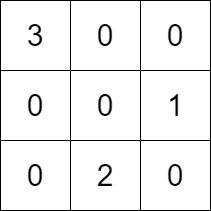

2392. Build a Matrix With Conditions

You are given a **positive** integer `k`. You are also given:

* a 2D integer array `rowConditions` of size `n` where `rowConditions[i] = [abovei, belowi]`, and
* a 2D integer array `colConditions` of size `m` where `colConditions[i] = [lefti, righti]`.

The two arrays contain integers from `1` to `k`.

You have to build a `k x k` matrix that contains each of the numbers from `1` to `k` exactly once. The remaining cells should have the value `0`.

The matrix should also satisfy the following conditions:

* The number `abovei` should appear in a row that is strictly above the row at which the number `belowi` appears for all `i` from `0` to `n - 1`.
* The number `lefti` should appear in a column that is strictly left of the column at which the number `righti` appears for all `i` from `0` to `m - 1`.

Return **any** matrix that satisfies the conditions. If no answer exists, return an empty matrix.

 

**Example 1:**


```
Input: k = 3, rowConditions = [[1,2],[3,2]], colConditions = [[2,1],[3,2]]
Output: [[3,0,0],[0,0,1],[0,2,0]]
Explanation: The diagram above shows a valid example of a matrix that satisfies all the conditions.
The row conditions are the following:
- Number 1 is in row 1, and number 2 is in row 2, so 1 is above 2 in the matrix.
- Number 3 is in row 0, and number 2 is in row 2, so 3 is above 2 in the matrix.
The column conditions are the following:
- Number 2 is in column 1, and number 1 is in column 2, so 2 is left of 1 in the matrix.
- Number 3 is in column 0, and number 2 is in column 1, so 3 is left of 2 in the matrix.
Note that there may be multiple correct answers.
```

**Example 2:**
```
Input: k = 3, rowConditions = [[1,2],[2,3],[3,1],[2,3]], colConditions = [[2,1]]
Output: []
Explanation: From the first two conditions, 3 has to be below 1 but the third conditions needs 3 to be above 1 to be satisfied.
No matrix can satisfy all the conditions, so we return the empty matrix.
```

**Constraints:**

* `2 <= k <= 400`
* `1 <= rowConditions.length, colConditions.length <= 10^4`
* `rowConditions[i].length == colConditions[i].length == 2`
* `1 <= abovei, belowi, lefti, righti <= k`
* `abovei != belowi`
* `lefti != righti`

# Submissions
---
**Solution 1: (Topological Sort)**

Here is the BFS solution: start with dequeue of nodes with 0 indegree, update the indegree and add those nodes with 0 indegree to dequeue. Once we are done, the sequence by which we pop the nodes are one workable order.

If there exists a circle, the nodes on circle will never be visited. Thus we end up with a sequence shorter than the total number of nodes.

Once we find a proper order for both the rows and cols, just add the number back to an empty matrix accordingly.

```
Runtime: 1382 ms
Memory Usage: 23 MB
```
```python
class Solution:
    def buildMatrix(self, k: int, rowConditions: List[List[int]], colConditions: List[List[int]]) -> List[List[int]]:
        def getOrder(A):
            nxt, indegree = [set() for _ in range(k)], [0] * k
            seen, dq, ans = set(), collections.deque(), []
            A = set([tuple(a) for a in A])  
            for i, j in A:
                nxt[i - 1].add(j - 1)
                indegree[j - 1] += 1
            for i in range(k):
                if indegree[i] == 0:
                    dq.append(i)
                    seen.add(i)    
            while dq:
                cur = dq.popleft()
                ans.append(cur)
                for cand in nxt[cur]:
                    indegree[cand] -= 1
                    if indegree[cand] == 0 and cand not in seen:
                        seen.add(cand)
                        dq.append(cand)       
            return ans if len(seen) == k else []
        
        ans1, ans2 = getOrder(rowConditions), getOrder(colConditions)
        if not ans1 or not ans2: return []

        A = [[0] * k for _ in range(k)]
        for i in range(k): A[ans1.index(i)][ans2.index(i)] = i + 1
        return A
```

**Solution 2: (Topological Sort)**
```
Runtime: 198 ms
Memory Usage: 63.6 MB
```
```c++
class Solution {
    vector<int> khansAlgo(vector<vector<int>> &r, int k){
        vector<int> cnt(k+1, 0);
        vector<int> adj[k+1];
        for(auto x:r){
            cnt[x[1]]++;
            adj[x[0]].push_back(x[1]);
        }
        vector<int> row;
        queue<int> q;
        for(int i=1;i<=k;i++){
            if(cnt[i]==0){
                q.push(i);
            }
        }
        while(!q.empty()){
            int t = q.front();
            q.pop();
            row.push_back(t);
            for(auto x:adj[t]){
                cnt[x]--;
                if(cnt[x]==0){
                    q.push(x);
                }
            }
        }
        return row;
    }
public:
    vector<vector<int>> buildMatrix(int k, vector<vector<int>>& rowConditions, vector<vector<int>>& colConditions) {
        vector<vector<int>> res(k, vector<int>(k, 0));
        
        vector<int> row = khansAlgo(rowConditions, k);
        if(row.size()!=k) return {};
        
        vector<int> col = khansAlgo(colConditions, k);
        if(col.size()!=k) return {};
        
        vector<int> idx(k+1,0);
        for(int j=0;j<col.size();j++){
            idx[col[j]] = j;
        }
        for(int i=0;i<k;i++){
            res[i][idx[row[i]]] = row[i];
        }
        return res;
    }
};
```

**Solution 2: (Depth-First Search)**
```
Runtime: 83 ms
Memory: 60.37 MB
```
```c++
class Solution {
    vector<int> topoSort(vector<vector<int>>& edges, int n) {
        vector<vector<int>> adj(n + 1);
        vector<int> order;
        // 0: not visited, 1: visiting, 2: visited
        vector<int> visited(n + 1, 0);
        bool hasCycle = false;

        // Build adjacency list
        for (auto& x : edges) {
            adj[x[0]].push_back(x[1]);
        }

        // Perform DFS for each node
        for (int i = 1; i <= n; i++) {
            if (visited[i] == 0) {
                dfs(i, adj, visited, order, hasCycle);
                // Return empty if cycle detected
                if (hasCycle) return {};
            }
        }
        // Reverse to get the correct order
        reverse(order.begin(), order.end());
        return order;
    }

    void dfs(int node, vector<vector<int>>& adj, vector<int>& visited,
             vector<int>& order, bool& hasCycle) {
        visited[node] = 1;  // Mark node as visiting
        for (int neighbor : adj[node]) {
            if (visited[neighbor] == 0) {
                dfs(neighbor, adj, visited, order, hasCycle);
                // Early exit if a cycle is detected
                if (hasCycle) return;
            } else if (visited[neighbor] == 1) {
                // Cycle detected
                hasCycle = true;
                return;
            }
        }
        // Mark node as visited
        visited[node] = 2;
        // Add node to the order
        order.push_back(node);
    }
public:
    vector<vector<int>> buildMatrix(int k, vector<vector<int>>& rowConditions, vector<vector<int>>& colConditions) {
        // Store the topologically sorted sequences.
        vector<int> orderRows = topoSort(rowConditions, k);
        vector<int> orderColumns = topoSort(colConditions, k);

        // If no topological sort exists, return empty array.
        if (orderRows.empty() or orderColumns.empty()) return {};

        vector<vector<int>> matrix(k, vector<int>(k, 0));
        for (int i = 0; i < k; i++) {
            for (int j = 0; j < k; j++) {
                if (orderRows[i] == orderColumns[j]) {
                    matrix[i][j] = orderRows[i];
                }
            }
        }
        return matrix;
    }
};
```

**Solution 3: (Kahn's Algorithm)**
```
Runtime: 109 ms
Memory: 65.13 MB
```
```c++
class Solution {
    // Code to find the topologically sorted sequence using Kahn's algorithm.
    vector<int> topoSort(vector<vector<int>>& edges, int n) {
        // Create an adjacency list to store the edges.
        vector<vector<int>> adj(n + 1);
        vector<int> deg(n + 1), order;
        for (auto x : edges) {
            adj[x[0]].push_back(x[1]);
            deg[x[1]]++;
        }
        queue<int> q;
        // Push all integers with in-degree 0 in the queue.
        for (int i = 1; i <= n; i++) {
            if (deg[i] == 0) q.push(i);
        }
        while (!q.empty()) {
            int f = q.front();
            q.pop();
            order.push_back(f);
            n--;
            for (auto v : adj[f]) {
                if (--deg[v] == 0) q.push(v);
            }
        }
        // If we have not visited all integers, return empty array.
        if (n != 0) return {};
        return order;
    }
public:
    vector<vector<int>> buildMatrix(int k, vector<vector<int>>& rowConditions, vector<vector<int>>& colConditions) {
        // Store the topologically sorted sequences.
        vector<int> orderRows = topoSort(rowConditions, k);
        vector<int> orderColumns = topoSort(colConditions, k);

        // If no topological sort exists, return empty array.
        if (orderRows.empty() or orderColumns.empty()) return {};

        vector<vector<int>> matrix(k, vector<int>(k, 0));
        for (int i = 0; i < k; i++) {
            for (int j = 0; j < k; j++) {
                if (orderRows[i] == orderColumns[j]) {
                    matrix[i][j] = orderRows[i];
                }
            }
        }
        return matrix;
    }
};
```
