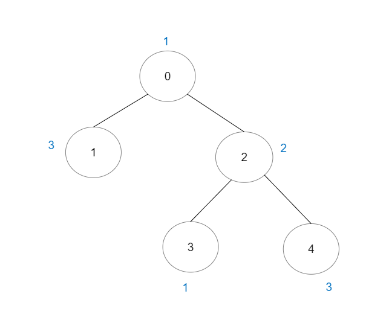

2421. Number of Good Paths

There is a tree (i.e. a connected, undirected graph with no cycles) consisting of `n` nodes numbered from `0` to `n - 1` and exactly `n - 1` edges.

You are given a **0-indexed** integer array `vals` of length `n` where `vals[i]` denotes the value of the `i`   th node. You are also given a 2D integer array `edges` where `edges[i] = [ai, bi]` denotes that there exists an **undirected** edge connecting nodes `ai` and `bi`.

A **good path** is a simple path that satisfies the following conditions:

1. The starting node and the ending node have the **same** value.
1. All nodes between the starting node and the ending node have values **less than or equal to** the starting node (i.e. the starting node's value should be the maximum value along the path).

Return the number of distinct good paths.

Note that a path and its reverse are counted as the **same** path. For example, `0 -> 1` is considered to be the same as `1 -> 0`. A single node is also considered as a valid path.

 

**Example 1:**


```
Input: vals = [1,3,2,1,3], edges = [[0,1],[0,2],[2,3],[2,4]]
Output: 6
Explanation: There are 5 good paths consisting of a single node.
There is 1 additional good path: 1 -> 0 -> 2 -> 4.
(The reverse path 4 -> 2 -> 0 -> 1 is treated as the same as 1 -> 0 -> 2 -> 4.)
Note that 0 -> 2 -> 3 is not a good path because vals[2] > vals[0].
```

**Example 2:**


```
Input: vals = [1,1,2,2,3], edges = [[0,1],[1,2],[2,3],[2,4]]
Output: 7
Explanation: There are 5 good paths consisting of a single node.
There are 2 additional good paths: 0 -> 1 and 2 -> 3.
```

**Example 3:**


```
Input: vals = [1], edges = []
Output: 1
Explanation: The tree consists of only one node, so there is one good path.
```

**Constraints:**

* `n == vals.length`
* `1 <= n <= 3 * 10^4`
* `0 <= vals[i] <= 10^5`
* `edges.length == n - 1`
* `edges[i].length == 2`
* `0 <= ai, bi < n`
* `ai != bi`
* `edges` represents a valid tree.

# Submissions
---
**Solution 1: (Union Find)**

**Intuition**

All single node are considered as a good path.
Take a look at the biggest value `maxv`
If the number of nodes with biggest value `maxv` is `k`,
then good path starting with value `maxv` is `k*(k-1)/2`,
any pair can build up a good path.
And these nodes will cut the tree into small trees.

**Explanation**

We do the "cutting" process reversely by union-find.

Firstly we initilize result `res = n`,
we union the edge with small values `v`.

Then the nodes of value `v` on one side,
can pair up with the nodes of value `v` on the other side.

We union one node into the other by union action,
and also the count of nodes with value `v`.

We reapeatly doing union action for all edges until we build up the whole tree.


**Complexity**

Time O(union-find(n))
Space O(union-find(n))

```
Runtime: 3893 ms
Memory Usage: 36.9 MB
```
```python
class Solution:
    def numberOfGoodPaths(self, vals: List[int], edges: List[List[int]]) -> int:
        res = n = len(vals)
        f = list(range(n))
        count = [Counter({vals[i]: 1}) for i in range(n)]
        edges = sorted([max(vals[i], vals[j]),i,j] for i,j in edges)

        def find(x):
            if f[x] != x:
                f[x] = find(f[x])
            return f[x]

        for v,i,j in edges:
            fi, fj = find(i), find(j)
            cj, ci = count[fi][v], count[fj][v]
            res += ci * cj
            f[fj] = fi
            count[fi] = Counter({v: ci + cj})
        return res
```
