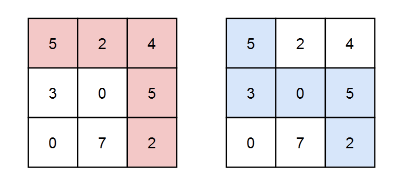

2435. Paths in Matrix Whose Sum Is Divisible by K

You are given a **0-indexed** `m x n` integer matrix `grid` and an integer `k`. You are currently at position `(0, 0)` and you want to reach position `(m - 1, n - 1)` moving only **down** or **right**.

Return the number of paths where the sum of the elements on the path is divisible by `k`. Since the answer may be very large, return it **modulo** `10^9 + 7`.

 

**Example 1:**


```
Input: grid = [[5,2,4],[3,0,5],[0,7,2]], k = 3
Output: 2
Explanation: There are two paths where the sum of the elements on the path is divisible by k.
The first path highlighted in red has a sum of 5 + 2 + 4 + 5 + 2 = 18 which is divisible by 3.
The second path highlighted in blue has a sum of 5 + 3 + 0 + 5 + 2 = 15 which is divisible by 3.
```

**Example 2:**


```
Input: grid = [[0,0]], k = 5
Output: 1
Explanation: The path highlighted in red has a sum of 0 + 0 = 0 which is divisible by 5.
```

**Example 3:**


```
Input: grid = [[7,3,4,9],[2,3,6,2],[2,3,7,0]], k = 1
Output: 10
Explanation: Every integer is divisible by 1 so the sum of the elements on every possible path is divisible by k.
```

**Constraints:**

* `m == grid.length`
* `n == grid[i].length`
* `1 <= m, n <= 5 * 104`
* `1 <= m * n <= 5 * 104`
* `0 <= grid[i][j] <= 100`
* `1 <= k <= 50`

# Submissions
---
**Solution 1: (DP Bottom-Up)**
```
Runtime: 6808 ms
Memory: 92.4 MB
```
```python
class Solution:
    def numberOfPaths(self, grid: List[List[int]], k: int) -> int:
        N = 10 ** 9 + 7
        m, n = len(grid), len(grid[0])
        dp = [[[0] * k for i in range(n+1)] for j in range(m+1)]
        dp[1][1][grid[0][0] % k] = 1
        for i in range(m):
            for j in range(n):
                for t in range(k):
                    dp[i+1][j+1][(t + grid[i][j]) % k] += (dp[i+1][j][t] + dp[i][j+1][t]) % N
        return dp[m][n][0]
```

**Solution 2: (DP Top-Down)**
```
Runtime: 4535 ms
Memory: 580.4 MB
```
```python
class Solution:
    def numberOfPaths(self, grid: List[List[int]], k: int) -> int:
        m, n = len(grid), len(grid[0])

        @functools.lru_cache(None)
        def dp(i, j, v):
            if i < 0 or j < 0:
                return 0
            nv = (v + grid[i][j]) % k
            if i == 0 and j == 0:
                if nv == 0:
                    return 1
                return 0
            return dp(i-1, j, nv) + dp(i, j-1, nv)

        return (dp(m-1, n-1, 0))%(10**9 + 7)
```

**Solution 3: (DP Top-Down)**
```
Runtime: 1490 ms
Memory: 133.7 MB
```
```c++
class Solution {
    int dirR[2] = {0,1};
	int dirC[2] = {1,0};
	long long MOD = 1e9+7;
    int getAnswer(int r, int c, int sum, vector<vector<int>>& grid, int k, vector<vector<vector<int>>>&dp)
	{
		if(r<0 || c<0 || r>=grid.size() || c>=grid[0].size())
			return 0;
		if(r == grid.size()-1 && c == grid[r].size()-1)
		{
			return (sum+grid[r][c])%k == 0;
		}

		if(dp[r][c][sum]!=-1)
			return dp[r][c][sum];

		int cnt = 0;

		for(int i=0;i<2;i++)
		{
			cnt += getAnswer(r+dirR[i], c+dirC[i], (sum+grid[r][c])%k, grid, k, dp);
			cnt%=MOD;
		}

		return dp[r][c][sum] = cnt;
	}
public:
    int numberOfPaths(vector<vector<int>>& grid, int k) {
        vector<vector<vector<int>>>dp(grid.size(), vector<vector<int>>(grid[0].size(), vector<int>(k,-1)));
		return getAnswer(0,0,0,grid,k, dp);
    }
};
```
