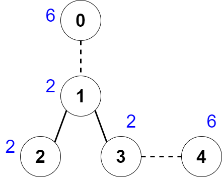

2440. Create Components With Same Value

There is an undirected tree with `n` nodes labeled from `0` to `n - 1`.

You are given a **0-indexed** integer array `nums` of length `n` where `nums[i]` represents the value of the `i`th node. You are also given a 2D integer array `edges` of length `n - 1` where `edges[i] = [ai, bi]` indicates that there is an edge between nodes `ai` and `bi` in the tree.

You are allowed to **delete** some edges, splitting the tree into multiple connected components. Let the **value** of a component be the sum of **all** `nums[i]` for which node `i` is in the component.

Return the **maximum** number of edges you can delete, such that every connected component in the tree has the same value.

 

**Example 1:**


```
Input: nums = [6,2,2,2,6], edges = [[0,1],[1,2],[1,3],[3,4]] 
Output: 2 
Explanation: The above figure shows how we can delete the edges [0,1] and [3,4]. The created components are nodes [0], [1,2,3] and [4]. The sum of the values in each component equals 6. It can be proven that no better deletion exists, so the answer is 2.
Example 2:

Input: nums = [2], edges = []
Output: 0
Explanation: There are no edges to be deleted.
```

**Constraints:**

* `1 <= n <= 2 * 10^4`
* `nums.length == n`
* `1 <= nums[i] <= 50`
* `edges.length == n - 1`
* `edges[i].length == 2`
* `0 <= edges[i][0], edges[i][1] <= n - 1`
* `edges` represents a valid tree.

# Submissions
---
**Solution 1: (post-order dfs)**
```
Runtime: 3771 ms
Memory: 43.1 MB
```
```python
class Solution:
    def componentValue(self, nums: List[int], edges: List[List[int]]) -> int:
        tree = [[] for _ in nums]
        for u, v in edges: 
            tree[u].append(v)
            tree[v].append(u)
        
        def fn(u, p):
            """Post-order dfs."""
            ans = nums[u]
            for v in tree[u]: 
                if v != p: ans += fn(v, u)
            return 0 if ans == cand else ans
        
        total = sum(nums)
        for cand in range(1, total//2+1): 
            if total % cand == 0 and fn(0, -1) == 0: return total//cand-1
        return 0 
```

**Solution 2: (DFS)**
```
Runtime: 900 ms
Memory: 144.8 MB
```
```c++
class Solution {
    int traverse(vector<int>& nums, vector<vector<int>>& next, int cur, vector<int>& temp, int target) {
        temp[cur]=nums[cur];
        for (auto n : next[cur]) {
            if (temp[n]) continue; // this condition represents that the node n has been visited.
            temp[cur]+=traverse(nums, next, n, temp, target);
            // If temp[cur]>target means that we fail the separation.
            // In this condition, we just return a very large integer.
            if (temp[cur]>target) return 1e7;
        }
        // this condition represents that the substree rooted at cur can be deleted from the tree. So, the sum of value can not add up to the parent of curent node.
        if (temp[cur]==target) return 0;
        return temp[cur];
    }
public:
    int componentValue(vector<int>& nums, vector<vector<int>>& edges) {
        int sum=0, n=nums.size();
        
        // sum of value
        for (int i=0; i<n; ++i)
            sum+=nums[i];
        
        vector<vector<int>> next(n);
        
        // create edges map
        for (auto e : edges) {
            next[e[0]].push_back(e[1]);
            next[e[1]].push_back(e[0]);
        }
        
        for (int i=n; i>1; --i) {
            if (sum%i) continue;  // there is no probability that split the tree into i part.
            vector<int> temp(n);
            if (traverse(nums, next, 0, temp, sum/i)==0) return i-1;
        }
        return 0;
    }
};
```
