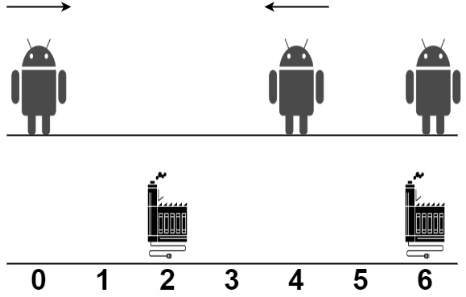

2463. Minimum Total Distance Traveled

There are some robots and factories on the X-axis. You are given an integer array `robot` where `robot[i]` is the position of the ith robot. You are also given a 2D integer array `factory` where `factory[j] = [positionj, limitj]` indicates that `positionj` is the position of the `j`th factory and that the `j`th factory can repair at most `limitj` robots.

The positions of each robot are **unique**. The positions of each factory are also **unique**. Note that a robot can be in the **same position** as a factory initially.

All the robots are initially broken; they keep moving in one direction. The direction could be the negative or the positive direction of the X-axis. When a robot reaches a factory that did not reach its limit, the factory repairs the robot, and it stops moving.

**At any moment**, you can set the initial direction of moving for **some** robot. Your target is to minimize the total distance traveled by all the robots.

Return the minimum total distance traveled by all the robots. The test cases are generated such that all the robots can be repaired.

**Note that**

* All robots move at the same speed.
* If two robots move in the same direction, they will never collide.
* If two robots move in opposite directions and they meet at some point, they do not collide. They cross each other.
* If a robot passes by a factory that reached its limits, it crosses it as if it does not exist.
* If the robot moved from a position `x` to a position `y`, the distance it moved is `|y - x|`.
 

**Example 1:**


```
Input: robot = [0,4,6], factory = [[2,2],[6,2]]
Output: 4
Explanation: As shown in the figure:
- The first robot at position 0 moves in the positive direction. It will be repaired at the first factory.
- The second robot at position 4 moves in the negative direction. It will be repaired at the first factory.
- The third robot at position 6 will be repaired at the second factory. It does not need to move.
The limit of the first factory is 2, and it fixed 2 robots.
The limit of the second factory is 2, and it fixed 1 robot.
The total distance is |2 - 0| + |2 - 4| + |6 - 6| = 4. It can be shown that we cannot achieve a better total distance than 4.
```

**Example 2:**


```
Input: robot = [1,-1], factory = [[-2,1],[2,1]]
Output: 2
Explanation: As shown in the figure:
- The first robot at position 1 moves in the positive direction. It will be repaired at the second factory.
- The second robot at position -1 moves in the negative direction. It will be repaired at the first factory.
The limit of the first factory is 1, and it fixed 1 robot.
The limit of the second factory is 1, and it fixed 1 robot.
The total distance is |2 - 1| + |(-2) - (-1)| = 2. It can be shown that we cannot achieve a better total distance than 2.
```

**Constraints:**

* `1 <= robot.length, factory.length <= 100`
* `factory[j].length == 2`
* `-109 <= robot[i], positionj <= 10^9`
* `0 <= limitj <= robot.length`
* The input will be generated such that it is always possible to repair every robot.

# Submissions
---
**Solution 1: (DP Top-Down, taken and not-taken)**
```
Runtime: 6994 ms
Memory: 445.3 MB
```
```python
class Solution:
    def minimumTotalDistance(self, robot: List[int], factory: List[List[int]]) -> int:
        robot.sort()
        factory.sort()
        
        @lru_cache(None)
        def dp(i, j, k):
            if i == len(robot): return 0
            if j == len(factory): return inf
            # not-taken
            res1 = dp(i, j + 1, 0)
            # taken
            res2 = dp(i + 1, j, k + 1) + abs(robot[i] - factory[j][0]) if factory[j][1] > k else inf
            return min(res1, res2)
        return dp(0, 0, 0)
```

**Solution 2: (DP Bottom-Up)**
```
Runtime: 691 ms
Memory: 16.82 MB
```
```python
class Solution:
    def minimumTotalDistance(self, robot: List[int], factory: List[List[int]]) -> int:
        m, n = len(robot), len(factory)
        dp = [inf] * (m + 1)
        dp[m] = 0
        robot.sort()
        factory.sort()
        for j in range(n-1,-1,-1):
            for i in range(m):
                cur = 0
                for k in range(1, min(factory[j][1], m - i) + 1):
                    cur += abs(robot[i + k - 1] - factory[j][0])
                    dp[i] = min(dp[i], dp[i + k] + cur)
        return dp[0]
```

**Solution 3: (DP Bottom-Up, taken and not-taken, flatten 3-D DP)**

dp[i][j] = the minimum total distance for assigning robots from i to robotCount - 1 using factories from j to factoryCount - 1.

robot = [0,4,6], factory = [[2,2],[6,2]]
dp:
    2 2 6 6
    0 1 2 3 4
0 0 4 4 ~ ~ ~
4 1 2 2 2 ~ ~
6 2 0 0 0 0 ~
  3 0 0 0 0 0

robot = [1,-1], factory = [[-2,1],[2,1]]
dp:
      -2 2
       0 1 2
-1  0  2 ~ ~
 1  1  3 1 ~
    0  0 0 0

```
Runtime: 58 ms
Memory: 67.61 MB
```
```c++
class Solution {
public:
    long long minimumTotalDistance(vector<int>& robot, vector<vector<int>>& factory) {
        // Sort robots and factories by position
        sort(robot.begin(), robot.end());
        sort(factory.begin(), factory.end());

        // Flatten factory positions according to their capacities
        vector<int> factoryPositions;
        for (auto& f : factory)
            for (int i = 0; i < f[1]; i++) factoryPositions.push_back(f[0]);

        int robotCount = robot.size(), factoryCount = factoryPositions.size();
        vector<vector<long long>> dp(robotCount + 1,
                                     vector<long long>(factoryCount + 1, 0));

        // Initialize base cases
        for (int i = 0; i < robotCount; i++)
            dp[i][factoryCount] = 1e12;  // No factories left

        // Fill DP table bottom-up
        for (int i = robotCount - 1; i >= 0; i--) {
            for (int j = factoryCount - 1; j >= 0; j--) {
                // Option 1: Assign current robot to current factory
                long long assign =
                    abs(robot[i] - factoryPositions[j]) + dp[i + 1][j + 1];

                // Option 2: Skip current factory for the current robot
                long long skip = dp[i][j + 1];

                dp[i][j] = min(assign, skip);  // Take the minimum option
            }
        }
        // Minimum distance starting from first robot and factory
        return dp[0][0];
    }
};
```

**Solution 4: (DP Bottom-Up, 1-D)**
```
Runtime: 27 ms
Memory: 13.12 MB
```
```c++
class Solution {
public:
    long long minimumTotalDistance(vector<int>& robot, vector<vector<int>>& factory) {
        // Sort robots and factories by position
        sort(begin(robot), end(robot));
        sort(begin(factory), end(factory));

        // Flatten factory positions according to their capacities
        vector<int> factoryPositions;
        for (auto& factory : factory) {
            for (int i = 0; i < factory[1]; i++) {
                factoryPositions.push_back(factory[0]);
            }
        }

        int robotCount = robot.size(), factoryCount = factoryPositions.size();
        vector<long long> next(factoryCount + 1, 0),
            current(factoryCount + 1, 0);

        // Fill DP table using two rows for optimization
        for (int i = robotCount - 1; i >= 0; i--) {
            // No factories left case
            if (i != robotCount - 1) next[factoryCount] = 1e12;
            // Initialize current row
            current[factoryCount] = 1e12;

            for (int j = factoryCount - 1; j >= 0; j--) {
                // Assign current robot to current factory
                long long assign =
                    abs(robot[i] - factoryPositions[j]) + next[j + 1];
                // Skip current factory for this robot
                long long skip = current[j + 1];
                // Take the minimum option
                current[j] = min(assign, skip);
            }
            // Move to next robot
            next = current;
        }
        // Return minimum distance starting from the first robot
        return current[0];
    }
};
```

**Solution 5: (DP Bottom-Up, 1-D)**
```
Runtime: 21 ms
Memory: 10.94 MB
```
```c++
class Solution {
public:
    long long minimumTotalDistance(vector<int>& robot, vector<vector<int>>& factory) {
        int m = robot.size(), n = factory.size(), i, j, k;
        long long cur;
        vector<long long> dp(m+1, 1e12);
        dp[m] = 0;
        sort(robot.begin(), robot.end());
        sort(factory.begin(), factory.end());
        for (j = n-1; j >= 0; j --) {
            for (i = 0; i < m; i ++) {
                cur = 0;
                for (k = 1; k < min(factory[j][1], m-i) + 1; k ++) {
                    cur += abs(robot[i+k-1] - factory[j][0]);
                    dp[i] = min(dp[i], dp[i+k] + cur);
                }
            }
        }
        return dp[0];
    }
};
```
