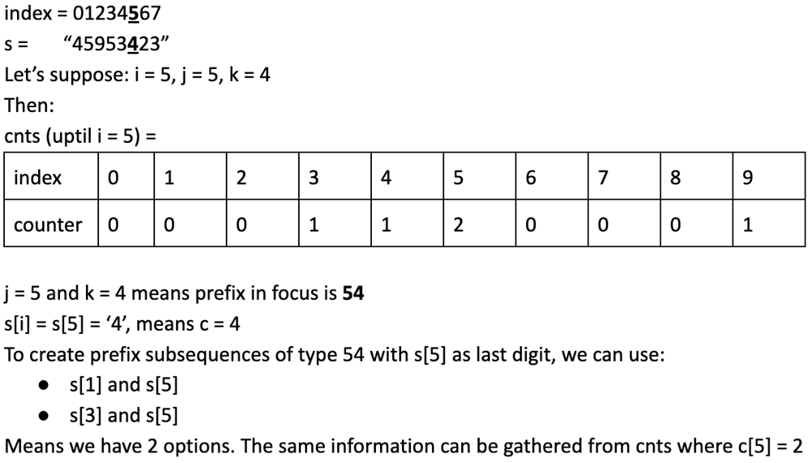

2484. Count Palindromic Subsequences

Given a string of digits `s`, return the number of **palindromic subsequence**s of `s` having length `5`. Since the answer may be very large, return it **modulo** `10^9 + 7`.

**Note:**

* A string is **palindromic** if it reads the same forward and backward.
* A **subsequence** is a string that can be derived from another string by deleting some or no characters without changing the order of the remaining characters.
 

**Example 1:**
```
Input: s = "103301"
Output: 2
Explanation: 
There are 6 possible subsequences of length 5: "10330","10331","10301","10301","13301","03301". 
Two of them (both equal to "10301") are palindromic.
```

**Example 2:**
```
Input: s = "0000000"
Output: 21
Explanation: All 21 subsequences are "00000", which is palindromic.
```

**Example 3:**
```
Input: s = "9999900000"
Output: 2
Explanation: The only two palindromic subsequences are "99999" and "00000".
```

**Constraints:**

* `1 <= s.length <= 10^4`
* `s` consists of digits.

# Submissions
---
**Solution 1: (DP Bottom-Up)**

**Intuition**

To create a 5 digit palindrome we do not need to care about the middle element. We just need to find subsequence of pattern XY_YX. Calculate number of subsequences of type XY and subsequences of type YX around any given point i and multiply them to find number of subsequences of type XY_YX. Since string only has digits, the time complexity will be 100\*n.

**Approach**

We will be maintaing the counts of digit in the list cnts
Keep 2 arrays pre and suf to store the number of prefixes of type XY and suffixes of type YX. pre[i-1][1][2] means prefixes of type 12 before index i. Similarly suf[i+1][1][2] means suffixes of type 21 after index i
Remember given string is made of digits that is 0123456789. That's a total of 10 unique characters
Once we have calculated the prefix and suffix lists we just need to multiply pre[i - 1][j][k] with suf[i + 1][j][k] to find number of palindromic subsequences
```
    for (int i = 0; i < n; i++) {
        int c = s[i] - '0';
        if (i) {
            for (int j = 0; j < 10; j++)
                for (int k = 0; k < 10; k++) {
                    pre[i][j][k] = pre[i - 1][j][k];
                    if (k == c) pre[i][j][k] += cnts[j];
                }
        }
        cnts[c]++;
    }
```
Explanation of above code:
Use if (i) to not step outside of array limits when accessing pre[i-1]
Let's say j = 5, k = 4 and c = 4 which means we are looking at prefix 54. pre[i][j][k] = pre[i - 1][j][k] will carry forward previous count of prefixes. Since k == c means the current character(s[i]) matches with last digit of prefix. To find total number of possibilites of prefixes of type 54 we need to know how many 5 exist before current index. This information is stored in cnts[5]. So we add cnts[5] to pre[i][5][4].



**Complexity**

* Time complexity: O(n)

* Space complexity: O(n)

```
Runtime: 2223 ms
Memory: 52.5 MB
```
```python
class Solution:
    def countPalindromes(self, s: str) -> int:
        mod, n, ans = 10 ** 9 + 7, len(s), 0
        pre, cnts = [[[0] * 10 for _ in range(10)] for _ in range(n)], [0] * 10
        for i in range(n):
            c = ord(s[i]) - ord('0')
            if i:
                for j in range(10):
                    for k in range(10):
                        pre[i][j][k] = pre[i - 1][j][k] 
                        if k == c: pre[i][j][k] += cnts[j]
            cnts[c] += 1
        suf, cnts = [[[0] * 10 for _ in range(10)] for _ in range(n)], [0] * 10
        for i in range(n - 1, -1, -1):
            c = ord(s[i]) - ord('0')
            if i < n - 1:
                for j in range(10):
                    for k in range(10):
                        suf[i][j][k] = suf[i + 1][j][k]
                        if k == c: suf[i][j][k] += cnts[j]
            cnts[c] += 1
        for i in range(2, n - 2):
            for j in range(10):
                for k in range(10):
                    ans += pre[i - 1][j][k] * suf[i + 1][j][k]
        return ans % mod
```

**Solution 2: (DP Bottom-Up)**
```
Runtime: 80 ms
Memory: 15.3 MB
```
```c++
class Solution {
    int pre[10000][10][10], suf[10000][10][10], cnts[10] = {};
public:
    int countPalindromes(string s) {
        int mod = 1e9 + 7, n = s.size(), ans = 0;
        for (int i = 0; i < n; i++) {
            int c = s[i] - '0';
            if (i)
                for (int j = 0; j < 10; j++)
                    for (int k = 0; k < 10; k++) {
                        pre[i][j][k] = pre[i - 1][j][k];
                        if (k == c) pre[i][j][k] += cnts[j];
                    }
            cnts[c]++;
        }
        memset(cnts, 0, sizeof(cnts));
        for (int i = n - 1; i >= 0; i--) {
            int c = s[i] - '0';
            if (i < n - 1)
                for (int j = 0; j < 10; j++)
                    for (int k = 0; k < 10; k++) {
                        suf[i][j][k] = suf[i + 1][j][k];
                        if (k == c) suf[i][j][k] += cnts[j];
                    }
            cnts[c]++;
        }
        for (int i = 2; i < n - 2; i++)
            for (int j = 0; j < 10; j++)
                for (int k = 0; k < 10; k++)
                    ans = (ans + 1LL * pre[i - 1][j][k] * suf[i + 1][j][k]) % mod;
        return ans;
    }
};
```
