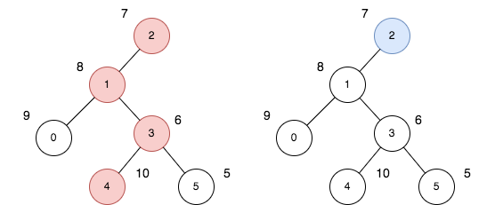

2538. Difference Between Maximum and Minimum Price Sum

There exists an undirected and initially unrooted tree with `n` nodes indexed from `0` to `n - 1`. You are given the integer `n` and a 2D integer array `edges` of length `n - 1`, where `edges[i] = [ai, bi]` indicates that there is an edge between nodes `ai` and `bi` in the tree.

Each node has an associated price. You are given an integer array `price`, where `price[i]` is the price of the `i`th node.

The **price sum** of a given path is the sum of the prices of all nodes lying on that path.

The tree can be rooted at any node `root` of your choice. The incurred **cost** after choosing `root` is the difference between the maximum and minimum **price sum** amongst all paths starting at `root`.

Return the **maximum** possible **cost** amongst all possible root choices.

 

**Example 1:**


```
Input: n = 6, edges = [[0,1],[1,2],[1,3],[3,4],[3,5]], price = [9,8,7,6,10,5]
Output: 24
Explanation: The diagram above denotes the tree after rooting it at node 2. The first part (colored in red) shows the path with the maximum price sum. The second part (colored in blue) shows the path with the minimum price sum.
- The first path contains nodes [2,1,3,4]: the prices are [7,8,6,10], and the sum of the prices is 31.
- The second path contains the node [2] with the price [7].
The difference between the maximum and minimum price sum is 24. It can be proved that 24 is the maximum cost.
```

**Example 2:**


```
Input: n = 3, edges = [[0,1],[1,2]], price = [1,1,1]
Output: 2
Explanation: The diagram above denotes the tree after rooting it at node 0. The first part (colored in red) shows the path with the maximum price sum. The second part (colored in blue) shows the path with the minimum price sum.
- The first path contains nodes [0,1,2]: the prices are [1,1,1], and the sum of the prices is 3.
- The second path contains node [0] with a price [1].
The difference between the maximum and minimum price sum is 2. It can be proved that 2 is the maximum cost.
```

**Constraints:**

* `1 <= n <= 10^5`
* `edges.length == n - 1`
* `0 <= ai, bi <= n - 1`
* `edges` represents a valid tree.
* `price.length == n`
* `1 <= price[i] <= 10^5`

# Submissions
---
**Solution 1: (DFS + MEMO)**
```
Runtime: 2562 ms
Memory: 214.5 MB
```
```python
class Solution:
    def maxOutput(self, n: int, edges: List[List[int]], price: List[int]) -> int:
        g = defaultdict(list)
        for u, v in edges:
            g[u] += [v]
            g[v] += [u]
        
        @cache
        def find_max(cur, prev):
            res = price[cur]
            for ncur in g[cur]:
                if ncur == prev:
                    continue
                res = max(res, price[cur] + find_max(ncur, cur))
            return res
        
        res = 0
        for i in range(n):
            for ni in g[i]:
                res = max(res, find_max(ni, i))
        
        return res
```
