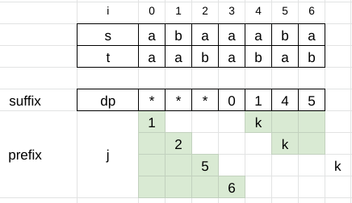

2565. Subsequence With the Minimum Score

You are given two strings `s` and `t`.

You are allowed to remove any number of characters from the string `t`.

The score string is `0` if no characters are removed from the string `t`, otherwise:

* Let `left` be the minimum index among all removed characters.
* Let `right` be the maximum index among all removed characters.

Then the score of the string is `right - left + 1`.

Return the minimum possible score to make `t` a subsequence of `s`.

A **subsequence** of a string is a new string that is formed from the original string by deleting some (can be none) of the characters without disturbing the relative positions of the remaining characters. (i.e., `"ace"` is a subsequence of `"abcde"` while `"aec"` is not).

 

**Example 1:**
```
Input: s = "abacaba", t = "bzaa"
Output: 1
Explanation: In this example, we remove the character "z" at index 1 (0-indexed).
The string t becomes "baa" which is a subsequence of the string "abacaba" and the score is 1 - 1 + 1 = 1.
It can be proven that 1 is the minimum score that we can achieve.
```

**Example 2:**
```
Input: s = "cde", t = "xyz"
Output: 3
Explanation: In this example, we remove characters "x", "y" and "z" at indices 0, 1, and 2 (0-indexed).
The string t becomes "" which is a subsequence of the string "cde" and the score is 2 - 0 + 1 = 3.
It can be proven that 3 is the minimum score that we can achieve.
```

**Constraints:**

* `1 <= s.length, t.length <= 10^5`
* `s` and `t` consist of only lowercase English letters.

# Submissions
---
**Solution 1: (Right and Left O(n))**

Based on the problem description, we need to find the longest prefix + suffix of t that is a subsequence of s.

We first match t starting from the right.

For each matched character in t, we remember the corresponding point in s in the dp array. This is our suffix.

Then we go left-to-right building our prefix. For each prefix, we determine the longest suffix using dp.



```
Runtime: 14 ms
Memory: 10.1 MB
```
```c++
class Solution {
public:
    int minimumScore(string s, string t) {
        int ss = s.size(), st = t.size(), k = st - 1;
        vector<int> dp(st, -1);
        for (int i = ss - 1; i >= 0 && k >= 0; --i)
            if (s[i] == t[k])
                dp[k--] = i;
        int res = k + 1;
        for (int i = 0, j = 0; i < ss && j < st && res > 0; ++i)
            if (s[i] == t[j]) {
                for (; k < t.size() && dp[k] <= i; ++k);
                res = min(res, k - (++j));
            }
        return res;
    }
};
```

**Solution 2: (Right and Left O(n))**

    min score = right - left + 1
                -> t match most prefix and suffix of s, and prefix < suffix


            vi                         
s        a  b  a  c  a  b  a
         vj    vk       
t        b  z  a  a
left     1
right   -1 -1  4  6


         0  1  2  3  4  5  6                      
               vi    <-
s        a  b  a  a  a  b  a
               vj    <-
         vk ->       vj ->  
t        a  a  b  a  b  a  b
right   -1 -1 -1  0  1  4  5
left     0           4
            2           5
               5             7
         -------     ---------
            i            i
          prefix       suffix   
```
Runtime: 3 ms, Beats 84.62%
Memory: 13.83 MB, Beats 80.77%
```
```c++
class Solution {
public:
    int minimumScore(string s, string t) {
        int m = s.size(), n = t.size(), i, j = n - 1, k;
        vector<int> right(n, -1);
        for (i = m - 1; i >= 0 && j >= 0; i --) {
            if (s[i] == t[j]) {
                right[j] = i;
                j -= 1;
            }
        }
        int ans = j + 1;
        for (i = 0, k = 0; i < m && k < n && ans > 0; i ++) {
            if (s[i] == t[k]) {
                while (j < n && right[j] <= i) {
                    j += 1;
                }
                k += 1;
                ans = min(ans, j - k);
            }
        }
        return ans;

    }
};
```
