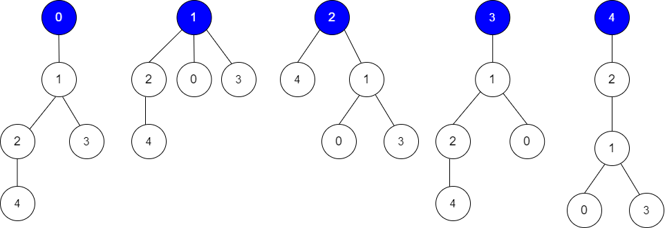
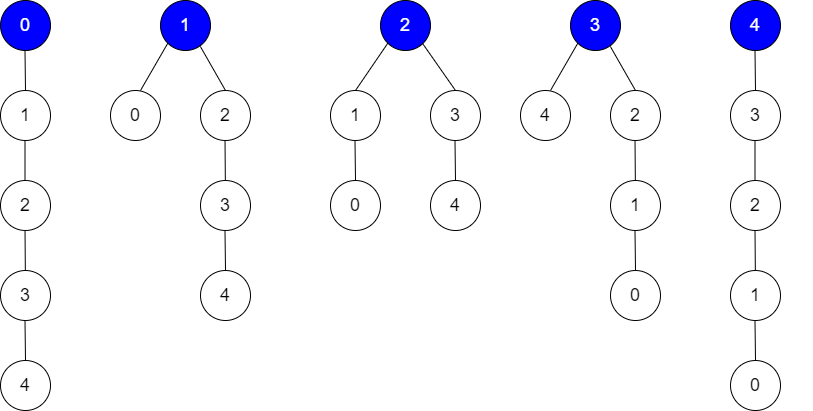

2581. Count Number of Possible Root Nodes

Alice has an undirected tree with n nodes labeled from `0` to `n - 1`. The tree is represented as a 2D integer array edges of length `n - 1` where `edges[i] = [ai, bi]` indicates that there is an edge between nodes `ai` and `bi` in the tree.

Alice wants Bob to find the root of the tree. She allows Bob to make several **guesses** about her tree. In one guess, he does the following:

* Chooses two **distinct** integers `u` and `v` such that there exists an edge `[u, v]` in the tree.
* He tells Alice that `u` is the **parent** of `v` in the tree.

Bob's guesses are represented by a 2D integer array `guesses` where `guesses[j] = [uj, vj]` indicates Bob guessed `uj` to be the parent of `vj`.

Alice being lazy, does not reply to each of Bob's guesses, but just says that **at least** `k` of his guesses are `true`.

Given the 2D integer arrays `edges`, `guesses` and the integer `k`, return the **number of possible nodes** that can be the root of Alice's tree. If there is no such tree, return `0`.

 

**Example 1:**


```
Input: edges = [[0,1],[1,2],[1,3],[4,2]], guesses = [[1,3],[0,1],[1,0],[2,4]], k = 3
Output: 3
Explanation: 
Root = 0, correct guesses = [1,3], [0,1], [2,4]
Root = 1, correct guesses = [1,3], [1,0], [2,4]
Root = 2, correct guesses = [1,3], [1,0], [2,4]
Root = 3, correct guesses = [1,0], [2,4]
Root = 4, correct guesses = [1,3], [1,0]
Considering 0, 1, or 2 as root node leads to 3 correct guesses.
```

**Example 2:**


```
Input: edges = [[0,1],[1,2],[2,3],[3,4]], guesses = [[1,0],[3,4],[2,1],[3,2]], k = 1
Output: 5
Explanation: 
Root = 0, correct guesses = [3,4]
Root = 1, correct guesses = [1,0], [3,4]
Root = 2, correct guesses = [1,0], [2,1], [3,4]
Root = 3, correct guesses = [1,0], [2,1], [3,2], [3,4]
Root = 4, correct guesses = [1,0], [2,1], [3,2]
Considering any node as root will give at least 1 correct guess. 
```
 

**Constraints:**

* `edges.length == n - 1`
* `2 <= n <= 10^5`
* `1 <= guesses.length <= 10^5`
* `0 <= ai, bi, uj, vj <= n - 1`
* `ai != bi`
* `uj != vj`
* `edges` represents a valid tree.
* `guesses[j]` is an edge of the tree.
* `guesses` is unique.
* `0 <= k <= guesses.length`

# Submissions
---
**Solution 1: (Tree Based DP, DP Top-Down, Time:O(N), Space: O(N))**
```
Runtime: 2514 ms
Memory: 226.7 MB
```
```python
class Solution:
    def rootCount(self, edges: List[List[int]], guesses: List[List[int]], k: int) -> int:
        n = len(edges) + 1
        h = set(tuple(x) for x in guesses)
        g = [[] for _ in range(n)]
        for a, b in edges:
            g[a].append(b)
            g[b].append(a)

        @cache
        def rec(p, pp):
            r = 0
            for q in g[p]:
                if q == pp: continue
                if (p, q) in h:
                    r += 1
                r += rec(q, p)
            return r
        
        r = 0
        for i in range(n):
            if rec(i, i) >= k:
                r += 1
        return r
```

**Solution 2: (Tree Based DP, DP Top-Down, Time:O(N), Space: O(N))**
```
Runtime: 1213 ms
Memory: 356.7 MB
```
```c++
class Solution {
    int dfs(int node, int parent, vector<vector<int>>& adjacency, unordered_map<int, unordered_map<int, int>>& edge2validCnt, unordered_map<int, unordered_set<int>>& validEdge) {
        if (edge2validCnt.find(parent) != edge2validCnt.end() && edge2validCnt[parent].find(node) != edge2validCnt[parent].end()) {
            return edge2validCnt[parent][node];
        }
        int count = 0;
        if (validEdge.find(parent) != validEdge.end() && validEdge[parent].find(node) != validEdge[parent].end()) {
            count++;
        }
        for (auto& neighbor : adjacency[node]) {
            if (neighbor == parent) continue;
            count += dfs(neighbor, node, adjacency, edge2validCnt, validEdge);
        }
        return edge2validCnt[parent][node] = count;
    }
public:
    int rootCount(vector<vector<int>>& edges, vector<vector<int>>& guesses, int k) {
        int n = edges.size() + 1;
        vector<vector<int>> adjacency(n);
        for (auto& edge: edges) {
            adjacency[edge[0]].push_back(edge[1]);
            adjacency[edge[1]].push_back(edge[0]);
        }
        unordered_map<int, unordered_set<int>> validEdge; // parent -> children
        for (auto& guess : guesses) {
            validEdge[guess[0]].insert(guess[1]);
        }
        
        unordered_map<int, unordered_map<int, int>> edge2validCnt;
        int res = 0;
        for (int i = 0; i < n; ++i) {
            int count = dfs(i, -1, adjacency, edge2validCnt, validEdge);
            if (count >= k) res++;
        }
        return res;
    }
};
```
