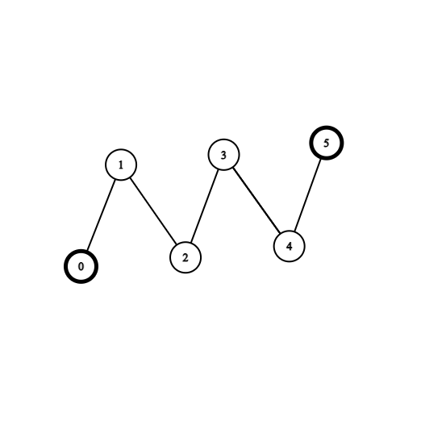
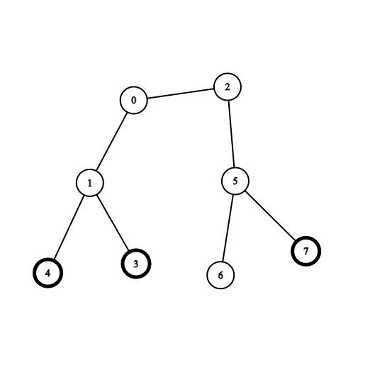

2603. Collect Coins in a Tree

There exists an undirected and unrooted tree with `n` nodes indexed from `0` to `n - 1`. You are given an integer `n` and a 2D integer array `edges` of length `n - 1`, where `edges[i] = [ai, bi]` indicates that there is an edge between nodes `ai` and `bi` in the tree. You are also given an array `coins` of size `n` where `coins[i]` can be either `0` or `1`, where `1` indicates the presence of a coin in the vertex `i`.

Initially, you choose to start at any vertex in the tree. Then, you can perform the following operations any number of times: 

* Collect all the coins that are at a distance of at most 2 from the current vertex, or
* Move to any adjacent vertex in the tree.

Find the minimum number of edges you need to go through to collect all the coins and go back to the initial vertex.

Note that if you pass an edge several times, you need to count it into the answer several times.

 

**Example 1:**


```
Input: coins = [1,0,0,0,0,1], edges = [[0,1],[1,2],[2,3],[3,4],[4,5]]
Output: 2
Explanation: Start at vertex 2, collect the coin at vertex 0, move to vertex 3, collect the coin at vertex 5 then move back to vertex 2.
```

**Example 2:**


```
Input: coins = [0,0,0,1,1,0,0,1], edges = [[0,1],[0,2],[1,3],[1,4],[2,5],[5,6],[5,7]]
Output: 2
Explanation: Start at vertex 0, collect the coins at vertices 4 and 3, move to vertex 2,  collect the coin at vertex 7, then move back to vertex 0.
```

**Constraints:**

* `n == coins.length`
* `1 <= n <= 3 * 10^4`
* `0 <= coins[i] <= 1`
* `edges.length == n - 1`
* `edges[i].length == 2`
* `0 <= ai, bi < n`
* `ai != bi`
* `edges represents a valid tree`.

# Submissions
---
**Solution 1: (trim the tree)**

Trim the tree by

1. removing leaves with no coins
2. removing leaves twice

```
Runtime: 2110 ms
Memory: 30.6 MB
```
```python
class Solution:
    def collectTheCoins(self, coins: List[int], edges: List[List[int]]) -> int:
        n = len(coins)
        tree = [set() for _ in range(n)]
        for u, v in edges: 
            tree[u].add(v)
            tree[v].add(u)
        leaf = deque()
        for u in range(n):
            while len(tree[u]) == 1 and not coins[u]: 
                v = tree[u].pop()
                tree[v].remove(u)
                u = v 
            if len(tree[u]) == 1: leaf.append(u)
        for _ in range(2): 
            for _ in range(len(leaf)): 
                u = leaf.popleft()
                if tree[u]: 
                    v = tree[u].pop()
                    tree[v].remove(u)
                    if len(tree[v]) == 1: leaf.append(v)
        return sum(len(tree[u]) for u in range(n))
```
