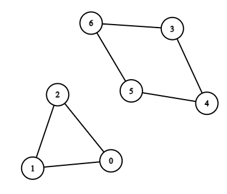
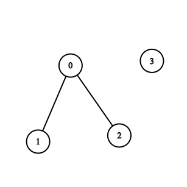

2608. Shortest Cycle in a Graph

There is a **bi-directiona**l graph with `n` vertices, where each vertex is labeled from `0` to `n - 1`. The edges in the graph are represented by a given 2D integer array `edges`, where `edges[i] = [ui, vi]` denotes an edge between vertex `ui` and vertex `vi`. Every vertex pair is connected by at most one edge, and no vertex has an edge to itself.

Return the length of the **shortest** cycle in the graph. If no cycle exists, return `-1`.

A cycle is a path that starts and ends at the same node, and each edge in the path is used only once.

 

**Example 1:**


```
Input: n = 7, edges = [[0,1],[1,2],[2,0],[3,4],[4,5],[5,6],[6,3]]
Output: 3
Explanation: The cycle with the smallest length is : 0 -> 1 -> 2 -> 0 
```

**Example 2:**


```
Input: n = 4, edges = [[0,1],[0,2]]
Output: -1
Explanation: There are no cycles in this graph.
```

**Constraints:**

* `2 <= n <= 1000`
* `1 <= edges.length <= 1000`
* `edges[i].length == 2`
* `0 <= ui, vi < n`
* `ui != vi`
* There are no repeated edges.

# Submissions
---
**Solution 1: (BFS, try every vertex)**
```
Runtime: 1305 ms
Memory: 14.4 MB
```
```python
class Solution:
    def findShortestCycle(self, n: int, edges: List[List[int]]) -> int:
        G = [[] for _ in range(n)]
        for i, j in edges:
            G[i].append(j)
            G[j].append(i)
        def root(i):
            dis = [inf] * n
            dis[i] = 0
            bfs = [i]
            for i in bfs:
                for j in G[i]:
                    if dis[j] == inf:
                        dis[j] = 1 + dis[i]
                        bfs.append(j)
                    elif dis[i] <= dis[j]:
                        return dis[i] + dis[j] + 1
            return inf
        res = min(map(root, range(n)))
        return res if res < inf else -1
```

**Solution 2: (BFS, level order, try every vertex)**
```
Runtime: 116 ms, Beats 95.44%
Memory: 53.77 MB, Beats 95.03%
```
```c++
class Solution {
public:
    int findShortestCycle(int n, vector<vector<int>>& edges) {
        int i, j, k, sz, cur, ans = INT_MAX;
        vector<vector<int>> g(n);
        vector<int> dist(n, -1);
        for (auto &e: edges) {
            g[e[0]].push_back(e[1]);
            g[e[1]].push_back(e[0]);
        }
        for (i = 0; i < n; i ++) {
            queue<int> q;
            dist[i] = 0;
            k = 0;
            cur = INT_MAX;
            q.push(i);
            while (q.size()) {
                sz = q.size();
                for (j = 0; j < sz; j ++) {
                    auto u = q.front();
                    q.pop();
                    for (auto &v: g[u]) {
                        if (dist[v] == -1) {
                            dist[v] = k + 1;
                            q.push(v);
                        } else if (dist[v] >= k) {
                            cur = min(cur, k + 1 + dist[v]);
                            break;
                        }
                    }
                }
                if (cur != INT_MAX) {
                    break;
                }
                k += 1;
            }
            ans = min(ans, cur);
            fill(dist.begin(), dist.end(), -1);
        }
        return ans != INT_MAX ? ans : -1;
    }
};
```
