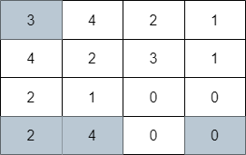

2617. Minimum Number of Visited Cells in a Grid

You are given a **0-indexed** `m x n` integer matrix `grid`. Your initial position is at the **top-left** cell `(0, 0)`.

Starting from the cell `(i, j)`, you can move to one of the following cells:

* Cells `(i, k)` with `j < k <= grid[i][j] + j` (rightward movement), or
* Cells `(k, j)` with `i < k <= grid[i][j] + i` (downward movement).

Return the minimum number of cells you need to visit to reach the **bottom-right** cell `(m - 1, n - 1)`. If there is no valid path, return `-1`.

 

**Example 1:**


```
Input: grid = [[3,4,2,1],[4,2,3,1],[2,1,0,0],[2,4,0,0]]
Output: 4
Explanation: The image above shows one of the paths that visits exactly 4 cells.
```

**Example 2:**


```
Input: grid = [[3,4,2,1],[4,2,1,1],[2,1,1,0],[3,4,1,0]]
Output: 3
Explanation: The image above shows one of the paths that visits exactly 3 cells.
```

**Example 3:**


```
Input: grid = [[2,1,0],[1,0,0]]
Output: -1
Explanation: It can be proven that no path exists.
```

**Constraints:**

* `m == grid.length`
* `n == grid[i].length`
* `1 <= m, n <= 10^5`
* `1 <= m * n <= 10^5`
* `0 <= grid[i][j] < m * n`
* `grid[m - 1][n - 1] == 0`

# Submissions
---
**Solution 1: (BFS with Skip Ahead)**
```
Runtime: 382 ms
Memory: 134.8 MB
```
```c++
class Solution {
public:
    int minimumVisitedCells(vector<vector<int>>& grid) {
        int m = grid.size(), n = grid[0].size(), steps = 0;
        vector<int> max_i(n), max_j(m);
        vector<pair<int, int>> q{{0, 0}}, q1;
        while (!q.empty()) {
            ++steps;
            for (auto [i, j] : q) {
                if (i == m - 1 && j == n - 1)
                    return steps;
                for (int k = max(max_i[j], i) + 1; k < m && k - i <= grid[i][j]; ++k)
                    q1.push_back({k, j});
                for (int k = max(max_j[i], j) + 1; k < n && k - j <= grid[i][j]; ++k)
                    q1.push_back({i, k});
                max_i[j] = max(max_i[j], i + grid[i][j]);
                max_j[i] = max(max_j[i], j + grid[i][j]);
            }
            swap(q, q1);
            q1.clear();
        }
        return -1;
    }
};
```
