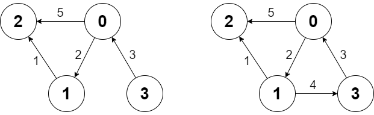

2642. Design Graph With Shortest Path Calculator

There is a directed weighted graph that consists of n nodes numbered from 0 to n - 1. The edges of the graph are initially represented by the given array edges where edges[i] = [fromi, toi, edgeCosti] meaning that there is an edge from fromi to toi with the cost edgeCosti.

Implement the `Graph` class:

* `Graph(int n, int[][] edges)` initializes the object with `n` nodes and the given edges.
* `addEdge(int[] edge)` adds an edge to the list of `edges` where `edge = [from, to, edgeCost]`. It is guaranteed that there is no edge between the two nodes before adding this one.
* `int shortestPath(int node1, int node2)` returns the minimum cost of a path from `node1` to `node2`. If no path exists, return `-1`. The cost of a path is the sum of the costs of the edges in the path.
 

**Example 1:**


```
Input
["Graph", "shortestPath", "shortestPath", "addEdge", "shortestPath"]
[[4, [[0, 2, 5], [0, 1, 2], [1, 2, 1], [3, 0, 3]]], [3, 2], [0, 3], [[1, 3, 4]], [0, 3]]
Output
[null, 6, -1, null, 6]

Explanation
Graph g = new Graph(4, [[0, 2, 5], [0, 1, 2], [1, 2, 1], [3, 0, 3]]);
g.shortestPath(3, 2); // return 6. The shortest path from 3 to 2 in the first diagram above is 3 -> 0 -> 1 -> 2 with a total cost of 3 + 2 + 1 = 6.
g.shortestPath(0, 3); // return -1. There is no path from 0 to 3.
g.addEdge([1, 3, 4]); // We add an edge from node 1 to node 3, and we get the second diagram above.
g.shortestPath(0, 3); // return 6. The shortest path from 0 to 3 now is 0 -> 1 -> 3 with a total cost of 2 + 4 = 6.
```

**Constraints:**

* `1 <= n <= 100`
* `0 <= edges.length <= n * (n - 1)`
* `edges[i].length == edge.length == 3`
* `0 <= fromi, toi, from, to, node1, node2 <= n - 1`
* `1 <= edgeCosti, edgeCost <= 10^6`
* There are no repeated edges and no self-loops in the graph at any point.
* At most `100` calls will be made for `addEdge`.
* At most `100` calls will be made for `shortestPath`.

# Submissions
---
**Solution 1: (Dijkstra)**
```
Runtime: 1192 ms
Memory: 17.1 MB
```
```python
class Graph:

    def __init__(self, n: int, edges: List[List[int]]):
        self.g = [[] for _ in range(n)]
        for f, t, c in edges:
            self.g[f] += [[t, c]]

    def addEdge(self, edge: List[int]) -> None:
        self.g[edge[0]] += [[edge[1], edge[2]]]

    def shortestPath(self, node1: int, node2: int) -> int:
        hq = [[0, node1]]
        seen = set()
        while hq:
            c, v = heapq.heappop(hq)
            if v in seen:
                continue
            if v == node2:
                return c
            seen.add(v)
            for nv, nc in self.g[v]:
                heapq.heappush(hq, [c+nc, nv])
        return -1


# Your Graph object will be instantiated and called as such:
# obj = Graph(n, edges)
# obj.addEdge(edge)
# param_2 = obj.shortestPath(node1,node2)
```

**Solution 2: (Dijkstra)**
```
Runtime: 204 ms
Memory: 86.3 MB
```
```c++
class Graph {
    typedef long long ll;
    vector<vector<pair<int, int>>> G;
    int n;
public:
    Graph(int n, vector<vector<int>>& edges) {
        this -> n = n;
        G.resize(n);
        for(auto& e : edges) G[e[0]].push_back({e[1], e[2]});
    }
    
    void addEdge(vector<int> edge) {
        G[edge[0]].push_back({edge[1], edge[2]});
    }
    
    int shortestPath(int node1, int node2) {
        // Dijktra's algo
        priority_queue<pair<ll, int>, vector<pair<ll, int>>, greater<pair<ll, int>>> pq;
        pq.push({0, node1});
        
        vector<int> dist(n, INT_MAX);
        dist[node1] = 0;
        
        while(!pq.empty()) {
            auto [d, u] = pq.top(); pq.pop();
            if(u == node2) return d;
            if(dist[u] < d) continue;
            for(auto [v, wt] : G[u]) {
               if(dist[v] > dist[u] + wt) {
                    pq.push({d + wt, v});
                    dist[v] = d + wt;
               }
            } 
        }
        
        return -1;
    }
};

/**
 * Your Graph object will be instantiated and called as such:
 * Graph* obj = new Graph(n, edges);
 * obj->addEdge(edge);
 * int param_2 = obj->shortestPath(node1,node2);
 */
```
