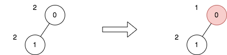

2646. Minimize the Total Price of the Trips

There exists an undirected and unrooted tree with `n` nodes indexed from `0` to `n - 1`. You are given the integer `n` and a 2D integer array `edges` of length `n - 1`, where `edges[i] = [ai, bi]` indicates that there is an edge between nodes `ai` and `bi` in the tree.

Each node has an associated pricex. You are given an integer array `price`, where `price[i]` is the price of the ith node.

The **price sum** of a given path is the sum of the prices of all nodes lying on that path.

Additionally, you are given a 2D integer array `trips`, where `trips[i] = [starti, endi]` indicates that you start the `i`th trip from the node `starti` and travel to the node `endi` by any path you like.

Before performing your first trip, you can choose some **non-adjacent** nodes and halve the prices.

Return the minimum total price sum to perform all the given trips.

 

**Example 1:**


```
Input: n = 4, edges = [[0,1],[1,2],[1,3]], price = [2,2,10,6], trips = [[0,3],[2,1],[2,3]]
Output: 23
Explanation: The diagram above denotes the tree after rooting it at node 2. The first part shows the initial tree and the second part shows the tree after choosing nodes 0, 2, and 3, and making their price half.
For the 1st trip, we choose path [0,1,3]. The price sum of that path is 1 + 2 + 3 = 6.
For the 2nd trip, we choose path [2,1]. The price sum of that path is 2 + 5 = 7.
For the 3rd trip, we choose path [2,1,3]. The price sum of that path is 5 + 2 + 3 = 10.
The total price sum of all trips is 6 + 7 + 10 = 23.
It can be proven, that 23 is the minimum answer that we can achieve.
```

**Example 2:**


```
Input: n = 2, edges = [[0,1]], price = [2,2], trips = [[0,0]]
Output: 1
Explanation: The diagram above denotes the tree after rooting it at node 0. The first part shows the initial tree and the second part shows the tree after choosing node 0, and making its price half.
For the 1st trip, we choose path [0]. The price sum of that path is 1.
The total price sum of all trips is 1. It can be proven, that 1 is the minimum answer that we can achieve.
```

**Constraints:**

* `1 <= n <= 50`
* `edges.length == n - 1`
* `0 <= ai, bi <= n - 1`
* `edges represents a valid tree.`
* `price.length == n`
* `price[i]` is an even integer.
* `1 <= price[i] <= 1000`
* `1 <= trips.length <= 100`
* `0 <= starti, endi <= n - 1`

# Submissions
---
**Solution 1: (DFS + DP)**
```
Runtime: 286 ms
Memory: 14.7 MB
```
```python
class Solution:
    def minimumTotalPrice(self, n: int, edges: List[List[int]], price: List[int], trips: List[List[int]]) -> int:
        # Creating the undirected graph
        graph = defaultdict(list)
        for a,b in edges:
            graph[a].append(b)
            graph[b].append(a)
        # Use this counter to count how many time each node are used for all paths.
        count = Counter()
        # The totalCost if we don't reduce any node cost to half
        totalCost = 0
        # dfs to find the path from start node to end node.
        # Add the cost to total cost for each node on the path.
        # Also keep counting how many times each node are used for all paths in trips.
        # Since it is an undirected tree, even though there are no cycles, we can still travel back from the parent node. So keep the parent to avoid going backward of the tree.
        def dfs(node,par,end):
            nonlocal count
            nonlocal totalCost
            if node == end:
                return True
            
            for nei in graph[node]:
                if nei != par:
                    if dfs(nei, node, end):
                        count[nei] += 1
                        totalCost += price[nei]
                        return True
            return False

        # For each trip, we compute the path and update the totalCost, and count how many times each node is being used. 
        for start,end in trips:
            count[start] += 1
            totalCost += price[start]
            dfs(start,None,end)
        
        # The dp function to find the optimal combination of which node should be reduced.
        @cache
        def dp(node, par, canReduce):
            if canReduce:
                res = (price[node]//2)*count[node]
            else:
                res = 0
            red = 0
            for nei in graph[node]:
                if nei != par:
                	# if the cost of the current node can be reduced, we have only one option moving forward => do not reduce
                    if canReduce:
                        cur = dp(nei, node, False)
                    # if the cost of the current node can not be reduced, we have two options, either reduce it for the neighbor node or don't reduce it for the neighbor node.
                    else:
                        cur = max(dp(nei, node, False), dp(nei, node, True))
                    red += cur
            return res + red
        
        # We find the maximum reduction using the dp function.
        reduce = 0
        for i in range(n):
            reduce = max( reduce, dp(i, None, True), dp(i, None, False) )
        
        # reduce the total cost
        return totalCost - reduce
```
