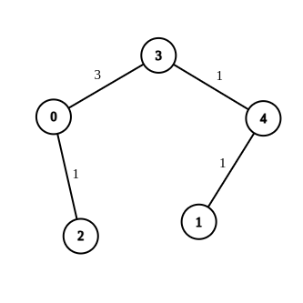
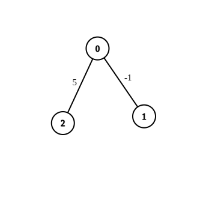
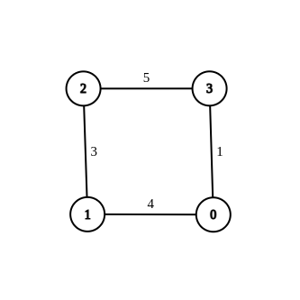

2699. Modify Graph Edge Weights


You are given an **undirected weighted connected** graph containing n nodes labeled from `0` to `n - 1`, and an integer array `edges` where `edges[i] = [ai, bi, wi]` indicates that there is an edge between nodes `ai` and `bi` with weight `wi`.

Some edges have a weight of `-1` (`wi = -1`), while others have a **positive** weight (`wi > 0`).

Your task is to modify **all edges** with a weight of `-1` by assigning them **positive integer values** in the range `[1, 2 * 10^9]` so that the shortest distance between the nodes `source` and `destination` becomes equal to an integer `target`. If there are **multiple** modifications that make the shortest distance between `source` and `destination` equal to target, any of them will be considered correct.

Return an array containing all edges (even unmodified ones) in any order if it is possible to make the shortest distance from `source` to `destination` equal to `target`, or an **empty array** if it's impossible.

**Note:** You are not allowed to modify the weights of edges with initial positive weights.

 

**Example 1:**


```
Input: n = 5, edges = [[4,1,-1],[2,0,-1],[0,3,-1],[4,3,-1]], source = 0, destination = 1, target = 5
Output: [[4,1,1],[2,0,1],[0,3,3],[4,3,1]]
Explanation: The graph above shows a possible modification to the edges, making the distance from 0 to 1 equal to 5.
```

**Example 2:**


```
Input: n = 3, edges = [[0,1,-1],[0,2,5]], source = 0, destination = 2, target = 6
Output: []
Explanation: The graph above contains the initial edges. It is not possible to make the distance from 0 to 2 equal to 6 by modifying the edge with weight -1. So, an empty array is returned.
```

**Example 3:**


```
Input: n = 4, edges = [[1,0,4],[1,2,3],[2,3,5],[0,3,-1]], source = 0, destination = 2, target = 6
Output: [[1,0,4],[1,2,3],[2,3,5],[0,3,1]]
Explanation: The graph above shows a modified graph having the shortest distance from 0 to 2 as 6.
```

**Constraints:**

* `1 <= n <= 100`
* `1 <= edges.length <= n * (n - 1) / 2`
* `edges[i].length == 3`
* `0 <= ai, bi < n`
* `wi = -1 or 1 <= wi <= 107`
* `ai != bi`
* `0 <= source, destination < n`
* `source != destination`
* 1 <= target <= 109`
* The graph is connected, and there are no self-loops or repeated edges

# Submissions
---
**Solution 1: (Dijkstra's algo - twice)**
```
Runtime: 2527 ms
Memory: 19.8 MB
```
```python
class Solution:
    def modifiedGraphEdges(self, n: int, edges: List[List[int]], source: int, destination: int, target: int) -> List[List[int]]:
        graph = [[0]*n for _ in range(n)]
        for u, v, w in edges: graph[u][v] = graph[v][u] = w
        orig = [inf] * n
        orig[source] = 0 
        pq = [(0, source)]
        while pq: 
            d, u = heappop(pq)
            if d == orig[u]: 
                for v, w in enumerate(graph[u]): 
                    if w and w != -1 and d+w < orig[v]: 
                        orig[v] = d+w
                        heappush(pq, (orig[v], v))
        if orig[destination] < target: return []
        if orig[destination] == target: 
            ans = []
            for u, v, w in edges: 
                if w == -1: w = 2_000_000_000
                ans.append([u, v, w])
            return ans 
        dist = [inf] * n
        dist[source] = 0 
        parent = [-1] * n 
        pq = [(0, source)]
        while pq: 
            d, u = heappop(pq)
            if u == destination: break 
            if d == dist[u]: 
                for v, w in enumerate(graph[u]): 
                    if w: 
                        if w == -1: dd = d+1
                        else: dd = d+w
                        if dd < dist[v]: 
                            dist[v] = dd 
                            parent[v] = u 
                            heappush(pq, (dd, v))
        if d > target: return []
        while u >= 0: 
            p = parent[u]
            if p >= 0: 
                if graph[p][u] == -1: 
                    if orig[p] < target: 
                        graph[p][u] = graph[u][p] = target - orig[p]
                        break 
                    graph[p][u] = graph[u][p] = 1 
                target -= graph[u][p]
            u = p 
        ans = []
        for u, v, w in edges: 
            if graph[u][v] == -1: graph[u][v] = 2_000_000_000
            ans.append([u, v, graph[u][v]])
        return ans
```

**Solution 2: (Dijkstra's algo - twice)**
```
Runtime: 813 ms
Memory: 231.2 MB
```
```c++
class Solution {
public:
    vector<vector<int>> modifiedGraphEdges(int n, vector<vector<int>>& edges, int source, int destination, int target) {
        vector<vector<pair<int,int>>> adj(n);

        //excluding edges with weight = -1
        for(auto e: edges){
            if(e[2]!=-1){
                adj[e[0]].push_back({e[1],e[2]});
                adj[e[1]].push_back({e[0],e[2]});
            }
        }

        //Dijkstra for shortest path
        priority_queue<pair<int,int>,vector<pair<int,int>>,greater<pair<int,int>>> q;
        q.push({0,source});
        vector<int> dis(n,1e9);
        dis[source]=0;
        while(!q.empty()){
            int curr_dis=q.top().first;
            int u=q.top().second;
            q.pop();
            if(u==destination){
                break;
            }
            for(auto nbr : adj[u]){
                int v=nbr.first;
                int wt=nbr.second;
                if(curr_dis+wt<dis[v]){
                    dis[v]=curr_dis+wt;
                    q.push({dis[v],v});
                }
            }
        }

        //if shortest path < target , then return empty array
        if(dis[destination]<target){
            return {};
        }

        //if shortest path is equal to target
        if(dis[destination]==target){
            for(auto &e : edges){
                if(e[2]==-1){
                    e[2]=1e9;
                }
            }
            return edges;
        }


        // Now changing weight of each edge with weight -1 to 1 one by one and trying to get shortest path
        for(int i=0 ; i<edges.size() ; i++){
            auto &e=edges[i];
            if(e[2]==-1){

                //change weight to 1
                e[2]=1;
                adj[e[1]].push_back({e[0],1});
                adj[e[0]].push_back({e[1],1});
                while(!q.empty()){
                    q.pop();
                }

                //Dijkstra 
                q.push({0,source});
                vector<int> dis(n,1e9);
                dis[source]=0;
                while(!q.empty()){
                    int curr_dis=q.top().first;
                    int u=q.top().second;
                    q.pop();
                    if(u==destination){
                        break;
                    }
                    for(auto nbr : adj[u]){
                        int v=nbr.first;
                        int wt=nbr.second;
                        if(curr_dis+wt<dis[v]){
                            dis[v]=curr_dis+wt;
                            q.push({dis[v],v});
                        }
                    }
                }

                //adding appropriate weight to get target
                if(dis[destination]<=target){
                    e[2]+=target-dis[destination];

                    //rest edges with weight=-1 set to 1e9
                    for(int j=i+1 ; j<edges.size() ; j++){
                        if(edges[j][2]==-1){
                            edges[j][2]=1e9;
                        }
                    }
                    return edges;
                }
            }
        }

        return {};
    }
};
```

**Solution 3: (Dijkstra's algo - twice, O(E * (V + E)LogV))**
```
Runtime: 569 ms
Memory: 222.96 MB
```
```c++
class Solution {
public:
    vector<vector<int>> modifiedGraphEdges(int n, vector<vector<int>>& edges, int source, int destination, int target) {
        vector<vector<pair<int, int>>> g(n);
        for (int i = 0; i < edges.size(); i ++) {
            if (edges[i][2] != -1) {
                g[edges[i][0]].push_back({edges[i][1], edges[i][2]});
                g[edges[i][1]].push_back({edges[i][0], edges[i][2]});
            }
        }
        priority_queue<pair<int,int>, vector<pair<int,int>>, greater<pair<int,int>>> pq;
        pq.push({0, source});
        vector<int> dist(n, 1e9);
        dist[source] = 0;
        while (pq.size()) {
            auto [w, v] = pq.top();
            pq.pop();
            if (w > dist[v]) {
                continue;
            }
            dist[v] = w;
            for (auto [nv, dw]: g[v]) {
                if (w + dw < dist[nv]) {
                    dist[nv] = w + dw;
                    pq.push({w + dw, nv});
                }
            }
        }
        if (dist[destination] < target) {
            return {};
        }
        if (dist[destination] == target) {
            for (int i = 0; i < edges.size(); i ++) {
                if (edges[i][2] == -1) {
                    edges[i][2] = 1e9;
                }
            }
            return edges;
        }
        for (int i = 0; i < edges.size(); i ++) {
            if (edges[i][2] == -1) {
                edges[i][2] = 1;
                g[edges[i][0]].push_back({edges[i][1], edges[i][2]});
                g[edges[i][1]].push_back({edges[i][0], edges[i][2]});
                while (pq.size()) {
                    pq.pop();
                }
                pq.push({0, source});
                fill(dist.begin(), dist.end(), 1e9);
                dist[source] = 0;
                while (pq.size()) {
                    auto [w, v] = pq.top();
                    pq.pop();
                    if (w > dist[v]) {
                        continue;
                    }
                    if (v == destination) {
                        break;
                    }
                    dist[v] = w;
                    for (auto [nv, dw]: g[v]) {
                        if (w + dw < dist[nv]) {
                            dist[nv] = w + dw;
                            pq.push({w + dw, nv});
                        }
                    }
                }
                if (dist[destination] <= target) {
                    edges[i][2] += target - dist[destination];
                    for (int j = 0; j < edges.size(); j ++) {
                        if (edges[j][2] == -1) {
                            edges[j][2] = 1e9;
                        }
                    }
                    return edges;
                }
            }
        }
        return {};
    }
};
```

**Solution 4: (Traditional Dijkstra's algorithm, O(E * V^2))**
```
Runtime: 1321 ms
Memory: 586.28 MB
```
```c++
class Solution {
    const int INF = 2e9;
    // Dijkstra's algorithm to find the shortest path distance
    long long runDijkstra(const vector<vector<int>>& edges, int nodeCount,
                          int sourceNode, int destinationNode) {
        // Step 1: Initialize adjacency matrix and distance arrays
        vector<vector<long long>> adjMatrix(nodeCount,
                                            vector<long long>(nodeCount, INF));
        vector<long long> minDistance(nodeCount, INF);
        vector<bool> visited(nodeCount, false);

        // Set the distance to the source node as 0
        minDistance[sourceNode] = 0;

        // Step 2: Fill the adjacency matrix with edge weights
        for (const vector<int>& edge : edges) {
            if (edge[2] != -1) {
                adjMatrix[edge[0]][edge[1]] = edge[2];
                adjMatrix[edge[1]][edge[0]] = edge[2];
            }
        }

        // Step 3: Perform Dijkstra's algorithm
        for (int i = 0; i < nodeCount; ++i) {
            // Find the nearest unvisited node
            int nearestUnvisitedNode = -1;
            for (int j = 0; j < nodeCount; ++j) {
                if (!visited[j] &&
                    (nearestUnvisitedNode == -1 ||
                     minDistance[j] < minDistance[nearestUnvisitedNode])) {
                    nearestUnvisitedNode = j;
                }
            }
            // Mark the nearest node as visited
            visited[nearestUnvisitedNode] = true;

            // Update the minimum distance for each adjacent node
            for (int v = 0; v < nodeCount; ++v) {
                minDistance[v] =
                    min(minDistance[v], minDistance[nearestUnvisitedNode] +
                                            adjMatrix[nearestUnvisitedNode][v]);
            }
        }

        // Return the shortest distance to the destination node
        return minDistance[destinationNode];
    }
public:
    vector<vector<int>> modifiedGraphEdges(int n, vector<vector<int>>& edges, int source, int destination, int target) {
        // Step 1: Compute the initial shortest distance from source to
        // destination
        long long currentShortestDistance =
            runDijkstra(edges, n, source, destination);

        // If the current shortest distance is less than the target, return an
        // empty result
        if (currentShortestDistance < target) return {};

        bool matchesTarget = (currentShortestDistance == target);

        // Step 2: Iterate through each edge to adjust its weight if necessary
        for (vector<int>& edge : edges) {
            // Skip edges that already have a positive weight
            if (edge[2] > 0) continue;

            // Set edge weight to a large value if current distance matches
            // target else set to 1
            edge[2] = matchesTarget ? INF : 1;

            // Step 3: If current shortest distance does not match target
            if (!matchesTarget) {
                // Compute the new shortest distance with the updated edge
                // weight
                long long newDistance =
                    runDijkstra(edges, n, source, destination);
                // If the new distance is within the target range, update edge
                // weight to match target
                if (newDistance <= target) {
                    matchesTarget = true;
                    edge[2] += target - newDistance;
                }
            }
        }

        // Return modified edges if the target distance is achieved, otherwise
        // return an empty result
        return matchesTarget ? edges : vector<vector<int>>{};
    }
};
```

**Soilution 5: (Dijkstra's Algorithm with Min-Heap, O(E * (V + E)LogV))**
```
Runtime: 570 ms
Memory: 244.26 MB
```
```c++
class Solution {
    const int INF = 2e9;
    int runDijkstra(int n, int source, int destination,
                    const vector<vector<pair<int, int>>>& graph) {
        vector<int> minDistance(n, INF);
        vector<bool> visited(n, false);
        priority_queue<pair<int, int>, vector<pair<int, int>>, greater<>>
            minHeap;

        minDistance[source] = 0;
        minHeap.emplace(0, source);

        while (!minHeap.empty()) {
            auto [d, u] = minHeap.top();
            minHeap.pop();

            if (d > minDistance[u]) continue;

            for (const auto& [v, weight] : graph[u]) {
                if (d + weight < minDistance[v]) {
                    minDistance[v] = d + weight;
                    minHeap.emplace(minDistance[v], v);
                }
            }
        }

        return minDistance[destination];
    }
public:
    vector<vector<int>> modifiedGraphEdges(int n, vector<vector<int>>& edges, int source, int destination, int target) {
        vector<vector<pair<int, int>>> graph(n);

        // Step 1: Build the graph, excluding edges with -1 weights
        for (const auto& edge : edges) {
            if (edge[2] != -1) {
                graph[edge[0]].emplace_back(edge[1], edge[2]);
                graph[edge[1]].emplace_back(edge[0], edge[2]);
            }
        }

        // Step 2: Compute the initial shortest distance from source to
        // destination
        int currentShortestDistance =
            runDijkstra(n, source, destination, graph);
        if (currentShortestDistance < target) {
            return vector<vector<int>>();
        }

        bool matchesTarget = (currentShortestDistance == target);

        // Step 3: Iterate through each edge to adjust its weight if necessary
        for (auto& edge : edges) {
            if (edge[2] != -1)
                continue;  // Skip edges with already known weights

            // Set edge weight to a large value if current distance matches
            // target, else set to 1
            edge[2] = matchesTarget ? INF : 1;
            graph[edge[0]].emplace_back(edge[1], edge[2]);
            graph[edge[1]].emplace_back(edge[0], edge[2]);

            // Step 4: If current shortest distance does not match target
            if (!matchesTarget) {
                // Compute the new shortest distance with the updated edge
                // weight
                int newDistance = runDijkstra(n, source, destination, graph);
                // If the new distance is within the target range, update edge
                // weight to match target
                if (newDistance <= target) {
                    matchesTarget = true;
                    edge[2] += target - newDistance;
                }
            }
        }

        // Return modified edges if the target distance is achieved, otherwise
        // return an empty result
        return matchesTarget ? edges : vector<vector<int>>();
    }
};
```
