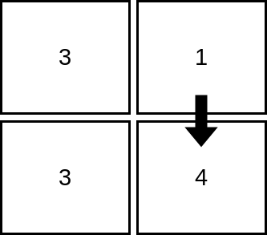
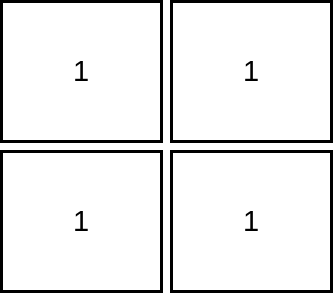
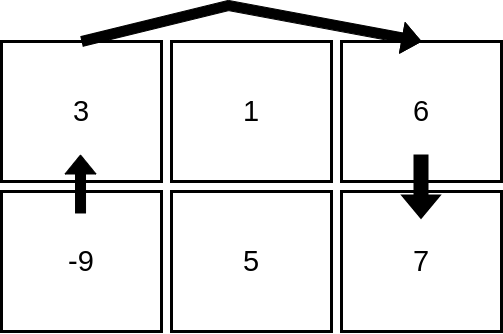

2713. Maximum Strictly Increasing Cells in a Matrix

Given a **1-indexed** `m x n` integer matrix `mat`, you can select any cell in the matrix as your **starting cell**.

From the starting cell, you can move to any other cell **in the same row or column**, but only if the value of the destination cell is **strictly greater** than the value of the current cell. You can repeat this process as many times as possible, moving from cell to cell until you can no longer make any moves.

Your task is to find the **maximum number of cells** that you can visit in the matrix by starting from some cell.

Return an integer denoting the maximum number of cells that can be visited.

 

**Example 1:**


```
Input: mat = [[3,1],[3,4]]
Output: 2
Explanation: The image shows how we can visit 2 cells starting from row 1, column 2. It can be shown that we cannot visit more than 2 cells no matter where we start from, so the answer is 2. 
```

**Example 2:**


```
Input: mat = [[1,1],[1,1]]
Output: 1
Explanation: Since the cells must be strictly increasing, we can only visit one cell in this example. 
```

**Example 3:**


```
Input: mat = [[3,1,6],[-9,5,7]]
Output: 4
Explanation: The image above shows how we can visit 4 cells starting from row 2, column 1. It can be shown that we cannot visit more than 4 cells no matter where we start from, so the answer is 4. 
```

**Constraints:**

* `m == mat.length` 
* `n == mat[i].length` 
* `1 <= m, n <= 10^5`
* `1 <= m * n <= 10^5`
* `-10^5 <= mat[i][j] <= 10^5`

# Submissions
---
**Solution 1: (Sort cells in decreasing order of value | Longest Path in DAG)**
```
Runtime: 1030 ms
Memory: 215.4 MB
```
```c++
class Solution {
public:
    int maxIncreasingCells(vector<vector<int>>& mat) {
        // we can maintain the maximum and minimum for each row and col directly
        int m = mat.size(), n = mat[0].size();
        
        using ll = long long;
        vector<ll> rowMax(m, 0);
        vector<ll> colMax(n, 0);
        
        map<int,vector<pair<int,int>>,greater<int>> cells;
        
        for(int i=0; i<m; i++) {
            for(int j=0; j<n; j++) {
                cells[mat[i][j]].push_back({i,j});
            }
        }
        
        ll result = 0;
        
        for(auto& it : cells) {
            vector<pair<int,int>>& arr = it.second;
            vector<ll> val(arr.size());
            
            for(int i=0; i<arr.size(); i++) {
                auto [x, y] = arr[i];
                val[i] = max(rowMax[x], colMax[y]) + 1;
                result = max(result, val[i]);
            }
            
            for(int i=0; i<arr.size(); i++) {
                auto [x, y] = arr[i];
                rowMax[x] = max(rowMax[x], val[i]);
                colMax[y] = max(colMax[y], val[i]);
            }
        }
        
        return result;
    }
};
```
