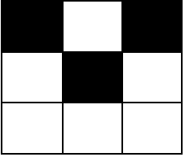

2768. Number of Black Blocks


You are given two integers `m` and `n` representing the dimensions of a **0-indexed** `m x n` grid.

You are also given a **0-indexed** 2D integer matrix `coordinates`, where `coordinates[i] = [x, y]` indicates that the cell with coordinates `[x, y]` is colored **black**. All cells in the grid that do not appear in coordinates are **white**.

A block is defined as a `2 x 2` submatrix of the grid. More formally, a block with cell `[x, y]` as its top-left corner where `0 <= x < m - 1` and `0 <= y < n - 1` contains the coordinates `[x, y]`, `[x + 1, y]`, `[x, y + 1]`, and `[x + 1, y + 1]`.

Return a **0-indexed** integer array `arr` of size `5` such that `arr[i]` is the number of blocks that contains exactly `i` black cells.

 

**Example 1:**


```
Input: m = 3, n = 3, coordinates = [[0,0]]
Output: [3,1,0,0,0]
Explanation: The grid looks like this:

There is only 1 block with one black cell, and it is the block starting with cell [0,0].
The other 3 blocks start with cells [0,1], [1,0] and [1,1]. They all have zero black cells. 
Thus, we return [3,1,0,0,0]. 
```

**Example 2:**


```
Input: m = 3, n = 3, coordinates = [[0,0],[1,1],[0,2]]
Output: [0,2,2,0,0]
Explanation: The grid looks like this:

There are 2 blocks with two black cells (the ones starting with cell coordinates [0,0] and [0,1]).
The other 2 blocks have starting cell coordinates of [1,0] and [1,1]. They both have 1 black cell.
Therefore, we return [0,2,2,0,0].
```

**Constraints:**

* `2 <= m <= 10^5`
* `2 <= n <= 10^5`
* `0 <= coordinates.length <= 10^4`
* `coordinates[i].length == 2`
* `0 <= coordinates[i][0] < m`
* `0 <= coordinates[i][1] < n`
* It is guaranteed that coordinates contains pairwise distinct coordinates.

# Submissions
---
**Solution 1: (Hashset, Track Blocks)**

We put block coordinates into a hash set.

For each x, y, we check four 2x2 squares that include it: x - 1, y - 1, x - 1, y, x, y - 1 and x, y.

We count squares with 1, 2, 3 and 4 blocks in cnt.

If a square contains k black blocks, we would cont it k times. Therefore, we return cnt[k] / k instead of cnt[k].

```
Runtime: 746 ms
Memory: 173.5 MB
```
```c++
class Solution {
public:
    vector<long long> countBlackBlocks(int m, int n, vector<vector<int>>& coordinates) {
        int cnt[5] = {};
        unordered_set<long long> s;
        auto b = [&](int x, int y) { return s.count(100000LL * x + y); };
        for (const auto &c : coordinates)
            s.insert(100000LL * c[0] + c[1]);
        for (const auto &c : coordinates)
            for (int x = max(0, c[0] - 1); x <= min(c[0], m - 2); ++x)
                for (int y = max(0, c[1] - 1); y <= min(c[1], n - 2); ++y)
                    ++cnt[b(x, y) + b(x, y + 1) + b(x + 1, y) + b(x + 1, y + 1)];
        return {(long)(m - 1) * (n - 1) - cnt[1] - cnt[2] / 2 - cnt[3] / 3 - cnt[4] / 4, 
                cnt[1], cnt[2] / 2, cnt[3] / 3, cnt[4] / 4};
    }
};
```
