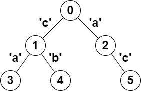

2791. Count Paths That Can Form a Palindrome in a Tree

You are given a **tree** (i.e. a connected, undirected graph that has no cycles) rooted at node `0` consisting of n nodes numbered from `0` to `n - 1`. The tree is represented by a **0-indexed** array `parent` of size `n`, where `parent[i]` is the parent of node `i`. Since node `0` is the root, `parent[0] == -1`.

You are also given a string `s` of length `n`, where `s[i]` is the character assigned to the edge between `i` and `parent[i]`. `s[0]` can be ignored.

Return the number of pairs of nodes `(u, v)` such that `u < v` and the characters assigned to edges on the path from `u` to `v` can be rearranged to form a palindrome.

A string is a **palindrome** when it reads the same backwards as forwards.

 

**Example 1:**


```
Input: parent = [-1,0,0,1,1,2], s = "acaabc"
Output: 8
Explanation: The valid pairs are:
- All the pairs (0,1), (0,2), (1,3), (1,4) and (2,5) result in one character which is always a palindrome.
- The pair (2,3) result in the string "aca" which is a palindrome.
- The pair (1,5) result in the string "cac" which is a palindrome.
- The pair (3,5) result in the string "acac" which can be rearranged into the palindrome "acca".
```

**Example 2:**
```
Input: parent = [-1,0,0,0,0], s = "aaaaa"
Output: 10
Explanation: Any pair of nodes (u,v) where u < v is valid.
```

**Constraints:**

* `n == parent.length == s.length`
* `1 <= n <= 10^5`
* `0 <= parent[i] <= n - 1` for all `i >= 1`
* `parent[0] == -1`
* `parent` represents a valid tree.
* `s` consists of only lowercase English letters.

# Submissions
---
**Solution 1: (Bit Mask)**

__Intuition__
If the path between nodes (u, v) is rearranged to form a palindrome,
then the paths between nodes (u, root) + (v, root) are is rearranged to form a palindrome,
because the path of ancestres is calculated twice.


__Bit mask__
Use a bit mask to calculate the character frequency on a path.
If 1 << 1 is present, a has odd frequency.
If 1 << 2 is present, b has odd frequency.
..
If 1 << 26 is present, z has odd frequency.


__Explanation__
f(i) = mask calculate the path value from root node to i.
Increment result res with count[mask],
since we have count[v] paths with same value.

Increment result res with count[mask ^ (1 << 1)],
since we have count[mask ^ (1 << 1)] paths,
can merge with current path with single a in middle.

Increment result res with count[mask ^ (1 << 2)],
since we have count[mask ^ (1 << 1)] paths,
can merge with current path with single b in middle.

..
After we calculate the pair for node i,
also need to update count[mask] += 1.

Continue doing this for all nodes,
and finally return result res in the end.


__Complexity__
* Time O(26n)
* Space O(n)


```
Runtime: 611 ms
Memory: 72.4 MB
```
```c++
class Solution {
    int f(vector<int>& dp, vector<int>& parent, string& s, int i) {
        if (i > 0 && dp[i] == 0)
            dp[i] = f(dp, parent, s, parent[i]) ^ (1 << (s[i] - 'a'));
        return dp[i];
    }
public:
    long long countPalindromePaths(vector<int>& parent, string s) {
        int n = parent.size();
        long long res = 0;
        vector<int> dp(n);
        unordered_map<int, int> count;
        for (int i = 0; i < n; i++) {
            int mask = f(dp, parent, s, i);
            for (int j = 0; j < 26; j++)
                res += count.count(mask ^ (1 << j)) ? count[mask ^ (1 << j)] : 0;
            res += count[mask]++;
        }
        return res;
    }
};
```

**Solution 1: (Bit Mask)**
```
Runtime: 2775 ms
Memory: 64.4 MB
```
```python
class Solution:
    def countPalindromePaths(self, parent: List[int], s: str) -> int:
        
        @cache
        def f(i):
            return f(parent[i]) ^ (1 << (ord(s[i]) - ord('a'))) if i else 0

        count = Counter()
        res = 0
        for i in range(len(parent)):
            v = f(i)
            res += count[v] + sum(count[v ^ (1 << j)] for j in range(26))
            count[v] += 1
        return res
```
