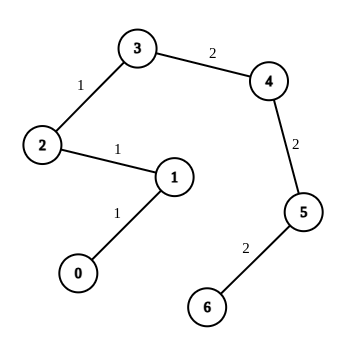
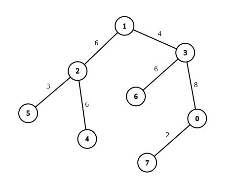

2846. Minimum Edge Weight Equilibrium Queries in a Tree

There is an undirected tree with `n` nodes labeled from `0` to `n - 1`. You are given the integer `n` and a 2D integer array `edges` of length `n - 1`, where `edges[i] = [ui, vi, wi]` indicates that there is an edge between nodes `ui` and `vi` with weight `wi` in the tree.

You are also given a 2D integer array `queries` of length `m`, where `queries[i] = [ai, bi]`. For each query, find the **minimum number of operations** required to make the weight of every edge on the path from `ai` to `bi` equal. In one operation, you can choose any edge of the tree and change its weight to any value.

**Note that:**

* Queries are **independent** of each other, meaning that the tree returns to its initial state on each new query.
* The path from `ai` to `bi` is a sequence of distinct nodes starting with node `ai` and ending with node `bi` such that every two adjacent nodes in the sequence share an edge in the tree.

Return an array `answer` of length `m` where `answer[i]` is the answer to the `i`th query.

 

**Example 1:**


```
Input: n = 7, edges = [[0,1,1],[1,2,1],[2,3,1],[3,4,2],[4,5,2],[5,6,2]], queries = [[0,3],[3,6],[2,6],[0,6]]
Output: [0,0,1,3]
Explanation: In the first query, all the edges in the path from 0 to 3 have a weight of 1. Hence, the answer is 0.
In the second query, all the edges in the path from 3 to 6 have a weight of 2. Hence, the answer is 0.
In the third query, we change the weight of edge [2,3] to 2. After this operation, all the edges in the path from 2 to 6 have a weight of 2. Hence, the answer is 1.
In the fourth query, we change the weights of edges [0,1], [1,2] and [2,3] to 2. After these operations, all the edges in the path from 0 to 6 have a weight of 2. Hence, the answer is 3.
For each queries[i], it can be shown that answer[i] is the minimum number of operations needed to equalize all the edge weights in the path from ai to bi.
```

**Example 2:**


```
Input: n = 8, edges = [[1,2,6],[1,3,4],[2,4,6],[2,5,3],[3,6,6],[3,0,8],[7,0,2]], queries = [[4,6],[0,4],[6,5],[7,4]]
Output: [1,2,2,3]
Explanation: In the first query, we change the weight of edge [1,3] to 6. After this operation, all the edges in the path from 4 to 6 have a weight of 6. Hence, the answer is 1.
In the second query, we change the weight of edges [0,3] and [3,1] to 6. After these operations, all the edges in the path from 0 to 4 have a weight of 6. Hence, the answer is 2.
In the third query, we change the weight of edges [1,3] and [5,2] to 6. After these operations, all the edges in the path from 6 to 5 have a weight of 6. Hence, the answer is 2.
In the fourth query, we change the weights of edges [0,7], [0,3] and [1,3] to 6. After these operations, all the edges in the path from 7 to 4 have a weight of 6. Hence, the answer is 3.
For each queries[i], it can be shown that answer[i] is the minimum number of operations needed to equalize all the edge weights in the path from ai to bi.
```

**Constraints:**

* `1 <= n <= 10^4`
* `edges.length == n - 1`
* `edges[i].length == 3`
* `0 <= ui, vi < n`
* `1 <= wi <= 26`
* The input is generated such that edges represents a valid tree.
* `1 <= queries.length == m <= 2 * 10^4`
* `queries[i].length == 2`
* `0 <= ai, bi < n`

# Submissions
---
**Solution 1: (Prefix-sum and LCA on tree)**

__Intuition__
For this kind of problem involves the "path between two nodes on the tree", the first intuition is to consider their lowest common ancestor(LCA).
Suppose we have known the LCA of every nodes pair. How to use it?

If we know the LCA of xxx and yyy is LLL, the path of x↔yx \leftrightarrow yx↔y can be divided into two segments: x↔Lx \leftrightarrow Lx↔L and y↔Ly \leftrightarrow Ly↔L.
So we can research them separately.

The problem requires the edge weights to be equal. So we should retain a most occurrences weight zzz, and change others.

Notice that the range of edge weights is very small (26 in this problem), so immediately consider enumerating all possible weights as retained weight zzz.

Now, we have 2 problems:

How to count the number of edges on the path of x↔Lx \leftrightarrow Lx↔L?
How to count the number of zzz occurs on the path of x↔Lx \leftrightarrow Lx↔L?
(The y↔Ly \leftrightarrow Ly↔L can solved in the same way).
For the first problem:
Because the LLL is an ancestor of xxx, the edges must equals to the difference of their depth:
edges=d[x]−d[L]edges = d[x] - d[L]edges=d[x]−d[L]

For the second problem:
This is an interval summation problem, which can be solved by following the idea of prefix-sum.
For each node xxx, we can maintain an array w[x]. w[x][i] saves the prefix-count of weight iii until xxx. (More formally, w[x][i] saves "from rootrootroot to xxx, the number of edges which has weight iii".)
As a result, the iii's count in x↔Lx \leftrightarrow Lx↔L can be calculated easily:
cnt(i)=w[x][i]−w[L][i]cnt(i) = w[x][i] - w[L][i]cnt(i)=w[x][i]−w[L][i]

Can read #example at the end of this article to enhance understanding

And finally, how to calculate the LCA?
There are many methods to find the LCA of nodes on a tree. The easiest way is to use binary lifting. As I mentioned last week as well.

__Approach__
For convenience, in addition to the 2D array fa required by binary lifting, we also maintain an array d as the depth of each node.
The depth of root node is 000, and the child node's depth is one more than its father. Easily use dfs to get these information.

In lca(x, y) function, we first adjust the xxx and yyy to the same level, because the LCA will never be deeper than xxx or yyy.
After the adjustment, the distant of xxx to LLL and yyy to LLL will be equal. It's actually same with Two Linked Lists Intersection problem.

So, we jump xxx and yyy upward together, they will first meet on their LCA.

Try from long-step to short-step. If jump 2p2^p2 
p
  steps makes xxx and yyy together, it means 2p2^p2 
p
  is too long. At the same time, if 2p−12^{p-1}2 
p−1
  can't make them together, it means we must jump 2p−12^{p-1}2 
p−1
  steps, otherwise we may miss the final result.

__Complexity__
Time complexity: O(nlog⁡n+q(C+log⁡n))O(n \log n + q(C + \log n))O(nlogn+q(C+logn))
Space complexity: O(nlog⁡n)O(n \log n)O(nlogn)

```
Runtime: 692 ms
Memory: 230 MB
```
```c++
class Solution {
public:
    vector<int> minOperationsQueries(int n, vector<vector<int>>& edges, vector<vector<int>>& queries) {
        int m = (int)log2(n) + 1, C = 27;
        vector<vector<pair<int, int>>> g(n);
        for (auto& e : edges) {
            g[e[0]].push_back(make_pair(e[1], e[2]));
            g[e[1]].push_back(make_pair(e[0], e[2]));
        }

        // fa[i][j] means the 2^i -th father of vertex j:
        vector<vector<int>> fa(m, vector<int>(n));
        // w[i][j] means the count of j from root to vertex i:
        vector<vector<int>> w(n);
        // d[i] means the depth of vertex i:
        vector<int> d(n, 0);

        function<void(int, int, int)> dfs = [&](int x, int f, int dep) -> void {
            fa[0][x] = f;
            d[x] = dep;
            for (auto& [c, weight] : g[x]) {
                if (f == c) continue;
                w[c] = w[x];
                w[c][weight]++;
                dfs(c, x, dep + 1);
            }
        };
        w[0] = vector<int>(C, 0);
        dfs(0, 0, 0);
        // binary lifting: 
        for (int i = 1; i < m; ++i) {
            for (int j = 0; j < n; ++j) {
                fa[i][j] = fa[i-1][fa[i-1][j]];
            }
        }

        auto lca = [&](int x, int y) -> int {
            if (d[x] > d[y]) swap<int>(x, y);
            // adjust x and y to the same depth:
            for (int p = 0; (1 << p) <= d[y] - d[x]; ++p) 
                if ((1 << p) & d[y] - d[x]) y = fa[p][y];
            // conservatively jump x and y together, until they meet:
            for (int p = m - 1; p >= 1; --p) {
                if (fa[p][x] == fa[p][y] && fa[p-1][x] != fa[p-1][y]) {
                    x = fa[p-1][x];
                    y = fa[p-1][y];
                }
            }
            return x == y ? x : fa[0][x];
        };
        
        vector<int> res;
        for (auto &q: queries) {
            int x = q[0], y = q[1], l = lca(x, y);
            // the total length between x and y:
            int len = d[x] + d[y] - 2 * d[l];
            // the mode of weight between x and y:
            int max_z = 0;
            for (int z = 1; z < C; ++z) {
                int num_z = w[x][z] + w[y][z] - w[l][z] * 2;
                max_z = max(max_z, num_z);
            }
            // the others must be changed:
            res.push_back(len - max_z);
        }
        return res;
    }
};
```
