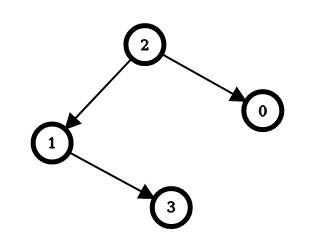
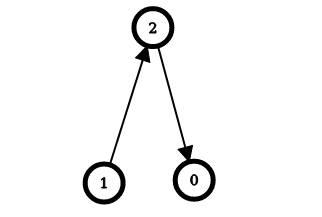

2858. Minimum Edge Reversals So Every Node Is Reachable


There is a **simple directed graph** with `n` nodes labeled from `0` to `n - 1`. The graph would form a **tree** if its edges were bi-directional.

You are given an integer `n` and a 2D integer array `edges`, where `edges[i] = [ui, vi]` represents a directed edge going from node `ui` to node `vi`.

An **edge reversal** changes the direction of an edge, i.e., a directed edge going from node `ui` to node `vi` becomes a directed edge going from node `vi` to node `ui`.

For every node `i` in the range `[0, n - 1]`, your task is to **independently** calculate the minimum number of edge reversals required so it is possible to reach any other node starting from node i through a **sequence** of **directed edges**.

Return an integer array `answer`, where `answer[i]` is the **minimum** number of **edge reversals** required so it is possible to reach any other node starting from node `i` through a **sequence** of **directed edges**.

 

**Example 1:**


```
Input: n = 4, edges = [[2,0],[2,1],[1,3]]
Output: [1,1,0,2]
Explanation: The image above shows the graph formed by the edges.
For node 0: after reversing the edge [2,0], it is possible to reach any other node starting from node 0.
So, answer[0] = 1.
For node 1: after reversing the edge [2,1], it is possible to reach any other node starting from node 1.
So, answer[1] = 1.
For node 2: it is already possible to reach any other node starting from node 2.
So, answer[2] = 0.
For node 3: after reversing the edges [1,3] and [2,1], it is possible to reach any other node starting from node 3.
So, answer[3] = 2.
```

**Example 2:**


```
Input: n = 3, edges = [[1,2],[2,0]]
Output: [2,0,1]
Explanation: The image above shows the graph formed by the edges.
For node 0: after reversing the edges [2,0] and [1,2], it is possible to reach any other node starting from node 0.
So, answer[0] = 2.
For node 1: it is already possible to reach any other node starting from node 1.
So, answer[1] = 0.
For node 2: after reversing the edge [1, 2], it is possible to reach any other node starting from node 2.
So, answer[2] = 1.
```

**Constraints:**

* 2 <= n <= 10^5`
* edges.length == n - 1`
* edges[i].length == 2`
* 0 <= ui == edges[i][0] < n`
* 0 <= vi == edges[i][1] < n`
* ui != vi`
* The input is generated such that if the edges were bi-directional, the graph would be a tree.

# Submissions
---
**Solution 1: (DP on Tree)**

G[i][j] is the cost to go from i to j.
For edge [i, j],
we have G[i][j] = 0, G[j][i] = 1.

In each call of dfs(i, j),
i is the parent, j is the current node,
and we return the cost from j to all other nodes in this direction.
We recursively accumulate dfs(j, k) + G[j][k],
where k is the children of j.
and then return the sum.

Finally we return dfs(-1, i) for each node i as the root.

* Time O(n), worst O(n^2)
* Space O(n)

```
Runtime: 1355 ms
Memory: 495.3 MB
```
```c++
class Solution {
public:
    vector<int> minEdgeReversals(int n, vector<vector<int>>& edges) {
        unordered_map<int, unordered_map<int, int>> G, dp;
        for (auto& e : edges) {
          G[e[0]][e[1]] = 0, G[e[1]][e[0]] = 1;
          dp[e[0]][e[1]] = dp[e[1]][e[0]] = dp[-1][e[0]] = dp[-1][e[1]] = -1;
        }

        function<int(int, int)> dfs = [&](int i, int j) {
          if (dp[i][j] >= 0)
              return dp[i][j];
          dp[i][j] = 0;
          for (const auto& k : G[j]) {
            if (k.first == i) continue;
            dp[i][j] += dfs(j, k.first) + k.second;
          }
          return dp[i][j];
        };

        vector<int> res(n);
        for (int i = 0; i < n; i++) {
          res[i] = dfs(-1, i);
        }
        return res;
    }
};
```
