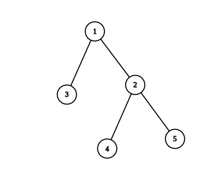
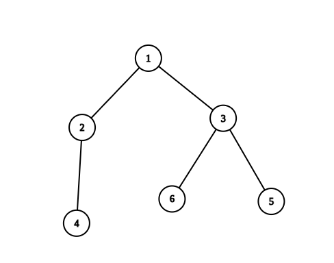

2867. Count Valid Paths in a Tree

There is an undirected tree with `n` nodes labeled from `1` to `n`. You are given the integer `n` and a 2D integer array `edges` of length `n - 1`, where `edges[i] = [ui, vi]` indicates that there is an edge between nodes `ui` and `vi` in the tree.

Return the **number of valid paths** in the tree.

A path `(a, b)` is **valid** if there exists **exactly one** prime number among the node labels in the path from `a` to `b`.

**Note** that:

* The path `(a, b)` is a sequence of distinct nodes starting with node `a` and ending with node `b` such that every two adjacent nodes in the sequence share an edge in the tree.
* Path `(a, b)` and path `(b, a)` are considered the same and counted only once.
 

**Example 1:**


```
Input: n = 5, edges = [[1,2],[1,3],[2,4],[2,5]]
Output: 4
Explanation: The pairs with exactly one prime number on the path between them are: 
- (1, 2) since the path from 1 to 2 contains prime number 2. 
- (1, 3) since the path from 1 to 3 contains prime number 3.
- (1, 4) since the path from 1 to 4 contains prime number 2.
- (2, 4) since the path from 2 to 4 contains prime number 2.
It can be shown that there are only 4 valid paths.
```

**Example 2:**


```
Input: n = 6, edges = [[1,2],[1,3],[2,4],[3,5],[3,6]]
Output: 6
Explanation: The pairs with exactly one prime number on the path between them are: 
- (1, 2) since the path from 1 to 2 contains prime number 2.
- (1, 3) since the path from 1 to 3 contains prime number 3.
- (1, 4) since the path from 1 to 4 contains prime number 2.
- (1, 6) since the path from 1 to 6 contains prime number 3.
- (2, 4) since the path from 2 to 4 contains prime number 2.
- (3, 6) since the path from 3 to 6 contains prime number 3.
It can be shown that there are only 6 valid paths.
```

**Constraints:**

* `1 <= n <= 10^5`
* `edges.length == n - 1`
* `edges[i].length == 2`
* `1 <= ui, vi <= n`
* The input is generated such that `edges` represent a valid tree.

# Submissions
---
**Solution 1: (BFS)**
```
Runtime: 1656 ms
Memory: 61.2 MB
```
```python
class Solution:
    def countPaths(self, n: int, edges: List[List[int]]) -> int:
        if n <= 2:
            return n - 1
        G = defaultdict(list)
        for a, b in edges:
            G[a].append(b)
            G[b].append(a)
        
        isPrime = [1] * (n + 1)
        isPrime[0], isPrime[1] = 0, 0
        for i in range(2, n + 1):
            if isPrime[i] == 0:
                continue
            j = i * 2
            while j <= n:
                isPrime[j] = 0
                j += i

        ans = 0
        count = defaultdict(lambda: 1)
        visited = set()
        for i in range(1, n + 1):
            if isPrime[i]:
                continue
            if i in visited:
                continue
            c = 1
            visited.add(i)
            queue = deque([i])
            primes = []
            while queue:
                node = queue.popleft()
                for nxt in G[node]:
                    if isPrime[nxt]:
                        primes.append(nxt)
                        continue
                    if nxt in visited:
                        continue
                    c += 1
                    visited.add(nxt)
                    queue.append(nxt)
            for p in primes:
                ans += c * count[p]
                count[p] += c
        return ans
```

**Solution 2: (DFS)**
```
Runtime: 409 ms
Memory: 173.1 MB
```
```c++
class Solution {
    // Helper function to generate prime numbers up to 'n'.
    vector<bool> genPrimes(int n) {
        vector<bool> prime(n + 1);
        if (n > 1) fill(prime.begin() + 2, prime.end(), true); // Initializing all numbers >= 2 as prime.
        for (int i = 2; i <= n; ++i)
            if (prime[i])
                for (int j = i + i; j <= n; j += i)
                    prime[j] = false; // Marking multiples of prime numbers as not prime.
        return prime;
    }
public:
    long long countPaths(int n, vector<vector<int>>& edges) {
        auto isPrime = genPrimes(n); // Generate a list of prime numbers up to 'n'.
        vector<vector<int>> E(n); // Creating an adjacency list for the graph.
        
        // Populate the adjacency list based on given edges.
        for (int i = 0; i < n - 1; ++i) {
            int u = edges[i][0], v = edges[i][1];
            --u;
            --v;
            E[u].push_back(v);
            E[v].push_back(u);
        }
        
        long long ans = 0; // Initialize the answer to zero.
        
        // Depth-first search (DFS) function to traverse the tree and count paths.
        function<array<int, 2>(int, int)> dfs = [&](int x, int p) {
            int prime = isPrime[x + 1]; // Check if the node number (1-based) is prime.
            array<int, 2> cur = {}; // Initialize an array to store counts based on prime status.
            cur[prime]++; // Update the count for prime or non-prime node.
            
            for (int y : E[x]) {
                if (y == p) continue; // Skip the parent node.
                auto v = dfs(y, x); // Recursively traverse the tree.
                
                // Update the answer by counting paths based on prime and non-prime nodes.
                ans += (long long)v[0] * cur[1];
                ans += (long long)v[1] * cur[0];
                
                cur[prime] += v[0]; // Update counts for the current node.
                
                if (!prime) cur[1 + prime] += v[1]; // If non-prime, update the count for non-prime nodes.
            }
            return cur; // Return the count array for the current node.
        };
        
        dfs(0, -1); // Start DFS from the root node (node 0) with parent -1.
        
        return ans; // Return the final count of paths.
    }
};
```
