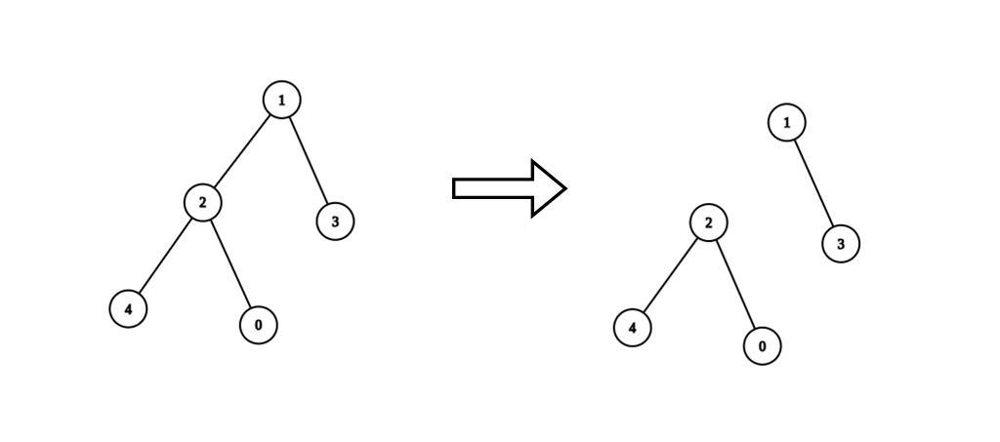
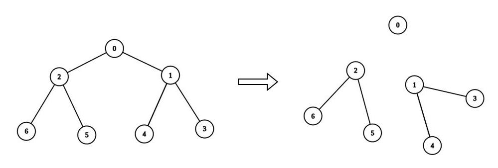

2872. Maximum Number of K-Divisible Components

There is an undirected tree with `n` nodes labeled from `0` to `n - 1`. You are given the integer `n` and a 2D integer array `edges` of length `n - 1`, where `edges[i] = [ai, bi]` indicates that there is an edge between nodes `ai` and `bi` in the tree.

You are also given a **0-indexed** integer array `values` of length `n`, where `values[i]` is the value associated with the ith node, and an integer `k`.

A **valid split** of the tree is obtained by removing any set of edges, possibly empty, from the tree such that the resulting components all have values that are divisible by `k`, where the value of a connected component is the sum of the values of its nodes.

Return the **maximum number of components** in any valid split.

 

**Example 1:**


```
Input: n = 5, edges = [[0,2],[1,2],[1,3],[2,4]], values = [1,8,1,4,4], k = 6
Output: 2
Explanation: We remove the edge connecting node 1 with 2. The resulting split is valid because:
- The value of the component containing nodes 1 and 3 is values[1] + values[3] = 12.
- The value of the component containing nodes 0, 2, and 4 is values[0] + values[2] + values[4] = 6.
It can be shown that no other valid split has more than 2 connected components.
```

**Example 2:**


```
Input: n = 7, edges = [[0,1],[0,2],[1,3],[1,4],[2,5],[2,6]], values = [3,0,6,1,5,2,1], k = 3
Output: 3
Explanation: We remove the edge connecting node 0 with 2, and the edge connecting node 0 with 1. The resulting split is valid because:
- The value of the component containing node 0 is values[0] = 3.
- The value of the component containing nodes 2, 5, and 6 is values[2] + values[5] + values[6] = 9.
- The value of the component containing nodes 1, 3, and 4 is values[1] + values[3] + values[4] = 6.
It can be shown that no other valid split has more than 3 connected components.
```

**Constraints:**

* `1 <= n <= 3 * 10^4`
* `edges.length == n - 1`
* `edges[i].length == 2`
* `0 <= ai, bi < n`
* `values.length == n`
* `0 <= values[i] <= 10^9`
* `1 <= k <= 10^9`
* Sum of values is divisible by `k`.
* The input is generated such that edges represents a valid tree.

# Submissions
---
**Solution 1: (BFS)**
```
Runtime: 376 ms
Memory: 167.8 MB
```
```c++
class Solution {
public:
    int maxKDivisibleComponents(int n, vector<vector<int>>& edges, vector<int>& values, int k) {
        vector<vector<int>> al(n);
        vector<int> cnt(n);
        int res = 0;
        for(const auto &e : edges) {
            al[e[0]].push_back(e[1]);
            al[e[1]].push_back(e[0]);        
        }
        queue<int> q;
        for (int i = 0; i < n; ++i) {
            cnt[i] = al[i].size();
            if (cnt[i] < 2)
                q.push(i);
        }
        while(!q.empty()) {
            int i = q.front(); q.pop();
            --cnt[i];
            res += values[i] % k == 0;
            for (auto j : al[i]) {
                if (cnt[j] != 0) {
                    values[j] += values[i] % k;
                    if (--cnt[j] == 1)
                        q.push(j);
                }
            }
        }
        return res;
    }
};
```
