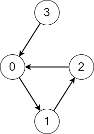
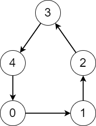

2876. Count Visited Nodes in a Directed Graph

There is a **directed** graph consisting of `n` nodes numbered from `0` to `n - 1` and n directed edges.

You are given a **0-indexed** array `edges` where `edges[i]` indicates that there is an edge from node `i` to node `edges[i]`.

Consider the following process on the graph:

* You start from a node `x` and keep visiting other nodes through edges until you reach a node that you have already visited before on this **same** process.

Return an array `answer` where `answer[i]` is the number of **different** nodes that you will visit if you perform the process starting from node `i`.

 

**Example 1:**


```
Input: edges = [1,2,0,0]
Output: [3,3,3,4]
Explanation: We perform the process starting from each node in the following way:
- Starting from node 0, we visit the nodes 0 -> 1 -> 2 -> 0. The number of different nodes we visit is 3.
- Starting from node 1, we visit the nodes 1 -> 2 -> 0 -> 1. The number of different nodes we visit is 3.
- Starting from node 2, we visit the nodes 2 -> 0 -> 1 -> 2. The number of different nodes we visit is 3.
- Starting from node 3, we visit the nodes 3 -> 0 -> 1 -> 2 -> 0. The number of different nodes we visit is 4.
```

**Example 2:**


```
Input: edges = [1,2,3,4,0]
Output: [5,5,5,5,5]
Explanation: Starting from any node we can visit every node in the graph in the process.
```

**Constraints:**

* `n == edges.length`
* `2 <= n <= 10^5`
* `0 <= edges[i] <= n - 1`
* `edges[i] != i`

# Submissions
---
**Solution 1: (Stack)**
```
Runtime: 1760 ms
Memory: 41.3 MB
```
```python
class Solution:
    def countVisitedNodes(self, edges: List[int]) -> List[int]:
        n = len(edges)
        res = [0] * n

        for i in range(n):
            seen = OrderedDict()
            j = i
            while (j not in seen) and (res[j] == 0):
                seen[j] = len(seen)
                j = edges[j]
            if j in seen:
                k = len(seen) - seen[j]
                for _ in range(k):
                    res[seen.popitem()[0]] = k
            while seen:
                j = seen.popitem()[0]
                res[j] = res[edges[j]] + 1
        return res
```

**Solution 2: (Stack)**
```
Runtime: 582 ms
Memory: 256.2 MB
```
```c++
class Solution {
public:
    vector<int> countVisitedNodes(vector<int>& edges) {
        int n = edges.size();
        vector<int> res(n);
        for (int i = 0, j = 0; i < n; j = ++i) {
            set<int> seen;
            vector<int> s;
            while (!seen.count(j) && res[j] == 0) {
                seen.insert(j);
                s.push_back(j);
                j = edges[j];
            }
            if (seen.count(j)) { // hit the cycle
                int k = distance(find(s.begin(), s.end(), j), s.end());
                for (j = 0; j < k; ++j) {
                    res[s.back()] = k;
                    s.pop_back();
                }
            }
            while (!s.empty()) {
                j = s.back();
                s.pop_back();
                res[j] = res[edges[j]] + 1;
            }
        }
        return res;
    }
};
```
