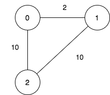
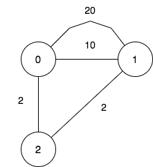

2959. Number of Possible Sets of Closing Branches

There is a company with `n` branches across the country, some of which are connected by roads. Initially, all branches are reachable from each other by traveling some roads.

The company has realized that they are spending an excessive amount of time traveling between their branches. As a result, they have decided to close down some of these branches (possibly none). However, they want to ensure that the remaining branches have a distance of at most `maxDistance` from each other.

The **distance** between two branches is the **minimum** total traveled length needed to reach one branch from another.

You are given integers `n`, `maxDistance`, and a **0-indexed** 2D array `roads`, where `roads[i] = [ui, vi, wi]` represents the undirected road between branches `ui` and `vi` with length `wi`.

Return the number of possible sets of closing branches, so that any branch has a distance of at most `maxDistance` from any other.

**Note** that, after closing a branch, the company will no longer have access to any roads connected to it.

**Note** that, multiple roads are allowed.

 

**Example 1:**


```
Input: n = 3, maxDistance = 5, roads = [[0,1,2],[1,2,10],[0,2,10]]
Output: 5
Explanation: The possible sets of closing branches are:
- The set [2], after closing, active branches are [0,1] and they are reachable to each other within distance 2.
- The set [0,1], after closing, the active branch is [2].
- The set [1,2], after closing, the active branch is [0].
- The set [0,2], after closing, the active branch is [1].
- The set [0,1,2], after closing, there are no active branches.
It can be proven, that there are only 5 possible sets of closing branches.
```

**Example 2:**


```
Input: n = 3, maxDistance = 5, roads = [[0,1,20],[0,1,10],[1,2,2],[0,2,2]]
Output: 7
Explanation: The possible sets of closing branches are:
- The set [], after closing, active branches are [0,1,2] and they are reachable to each other within distance 4.
- The set [0], after closing, active branches are [1,2] and they are reachable to each other within distance 2.
- The set [1], after closing, active branches are [0,2] and they are reachable to each other within distance 2.
- The set [0,1], after closing, the active branch is [2].
- The set [1,2], after closing, the active branch is [0].
- The set [0,2], after closing, the active branch is [1].
- The set [0,1,2], after closing, there are no active branches.
It can be proven, that there are only 7 possible sets of closing branches.
```

**Example 3:**
```
Input: n = 1, maxDistance = 10, roads = []
Output: 2
Explanation: The possible sets of closing branches are:
- The set [], after closing, the active branch is [0].
- The set [0], after closing, there are no active branches.
It can be proven, that there are only 2 possible sets of closing branches.
```

**Constraints:**

* `1 <= n <= 10`
* `1 <= maxDistance <= 10^5`
* `0 <= roads.length <= 1000`
* `roads[i].length == 3`
* `0 <= ui, vi <= n - 1`
* `ui != vi`
* `1 <= wi <= 1000`
* All branches are reachable from each other by traveling some roads.

# Submissions
---
**Solution 1: (Mask + Floyd-Warshall)**


We have 2 ^ n total sets.

We enumerate each set using mask, and run the Floyd-Warshall algorithm for the selected nodes.

Floyd-Warshall computes the minimum path between all pairs of nodes in O(n ^ 3).

The overall complexity is therefore O(2 ^ n * n ^ 3).

```
Runtime: 133 ms
Memory: 48.9 MB
```
```c++
class Solution {
    int getMaxDistance(int mask, int n, vector<vector<int>> d /* copy */) {
        int res = 0;
        for (int k = 0; k < n; ++k) // Floyd-Warshall
            if (mask & (1 << k))
                for (int i = 0; i < n; ++i)
                    if (i != k && mask & (1 << i))
                        for (int j = 0; j < n; ++j)
                            if (j != i && mask & (1 << j))
                                d[i][j] = min(d[i][j], d[i][k] + d[k][j]); 
        for (int i = 0; i < n; ++i)
            if (mask & (1 << i))
                for (int j = i + 1; j < n; ++j)
                    if (mask & (1 << j))
                        res = max(res, d[i][j]);
        return res;
    }
public:
    int numberOfSets(int n, int maxDistance, vector<vector<int>>& roads) {
        vector<vector<int>> d(n, vector<int>(n, 100000));
        for (auto &r : roads) {
            d[r[0]][r[1]] = min(d[r[0]][r[1]], r[2]);
            d[r[1]][r[0]] = min(d[r[1]][r[0]], r[2]);
        }
        int comb = 1 << n, res = 1;
        for (int mask = 1; mask < comb; ++mask)
            res += getMaxDistance(mask, n, d) <= maxDistance;
        return res;
    }
};
```
