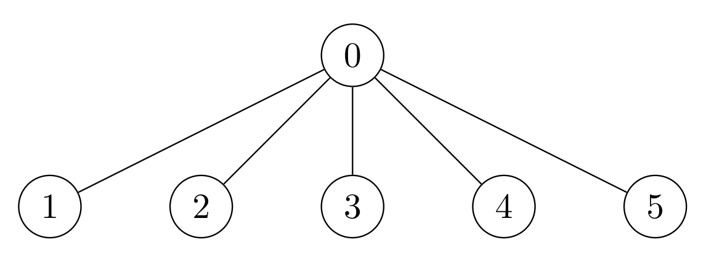

2973. Find Number of Coins to Place in Tree Nodes

You are given an undirected tree with n nodes labeled from 0 to n - 1, and rooted at node 0. You are given a 2D integer array edges of length n - 1, where edges[i] = [ai, bi] indicates that there is an edge between nodes ai and bi in the tree.

You are also given a 0-indexed integer array cost of length n, where cost[i] is the cost assigned to the ith node.

You need to place some coins on every node of the tree. The number of coins to be placed at node i can be calculated as:

* If size of the subtree of node `i` is less than `3`, place `1` coin.
* Otherwise, place an amount of coins equal to the **maximum** product of cost values assigned to `3` distinct nodes in the subtree of node `i`. If this product is **negative**, place `0` coins.

Return an array coin of size `n` such that `coin[i]` is the number of coins placed at node `i`.

 

**Example 1:**


```
Input: edges = [[0,1],[0,2],[0,3],[0,4],[0,5]], cost = [1,2,3,4,5,6]
Output: [120,1,1,1,1,1]
Explanation: For node 0 place 6 * 5 * 4 = 120 coins. All other nodes are leaves with subtree of size 1, place 1 coin on each of them.
```

**Example 2:**


```
Input: edges = [[0,1],[0,2],[1,3],[1,4],[1,5],[2,6],[2,7],[2,8]], cost = [1,4,2,3,5,7,8,-4,2]
Output: [280,140,32,1,1,1,1,1,1]
Explanation: The coins placed on each node are:
- Place 8 * 7 * 5 = 280 coins on node 0.
- Place 7 * 5 * 4 = 140 coins on node 1.
- Place 8 * 2 * 2 = 32 coins on node 2.
- All other nodes are leaves with subtree of size 1, place 1 coin on each of them.
```

**Example 3:**


```
Input: edges = [[0,1],[0,2]], cost = [1,2,-2]
Output: [0,1,1]
Explanation: Node 1 and 2 are leaves with subtree of size 1, place 1 coin on each of them. For node 0 the only possible product of cost is 2 * 1 * -2 = -4. Hence place 0 coins on node 0.
```

**Constraints:**

* `2 <= n <= 2 * 10^4`
* `edges.length == n - 1`
* `edges[i].length == 2`
* `0 <= ai, bi < n`
* `cost.length == n`
* `1 <= |cost[i]| <= 10^4`
* The input is generated such that edges represents a valid tree.

# Submissions
---
**Solution 1: (DFS, post order, sort)**
```
Runtime: 1569 ms
Memory: 32.6 MB
```
```python
class Solution:
    def placedCoins(self, edges: List[List[int]], cost: List[int]) -> List[int]:
        res, al = [0] * len(cost), [[] for _ in range(len(cost))]
        for  a, b in edges:
                al[a].append(b)
                al[b].append(a)
        def dfs(i: int, p : int) -> List[int]:
            c = [cost[i]]
            for j in al[i]:
                if j != p:
                    c.extend(dfs(j, i))
            c.sort()
            res[i] = 1 if len(c) < 3 else max(0, c[0] * c[1] * c[-1], c[-3] * c[-2] * c[-1])
            return c if len(c) < 5 else [c[0], c[1], c[-3], c[-2], c[-1]]
        dfs(0, 0)
        return res
```

**Solution 2: (DFS, post order, sort, track largest 3 and smallest 3 element)**
```
Runtime: 604 ms, Beats 47.88%
Memory: 266.12 MB, Beats 83.03%
```
```c++
class Solution {
    pair<vector<int>, vector<int>> dfs(int u, int p, vector<vector<int>> &g, vector<int> &cost, vector<long long> &ans) {
        pair<vector<int>, vector<int>> rst;
        rst.first.push_back(u);
        rst.second.push_back(u);
        for (auto &v: g[u]) {
            if (v != p) {
                auto [pa, pb] = dfs(v, u, g, cost, ans);
                rst.first.insert(rst.first.end(), pa.begin(), pa.end());
                rst.second.insert(rst.second.end(), pb.begin(), pb.end());
            }
        }
        if (rst.first.size() < 3) {
            for (auto &v: rst.first){
                ans[v] = 1;
            }
            return rst;
        }
        sort(rst.first.begin(), rst.first.end(), [&](auto &v1, int &v2){
            return cost[v1] > cost[v2];
        });
        sort(rst.second.begin(), rst.second.end(), [&](auto &v1, auto &v2){
            return cost[v1] < cost[v2];
        });
        rst.first.resize(min(3, (int)rst.first.size()));
        rst.second.resize(min(3, (int)rst.second.size()));
        long long a = max(1LL * cost[rst.first[0]] * cost[rst.first[1]] * cost[rst.first[2]],
                            1LL * cost[rst.second[0]] * cost[rst.second[1]] * cost[rst.first[0]]);
        if (a < 0) {
            ans[u] = 0;
        } else {
            ans[u] = a;
        }
        return rst;
    }
public:
    vector<long long> placedCoins(vector<vector<int>>& edges, vector<int>& cost) {
        int n = edges.size() + 1;
        vector<vector<int>> g(n);
        vector<long long> ans(n);
        for (auto &e: edges) {
            g[e[0]].push_back(e[1]);
            g[e[1]].push_back(e[0]);
        }
        dfs(0, -1, g, cost, ans);
        return ans;
    }
};
```
