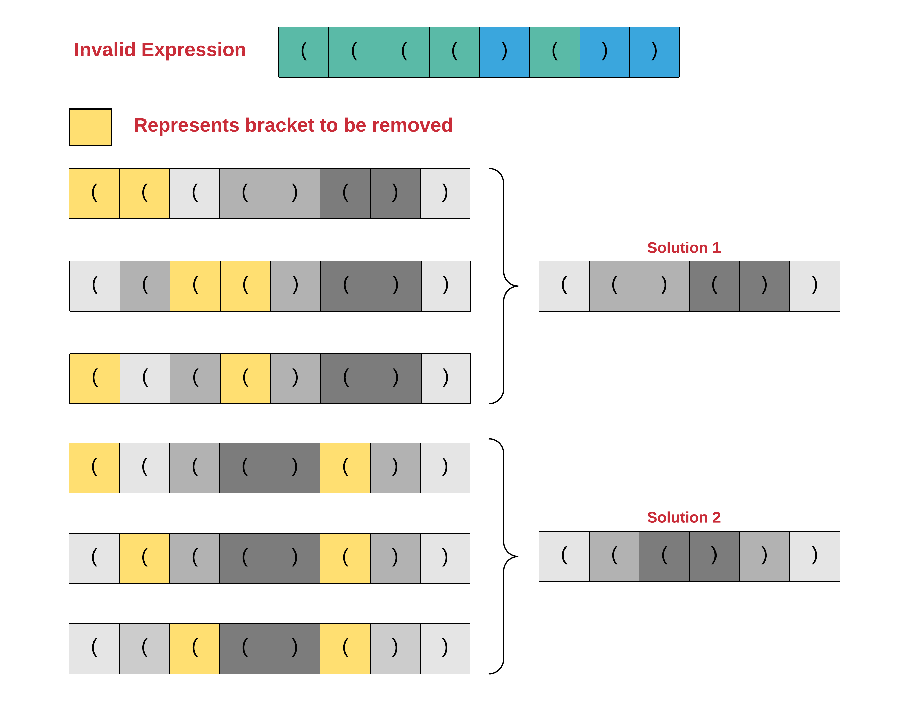

301. Remove Invalid Parentheses

Remove the minimum number of invalid parentheses in order to make the input string valid. Return all possible results.

Note: The input string may contain letters other than the parentheses `(` and `)`.

**Example 1:**
```
Input: "()())()"
Output: ["()()()", "(())()"]
```

**Example 2:**
```
Input: "(a)())()"
Output: ["(a)()()", "(a())()"]
```

**Example 3:**
```
Input: ")("
Output: [""]
```

# Submissions
---
## Approach 1: Backtracking
**Intuition**

For this question, we are given an expression consisting of parentheses and there can be some misplaced or extra brackets in the expression that cause it to be invalid. An expression consisting of parentheses is considered valid only when every closing bracket has a corresponding opening bracket and vice versa.

This means if we start looking at each of the bracket from left to right, as soon as we encounter a closing bracket, there should be an unmatched opening bracket available to match it. Otherwise the expression would become invalid. The expression can also become invalid if the number of opening parentheses i.e. `(` are more than the number of closing parentheses i.e. `)`.

Let us look at an invalid expression and all the possible valid expressions that can be formed from it by removing some of the brackets. There is no restriction on which parentheses we can remove. We simply have to make the expression valid.

>The only condition is that we should be removing the minimum number of brackets to make an invalid expression, valid. If this condition was not present, we could potentially remove most of the brackets and come down to say 2 brackets in the end which form () and that would be a valid expression.



An important thing to observe in the above diagram is that there are multiple ways of reaching the same solution i.e. say the optimal number of parentheses to be removed to make the original expression valid is K. We can remove multiple different sets of K brackets that will eventually give us the same final expression. But, each valid expression should be recorded only once. We have to take care of this in our solution. Note that there are other possible ways of reaching one of the two valid expressions shown above. We have simply shown 3 ways each for the two valid expressions.

Coming back to our problem, the question that now arises is, how to decide which of the parentheses to remove?

>Since we don't know which of the brackets can possibly be removed, we try out all the options!

For every bracket we have two choices:

* Either it can be considered a part of the final expression OR
* It can be ignored i.e. we can delete it from our final expression.

Such kind of problems where we have multiple options and we have no strategy or metric of deciding greedily which option to take, we try out all of the options and see which ones lead to an answer. These type of problems are perfect candidates for the programming paradigm, Recursion.

**Algorithm**

1. Initialize an array that will store all of our valid expressions finally.
1. Start with the leftmost bracket in the given sequence and proceed right in the recursion.
1. The state of recursion is defined by the index which we are currently processing in the original expression. Let this index be represented by the character `i`. Also, we have two different variables `left_count` and `right_count` that represent the number of left and right parentheses we have added to our expression till now. These are the parentheses that were considered.
1. If the current character i.e. `S[i]` (considering `S` is the expression string) is neither a closing or an opening parenthesis, then we simply add this character to our final solution string for the current recursion.
1. However, if the current character is either of the two brackets i.e. `S[i] == '(' or S[i] == ')'`, then we have two options. We can either discard this character by marking it an invalid character or we can consider this bracket to be a part of the final expression.
1. When all of the parentheses in the original expression have been processed, we simply check if the expression represented by `expr` i.e. the expression formed till now is valid one or not. The way we check if the final expression is valid or not is by looking at the values in `left_count` and `right_count`. For an expression to be valid `left_count == right_count`. If it is indeed valid, then it could be one of our possible solutions.
    * Even though we have a valid expression, we also need to keep track of the number of removals we did to get this expression. This is done by another variable passed in recursion called `rem_count`.
    * Once recursion finishes we check if the current value of `rem_count` is < the least number of steps we took to form a valid expression till now i.e. the global minima. If this is not the case, we don't record the new expression, else we record it.
    
One small optimization that we can do from an implementation perspective is introducing some sort of pruning in our algorithm. Right now we simply go till the very end i.e. process all of the parentheses and when we are done processing all of them, we check if the expression we have can be considered or not.

We have to wait till the very end to decide if the expression formed in recursion is a valid expression or not. Is there a way for us to cutoff from some of the recursion paths early on because they wouldn't lead to a solution? The answer to this is Yes! The optimization is based on the following idea.

For a left bracket encountered during recursion, if we decide to consider it, then it may or may not lead to an invalid final expression. It may lead to an invalid expression eventually if there are no matching closing bracket available afterwards. But, we don't know for sure if this will happen or not.\

>However, for a closing bracket, if we decide to keep it as a part of our final expression (remember for every bracket we have two options, either to keep it or to remove it and recurse further) and there is no corresponding opening bracket to match it in the expression till now, then it will definitely lead to an invalid expression no matter what we do afterwards.

e.g.

>( (  ) ) )

In this case the third closing bracket will make the expression invalid. No matter what comes afterwards, this will give us an invalid expression and if such a thing happens, we shouldn't recurse further and simply prune the recursion tree.

That is why, in addition to having the index in the original string/expression which we are currently processing and the expression string formed till now, we also keep track of the number of left and right parentheses. Whenever we keep a left parenthesis in the expression, we increment its counter. For a right parenthesis, we check if `right_count < left_count`. If this is the case then only we consider that right parenthesis and recurse further. Otherwise we don't as we know it will make the expression invalid. This simple optimization saves a lot of runtime.

Now, let us look at the implementation for this algorithm.

```python
class Solution(object):

    def __init__(self):
        self.valid_expressions = None
        self.min_removed = None

    def reset(self):
        self.valid_expressions = set()
        self.min_removed = float("inf")

    """
        string: The original string we are recursing on.
        index: current index in the original string.
        left: number of left parentheses till now.
        right: number of right parentheses till now.
        ans: the resulting expression in this particular recursion.
        ignored: number of parentheses ignored in this particular recursion.
    """
    def remaining(self, string, index, left_count, right_count, expr, rem_count):
        # If we have reached the end of string.
        if index == len(string):

            # If the current expression is valid. The only scenario where it can be
            # invalid here is if left > right. The other way around we handled early on in the recursion.
            if left_count == right_count:

                if rem_count <= self.min_removed:
                    # This is the resulting expression.
                    # Strings are immutable in Python so we move around a list in the recursion
                    # and eventually join to get the final string.
                    possible_ans = "".join(expr)

                    # If the current count of brackets removed < current minimum, ignore
                    # previous answers and update the current minimum count.
                    if rem_count < self.min_removed:
                        self.valid_expressions = set()
                        self.min_removed = rem_count

                    self.valid_expressions.add(possible_ans)    
        else:        

            current_char = string[index]

            # If the current character is not a parenthesis, just recurse one step ahead.
            if current_char != '(' and  current_char != ')':
                expr.append(current_char)
                self.remaining(string, index + 1, left_count, right_count, expr, rem_count)
                expr.pop()
            else:
                # Else, one recursion is with ignoring the current character.
                # So, we increment the ignored counter and leave the left and right untouched.
                self.remaining(string, index + 1, left_count, right_count, expr, rem_count + 1)

                expr.append(current_char)

                # If the current parenthesis is an opening bracket, we consider it
                # and increment left and  move forward
                if string[index] == '(':
                    self.remaining(string, index + 1, left_count + 1, right_count, expr, rem_count)
                elif right_count < left_count:
                    # If the current parenthesis is a closing bracket, we consider it only if we
                    # have more number of opening brackets and increment right and move forward.
                    self.remaining(string, index + 1, left_count, right_count + 1, expr, rem_count)

                expr.pop()

    def removeInvalidParentheses(self, s):
        """
        :type s: str
        :rtype: List[str]
        """

        # Reset the class level variables that we use for every test case.
        self.reset()

        # Recursive call
        self.remaining(s, 0, 0, 0, [], 0)
        return list(self.valid_expressions)
```

**Complexity analysis**

* Time Complexity : $O(2^N)$ since in the worst case we will have only left parentheses in the expression and for every bracket we will have two options i.e. whether to remove it or consider it. Considering that the expression has NN parentheses, the time complexity will be $O(2^N)$.
* Space Complexity : $O(N)$ because we are resorting to a recursive solution and for a recursive solution there is always stack space used as internal function states are saved onto a stack during recursion. The maximum depth of recursion decides the stack space used. Since we process one character at a time and the base case for the recursion is when we have processed all of the characters of the expression string, the size of the stack would be O(N)O(N). Note that we are not considering the space required to store the valid expressions. We only count the intermediate space here.

## Approach 2: Limited Backtracking!
Although the previous solution does get accepted on the platform, it is a very inefficient solution because we try removing each and every possible parentheses from the expression and in the end we check two things:

1. if the expression is valid or not
1. if the total number of removed parentheses removed in the current recursion is less than the global minimum till now or not.

We cannot determine which of the parentheses are misplaced because, as the problem statement puts across, we can remove multiple combinations of parentheses and end up with a valid expression. This means there can be multiple valid expressions from a single invalid expression and we have to find all of them.

>The one thing all these valid expressions have in common is that they will all be of the same length i.e. as compared to the original expression, all of these expressions will have the same number of characters removed.

What if we could determine this count?

What if in addition to determining this count of characters to be removed, we could also determine the number of left parentheses and number of right parentheses to be removed from the original expression to get **any** valid expression?

This would cut down the computations immensely and the runtime would plummet as a result. The reason for this is, if we knew how many left and right parentheses are to be removed from the original expression to get a valid expression, we would cut down on so many unwanted recursive calls.

Imagine the original expression to be 1000 characters with only 3 misplaced `(` parentheses and 2 misplaced `)` parentheses. In our previous solution we would end up trying to remove each one of left and right parentheses and try to reach a valid expression in the end whereas we should only be trying out removing 3 `(` brackets and 2 `)` brackets.

>This is the exact number of ( and ) that have to be removed to get a valid expression. No more, no less.

Let us look at how we can find out the number of misplaced left and right parentheses in a given expression first and then we will slightly modify our original algorithm to incorporate these counts as well.

1. We process the expression one bracket at a time starting from the left.
1. Suppose we encounter an opening bracket i.e. `(`, it may or may not lead to an invalid expression because there can be a matching ending bracket somewhere in the remaining part of the expression. Here, we simply increment the counter keeping track of left parentheses till now. `left += 1`
1. If we encounter a closing bracket, this has two meanings:
    * Either there was no matching opening bracket for this closing bracket and in that case we have an invalid expression. This is the case when `left == 0` i.e. when there are no unmatched left brackets available. In such a case we increment another counter say `right += 1` to represent misplaced right parentheses.
    * Or, we had some unmatched opening bracket available to match this closing bracket. This is the case when `left > 0`. In this case we simply decrement the `left` counter we had i.e. `left -= 1`
1. Continue processing the string until all parentheses have been processed.
1. In the end the values of `left` and `right` would tell us the number of unmatched `(` and `)` parentheses respectively.

Now that we have these two values available that tell us the total number of left i.e. `(` and right i.e. `)` parentheses that have to be removed to make the invalid expression valid, we will modify our original algorithm discussed in the previous session to avoid unwanted recursions.

**Algorithm**

The overall algorithm remains exactly the same as before. The changes that we will incorporate are listed below:

1. The state of the recursion is now defined by five different variables:
    * `index` which represents the current character that we have to process in the original string.
    * `left_count` which represents the number of left parentheses that have been added to the expression we are building.
    * `right_count` which represents the number of right parentheses that have been added to the expression we are building.
    * `left_rem` is the number of left parentheses that remain to be removed.
    * `right_rem` represents the number of right parentheses that remain to be removed. Overall, for the final expression to be valid, `left_rem == 0` and `right_rem == 0`.
1. When we decide to not consider a parenthesis i.e. delete a parenthesis, be it a left or a right parentheses, we have to consider their corresponding remaining counts as well. This means that we can only discard a left parentheses if `left_rem > 0` and similarly for the right one we will check for `right_rem > 0`.
1. There are no changes to checks for considering a parenthesis. Only the conditions change for discarding a parenthesis.
1. Condition for an expression being valid in the base case would now become left_rem == 0 and right_rem == 0. Note that we don't have to check if `left_count == right_count` anymore because in the case of a valid expression, we would have removed all the misplaced or invalid parenthesis by the time the recursion ends. So, the only check we need if `left_rem == 0` and `right_rem == 0`.

>The most important thing here is that we have completely gotten rid of checking if the number of parentheses removed is lesser than the current minimum or not. The reason for this is we always remove the same number of parentheses as defined by `left_rem + right_rem` at the start of recursion.

Now let us look at the implementation for this modified version of algorithm.

```python
class Solution:
    def removeInvalidParentheses(self, s):
        """
        :type s: str
        :rtype: List[str]
        """

        left = 0
        right = 0

        # First, we find out the number of misplaced left and right parentheses.
        for char in s:

            # Simply record the left one.
            if char == '(':
                left += 1
            elif char == ')':
                # If we don't have a matching left, then this is a misplaced right, record it.
                right = right + 1 if left == 0 else right

                # Decrement count of left parentheses because we have found a right
                # which CAN be a matching one for a left.
                left = left - 1 if left > 0 else left

        result = {}
        def recurse(s, index, left_count, right_count, left_rem, right_rem, expr):
            # If we reached the end of the string, just check if the resulting expression is
            # valid or not and also if we have removed the total number of left and right
            # parentheses that we should have removed.
            if index == len(s):
                if left_rem == 0 and right_rem == 0:
                    ans = "".join(expr)
                    result[ans] = 1
            else:

                # The discard case. Note that here we have our pruning condition.
                # We don't recurse if the remaining count for that parenthesis is == 0.
                if (s[index] == '(' and left_rem > 0) or (s[index] == ')' and right_rem > 0):
                    recurse(s, index + 1,
                            left_count,
                            right_count,
                            left_rem - (s[index] == '('),
                            right_rem - (s[index] == ')'), expr)

                expr.append(s[index])    

                # Simply recurse one step further if the current character is not a parenthesis.
                if s[index] != '(' and s[index] != ')':
                    recurse(s, index + 1,
                            left_count,
                            right_count,
                            left_rem,
                            right_rem, expr)
                elif s[index] == '(':
                    # Consider an opening bracket.
                    recurse(s, index + 1,
                            left_count + 1,
                            right_count,
                            left_rem,
                            right_rem, expr)
                elif s[index] == ')' and left_count > right_count:
                    # Consider a closing bracket.
                    recurse(s, index + 1,
                            left_count,
                            right_count + 1,
                            left_rem,
                            right_rem, expr)

                # Pop for backtracking.
                expr.pop()                 

        # Now, the left and right variables tell us the number of misplaced left and
        # right parentheses and that greatly helps pruning the recursion.
        recurse(s, 0, 0, 0, left, right, [])     
        return list(result.keys())
```

**Complexity analysis**

* Time Complexity : The optimization that we have performed is simply a better form of pruning. Pruning here is something that will vary from one test case to another. In the worst case, we can have something like `(((((((((` and the `left_rem = len(S)` and in such a case we can discard all of the characters because all are misplaced. So, in the worst case we still have 2 options per parenthesis and that gives us a complexity of $O(2^N)$.

* Space Complexity : The space complexity remains the same i.e. $O(N)$ as previous solution. We have to go to a maximum recursion depth of NN before hitting the base case. Note that we are not considering the space required to store the valid expressions. We only count the intermediate space here.

# Submissions
---
**Solution 1: (Backtracking)**
```
Runtime: 1648 ms
Memory Usage: 14.1 MB
```
```python
class Solution:
    
    def __init__(self):
        self.valid_expressions = None
        self.min_removed = None

    def reset(self):
        self.valid_expressions = set()
        self.min_removed = float("inf")

    """
        string: The original string we are recursing on.
        index: current index in the original string.
        left: number of left parentheses till now.
        right: number of right parentheses till now.
        ans: the resulting expression in this particular recursion.
        ignored: number of parentheses ignored in this particular recursion.
    """
    def remaining(self, string, index, left_count, right_count, expr, rem_count):
        # If we have reached the end of string.
        if index == len(string):

            # If the current expression is valid. The only scenario where it can be
            # invalid here is if left > right. The other way around we handled early on in the recursion.
            if left_count == right_count:

                if rem_count <= self.min_removed:
                    # This is the resulting expression.
                    # Strings are immutable in Python so we move around a list in the recursion
                    # and eventually join to get the final string.
                    possible_ans = "".join(expr)

                    # If the current count of brackets removed < current minimum, ignore
                    # previous answers and update the current minimum count.
                    if rem_count < self.min_removed:
                        self.valid_expressions = set()
                        self.min_removed = rem_count

                    self.valid_expressions.add(possible_ans)    
        else:        

            current_char = string[index]

            # If the current character is not a parenthesis, just recurse one step ahead.
            if current_char != '(' and  current_char != ')':
                expr.append(current_char)
                self.remaining(string, index + 1, left_count, right_count, expr, rem_count)
                expr.pop()
            else:
                # Else, one recursion is with ignoring the current character.
                # So, we increment the ignored counter and leave the left and right untouched.
                self.remaining(string, index + 1, left_count, right_count, expr, rem_count + 1)

                expr.append(current_char)

                # If the current parenthesis is an opening bracket, we consider it
                # and increment left and  move forward
                if string[index] == '(':
                    self.remaining(string, index + 1, left_count + 1, right_count, expr, rem_count)
                elif right_count < left_count:
                    # If the current parenthesis is a closing bracket, we consider it only if we
                    # have more number of opening brackets and increment right and move forward.
                    self.remaining(string, index + 1, left_count, right_count + 1, expr, rem_count)

                expr.pop()

    
    def removeInvalidParentheses(self, s: str) -> List[str]:
        # Reset the class level variables that we use for every test case.
        self.reset()

        # Recursive call
        self.remaining(s, 0, 0, 0, [], 0)
        return list(self.valid_expressions)
```

**Solution 2: (Limited Backtracking)**
```
Runtime: 72 ms
Memory Usage: 14 MB
```
```python
class Solution:
    def removeInvalidParentheses(self, s: str) -> List[str]:
        
        left = 0
        right = 0

        # First, we find out the number of misplaced left and right parentheses.
        for char in s:

            # Simply record the left one.
            if char == '(':
                left += 1
            elif char == ')':
                # If we don't have a matching left, then this is a misplaced right, record it.
                right = right + 1 if left == 0 else right

                # Decrement count of left parentheses because we have found a right
                # which CAN be a matching one for a left.
                left = left - 1 if left > 0 else left

        result = {}
        def recurse(s, index, left_count, right_count, left_rem, right_rem, expr):
            # If we reached the end of the string, just check if the resulting expression is
            # valid or not and also if we have removed the total number of left and right
            # parentheses that we should have removed.
            if index == len(s):
                if left_rem == 0 and right_rem == 0:
                    ans = "".join(expr)
                    result[ans] = 1
            else:

                # The discard case. Note that here we have our pruning condition.
                # We don't recurse if the remaining count for that parenthesis is == 0.
                if (s[index] == '(' and left_rem > 0) or (s[index] == ')' and right_rem > 0):
                    recurse(s, index + 1,
                            left_count,
                            right_count,
                            left_rem - (s[index] == '('),
                            right_rem - (s[index] == ')'), expr)

                expr.append(s[index])    

                # Simply recurse one step further if the current character is not a parenthesis.
                if s[index] != '(' and s[index] != ')':
                    recurse(s, index + 1,
                            left_count,
                            right_count,
                            left_rem,
                            right_rem, expr)
                elif s[index] == '(':
                    # Consider an opening bracket.
                    recurse(s, index + 1,
                            left_count + 1,
                            right_count,
                            left_rem,
                            right_rem, expr)
                elif s[index] == ')' and left_count > right_count:
                    # Consider a closing bracket.
                    recurse(s, index + 1,
                            left_count,
                            right_count + 1,
                            left_rem,
                            right_rem, expr)

                # Pop for backtracking.
                expr.pop()                 

        # Now, the left and right variables tell us the number of misplaced left and
        # right parentheses and that greatly helps pruning the recursion.
        recurse(s, 0, 0, 0, left, right, [])     
        return list(result.keys())
```

**Solution 3: (DFS)**
```
Runtime: 104 ms
Memory Usage: 21.8 MB
```
```c++
class Solution {
    void helper(string &str, string ans, int openBrackets, int closeBrackets, int maxDefects, int currDefects, int pos, unordered_set<string> &hset)
    {
        if (closeBrackets > openBrackets)
        {
            return;
        }
        if (pos == str.length())
        {
            if (openBrackets == closeBrackets)
            {
                hset.insert(ans);
            }
            return;
        }
        if (str[pos] == '(')
        {
            helper(str, ans + str[pos], openBrackets + 1, closeBrackets, maxDefects, currDefects, pos + 1, hset);

            if (currDefects < maxDefects)
            {
                helper(str, ans, openBrackets, closeBrackets, maxDefects, currDefects + 1, pos + 1, hset);
            }
        }
        else if (str[pos] == ')')
        {
            helper(str, ans + str[pos], openBrackets, closeBrackets + 1, maxDefects, currDefects, pos + 1, hset);

            if (currDefects < maxDefects)
            {
                helper(str, ans, openBrackets, closeBrackets, maxDefects, currDefects + 1, pos + 1, hset);
            }
        }
        else
        {
            helper(str, ans + str[pos], openBrackets, closeBrackets, maxDefects, currDefects, pos + 1, hset);
        }
    }
    
public:
    vector<string> removeInvalidParentheses(string s) {
        stack<char> st;
        // count is the number of defects in the current given string
        int count = 0;
        for (int i = 0; i < s.size(); i++)
        {
            if (s[i] == '(')
            {
                st.push(s[i]);
            }
            else if (s[i] == ')')
            {
                if (st.size() == 0)
                {
                    count++;
                }
                else
                {
                    st.pop();
                }
            }
        }
        
        count+=st.size();

        unordered_set<string> hset;
        vector<string> vec;
        helper(s, "", 0, 0, count, 0, 0, hset);
        for (auto itr = hset.begin(); itr != hset.end(); itr++)
        {
            vec.push_back(*itr);

        }
		// To handle the case when the whole string is wrong and in answer we get an empty string
        if(vec.size()==0){
            vec.push_back("");
        }
        return vec;
    }
};
```

**Solution 4: (Backtracking)**
```
Runtime: 107 ms, Beats 45.96%
Memory: 11.48 MB, Beats 82.91%
```
```c++
class Solution {
    void bt(int i, string &s, int b, int a, int &mn, string &path, unordered_set<string> &ans) {
        if (i == s.size()) {
            if (b == 0) {
                if (a < mn) {
                    mn = a;
                    ans.clear();
                    ans.insert(path);
                } else if (a == mn){
                    ans.insert(path);
                }
            }
            return;
        }
        if (a > mn || b > 10 || b < 0) {
            return;
        }
        if (s[i] == '(' || s[i] == ')') {
            if (s[i] == '(') {
                path += s[i];
                bt(i + 1, s, b + 1, a, mn, path, ans);
                path.pop_back();
            } else {
                path += s[i];
                bt(i + 1, s, b - 1, a, mn, path, ans);
                path.pop_back();
            }
            bt(i + 1, s, b, a + 1, mn, path, ans);
        } else {
            path += s[i];
            bt(i+1, s, b, a, mn, path, ans);
            path.pop_back();
        }
    }
public:
    vector<string> removeInvalidParentheses(string s) {
        unordered_set<string> ans;
        string path;
        int mn = INT_MAX, a = 0;
        bt(0, s, 0, a, mn, path, ans);
        return vector<string>(ans.begin(), ans.end());
    }
};
```
