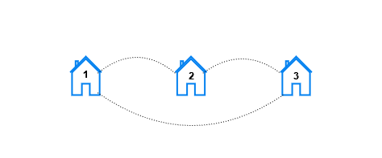

3017. Count the Number of Houses at a Certain Distance II

You are given three **positive** integers `n`, `x`, and `y`.

In a city, there exist houses numbered `1` to `n` connected by `n` streets. There is a street connecting the house numbered `i` with the house numbered `i + 1` for all `1 <= i <= n - 1` . An additional street connects the house numbered `x` with the house numbered `y`.

For each `k`, such that `1 <= k <= n`, you need to find the number of pairs of houses `(house1, house2)` such that the **minimum** number of streets that need to be traveled to reach `house2` from `house1` is `k`.

Return a **1-indexed** array `result` of length `n` where `result[k]` represents the **total** number of pairs of houses such that the **minimum** streets required to reach one house from the other is `k`.

**Note** that `x` and `y` can be **equal**.

 

**Example 1:**


```
Input: n = 3, x = 1, y = 3
Output: [6,0,0]
Explanation: Let's look at each pair of houses:
- For the pair (1, 2), we can go from house 1 to house 2 directly.
- For the pair (2, 1), we can go from house 2 to house 1 directly.
- For the pair (1, 3), we can go from house 1 to house 3 directly.
- For the pair (3, 1), we can go from house 3 to house 1 directly.
- For the pair (2, 3), we can go from house 2 to house 3 directly.
- For the pair (3, 2), we can go from house 3 to house 2 directly.
```

**Example 2:**


```
Input: n = 5, x = 2, y = 4
Output: [10,8,2,0,0]
Explanation: For each distance k the pairs are:
- For k == 1, the pairs are (1, 2), (2, 1), (2, 3), (3, 2), (2, 4), (4, 2), (3, 4), (4, 3), (4, 5), and (5, 4).
- For k == 2, the pairs are (1, 3), (3, 1), (1, 4), (4, 1), (2, 5), (5, 2), (3, 5), and (5, 3).
- For k == 3, the pairs are (1, 5), and (5, 1).
- For k == 4 and k == 5, there are no pairs.
```

**Example 3:**


```
Input: n = 4, x = 1, y = 1
Output: [6,4,2,0]
Explanation: For each distance k the pairs are:
- For k == 1, the pairs are (1, 2), (2, 1), (2, 3), (3, 2), (3, 4), and (4, 3).
- For k == 2, the pairs are (1, 3), (3, 1), (2, 4), and (4, 2).
- For k == 3, the pairs are (1, 4), and (4, 1).
- For k == 4, there are no pairs.
```

**Constraints:**

* `2 <= n <= 10^5`
* `1 <= x, y <= n`

# Submissions
---
**Solution 1: (Burning Points, Counter, Prefix Sum)**

__Intuition__
For each start point i where 1 < i < n,
it will spread in 2 directions.
Then there will be 2 points at the same time, with same distance to i

The idea is to count the spreading points.
You can imagine the graph is a connnected rope,
and we burn at the point of i,
we count how many points are burning.


__Explanation__
A[t] means at time = t,
the diff change of burning point is A[t].

Initially, it starts to burn on the left and on the right:
When it reach 1, deadend then stop.
When it reach n, deadend then stop.
When reach x, it split one more from x to y
When reach y, it split one more from y to x
When go from x to y then go to the middle, it will stop in middle.
When go from y to x then go to the middle, it will stop in middle.

In the end,
we aacumulate the prefix sum,
then we have the result to return.


__Complexity__
* Time O(n)
* Space O(n)


```
Runtime: 77 ms
Memory: 34.94 MB
```
```c++
class Solution {
public:
    vector<long long> countOfPairs(int n, int x, int y) {
        if (x > y) swap(x, y);
        vector<long long> A(n);
        for (int i = 1; i <= n; ++i) {
            A[0] += 2;                               // go left and right
            //  ---------------------  
            //       <-  ^i ->

            A[min(i - 1, abs(i - y) + x)]--;         // reach 1 then stop
            //
            //  |-----------------|
            // ------------------------
            //  1   ^x     ^y     ^i  
            //      --------   

            A[min(n - i, abs(i - x) + 1 + n - y)]--; // reach n then stop
            //
            //            |-----------------|
            // -------------------------------
            //      ^x    ^i      ^y        n
            //      ---------------
  
            A[min(abs(i - x), abs(y - i) + 1)]++;    // reach x then split
            //
            // -------------------------------
            //      ^x   ^i          ^y
            //

            A[min(abs(i - x) + 1, abs(y - i))]++;    // reach y then split
            //
            // -------------------------------
            //      ^x          ^i   ^y
            //

            int r = max(x - i, 0) + max(i - y, 0);
            A[r + (y - x + 0) / 2]--;                // i -> x -> y <- x
            A[r + (y - x + 1) / 2]--;                // i -> y -> x <- y
        }
        for (int i = 1; i < n; ++i)
            A[i] += A[i - 1];
        return A;
    }
};
```
