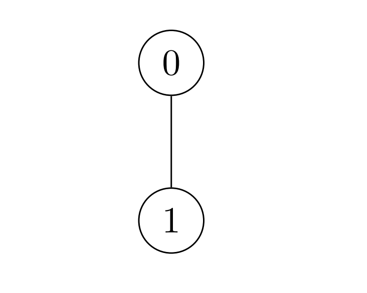
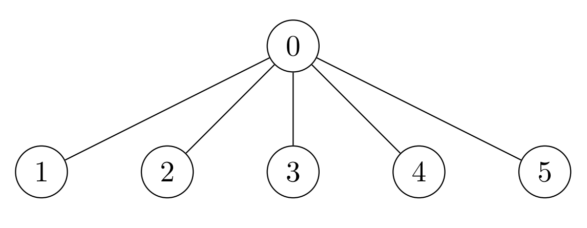

3068. Find the Maximum Sum of Node Values

There exists an **undirected** tree with `n` nodes numbered `0` to `n - 1`. You are given a **0-indexed** 2D integer array `edges` of length `n - 1`, where `edges[i] = [ui, vi]` indicates that there is an edge between nodes `ui` and `vi` in the tree. You are also given a positive integer `k`, and a **0-indexed** array of **non-negative** integers `nums` of length `n`, where `nums[i]` represents the value of the node numbered `i`.

Bogdan wants the sum of values of tree nodes to be **maximum**, for which Bogdan can perform the following operation any number of times (**including zero**) on the tree:

* Choose any edge `[u, v]` connecting the nodes `u` and `v`, and update their values as follows:
    * `nums[u] = nums[u] XOR k`
    * `nums[v] = nums[v] XOR k`

Return the **maximum** possible sum of the values Bogdan can achieve by performing the operation any number of times.

 

**Example 1:**


```
Input: nums = [1,2,1], k = 3, edges = [[0,1],[0,2]]
Output: 6
Explanation: Bogdan can achieve the maximum sum of 6 using a single operation:
- Choose the edge [0,2]. nums[0] and nums[2] become: 1 XOR 3 = 2, and the array nums becomes: [1,2,1] -> [2,2,2].
The total sum of values is 2 + 2 + 2 = 6.
It can be shown that 6 is the maximum achievable sum of values.
```

**Example 2:**


```
Input: nums = [2,3], k = 7, edges = [[0,1]]
Output: 9
Explanation: Bogdan can achieve the maximum sum of 9 using a single operation:
- Choose the edge [0,1]. nums[0] becomes: 2 XOR 7 = 5 and nums[1] become: 3 XOR 7 = 4, and the array nums becomes: [2,3] -> [5,4].
The total sum of values is 5 + 4 = 9.
It can be shown that 9 is the maximum achievable sum of values.
```

**Example 3:**


```
Input: nums = [7,7,7,7,7,7], k = 3, edges = [[0,1],[0,2],[0,3],[0,4],[0,5]]
Output: 42
Explanation: The maximum achievable sum is 42 which can be achieved by Bogdan performing no operations.
```

**Constraints:**

* `2 <= n == nums.length <= 2 * 10^4`
* `1 <= k <= 10^9`
* `0 <= nums[i] <= 10^9`
* `edges.length == n - 1`
* `edges[i].length == 2`
* `0 <= edges[i][0], edges[i][1] <= n - 1`
* The input is generated such that `edges` represent a valid tree.

# Submissions
---
**Solution 1: (Greedy)**

In a tree, we can freely change any even number of nodes.

> I got this intuitioin by drawing a few trees and trying to change some nodes without changing the others.

So, we count nodes that we want to change (where n ^ k > n).

If the count is even, we just return the best sum.

If the count is odd, we need to sacrifice one node:

Do not change a node we want to change, or
Change a node that we do not want to change.
We track the smallest sacrifice min(abs(n - (n ^ k)), and subtract it from the best sum.

```
Runtime: 179 ms
Memory: 125.72 MB
```
```c++
class Solution {
public:
    long long maximumValueSum(vector<int>& nums, int k, vector<vector<int>>& edges) {
        long long sum = 0, cnt = 0, sacrifice = INT_MAX;
        for (long long n : nums) {
            sum += max(n ^ k, n);
            cnt += (n ^ k) > n;
            sacrifice = min(sacrifice, abs(n - (n ^ k)));
        }
        return sum - (cnt % 2 ? sacrifice : 0);
    }
};
```
