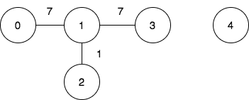
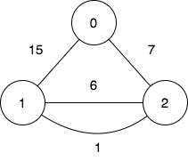

3108. Minimum Cost Walk in Weighted Graph

There is an undirected weighted graph with `n` vertices labeled from `0` to `n - 1`.

You are given the integer `n` and an array `edges`, where `edges[i] = [ui, vi, wi]` indicates that there is an edge between vertices `ui` and `vi` with a weight of `wi`.

A walk on a graph is a sequence of vertices and edges. The walk starts and ends with a vertex, and each edge connects the vertex that comes before it and the vertex that comes after it. It's important to note that a walk may visit the same edge or vertex more than once.

The cost of a walk starting at node `u` and ending at node `v` is defined as the bitwise `AND` of the weights of the edges traversed during the walk. In other words, if the sequence of edge weights encountered during the walk is `w0, w1, w2, ..., wk`, then the cost is calculated as `w0 & w1 & w2 & ... & wk`, where `&` denotes the bitwise `AND` operator.

You are also given a 2D array `query`, where `query[i] = [si, ti]`. For each query, you need to find the minimum cost of the walk starting at vertex `si` and ending at vertex `ti`. If there exists no such walk, the answer is `-1`.

Return the array `answer`, where `answer[i]` denotes the **minimum** cost of a walk for query `i`.

 

**Example 1:**
```
Input: n = 5, edges = [[0,1,7],[1,3,7],[1,2,1]], query = [[0,3],[3,4]]

Output: [1,-1]
```

**Explanation:**


```
To achieve the cost of 1 in the first query, we need to move on the following edges: 0->1 (weight 7), 1->2 (weight 1), 2->1 (weight 1), 1->3 (weight 7).

In the second query, there is no walk between nodes 3 and 4, so the answer is -1.
```

**Example 2:**
```
Input: n = 3, edges = [[0,2,7],[0,1,15],[1,2,6],[1,2,1]], query = [[1,2]]

Output: [0]
```

**Explanation:**


```
To achieve the cost of 0 in the first query, we need to move on the following edges: 1->2 (weight 1), 2->1 (weight 6), 1->2 (weight 1).
```
 

**Constraints:**

* `1 <= n <= 10^5`
* `0 <= edges.length <= 10^5`
* `edges[i].length == 3`
* `0 <= ui, vi <= n - 1`
* `ui != vi`
* `0 <= wi <= 10^5`
* `1 <= query.length <= 10^5`
* `query[i].length == 2`
* `0 <= si, ti <= n - 1`

# Submissions
---
**Solution 1: (Union Find)**
```
Runtime: 326 ms
Memory: 158.34 MB
```
```c++
class Solution {
    vector<int> ds, cost;
    int find(int i) {
        return ds[i] < 0 ? i : ds[i] = find(ds[i]);
    }
public:
    vector<int> minimumCost(int n, vector<vector<int>>& edges, vector<vector<int>>& query) {
        ds = cost = vector<int>(n, -1);
        for (auto &e : edges) {
            int p1 = find(e[0]), p2 = find(e[1]);
            if (p1 != p2) {
                cost[p1] &= cost[p2];
                ds[p2] = p1;
            }
            cost[p1] &= e[2];
        }
        vector<int> res;
        for (auto q : query) {
            if (q[0] == q[1])
                res.push_back(0);
            else if (int p1 = find(q[0]), p2 = find(q[1]); p1 != p2)
                res.push_back(-1);
            else
                res.push_back(cost[p1]);
        }
        return res;
    }
};
```
