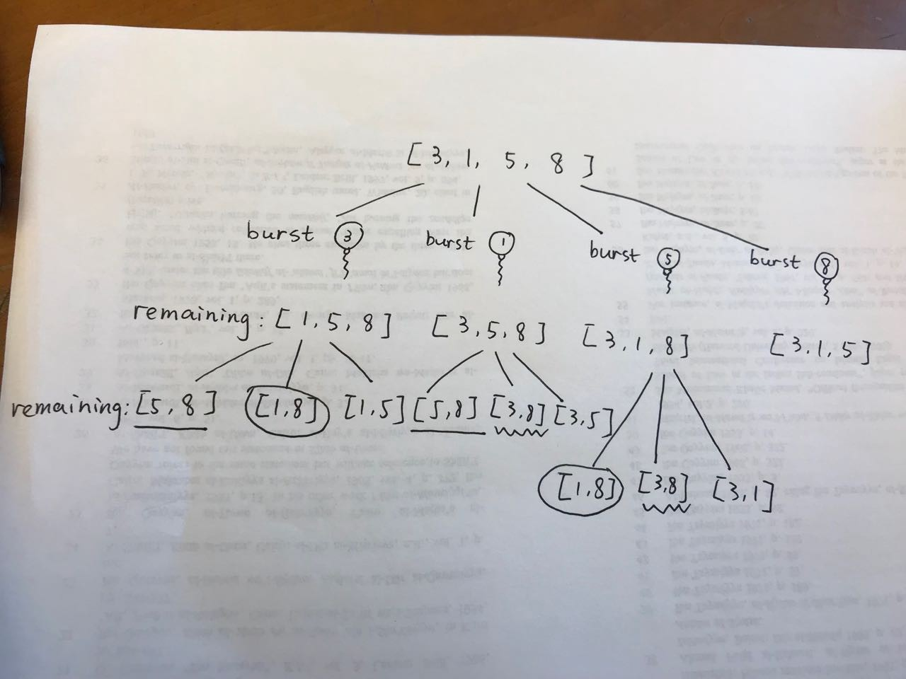
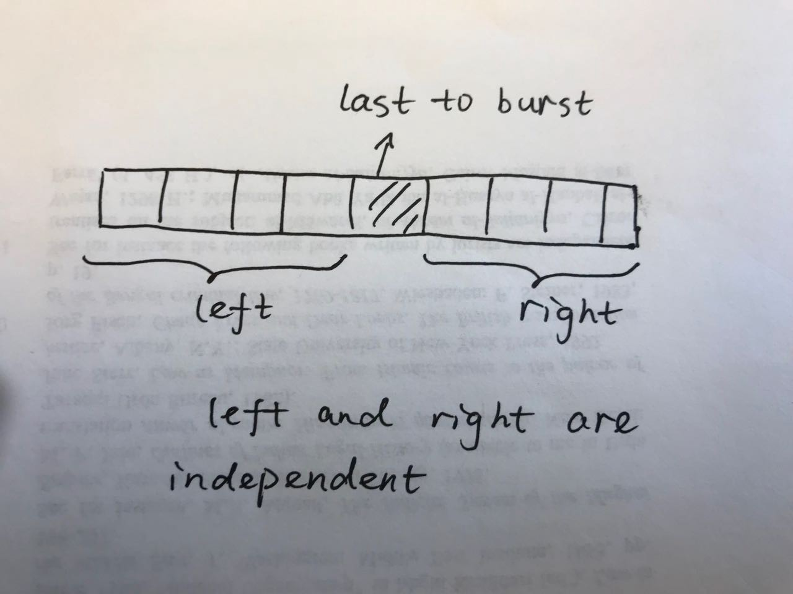
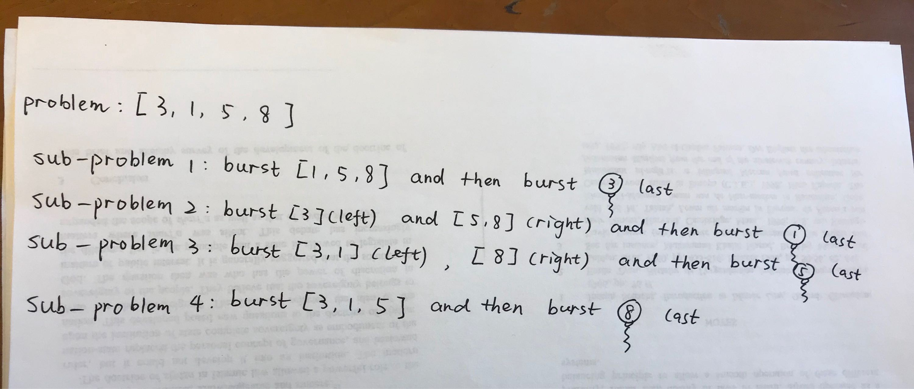
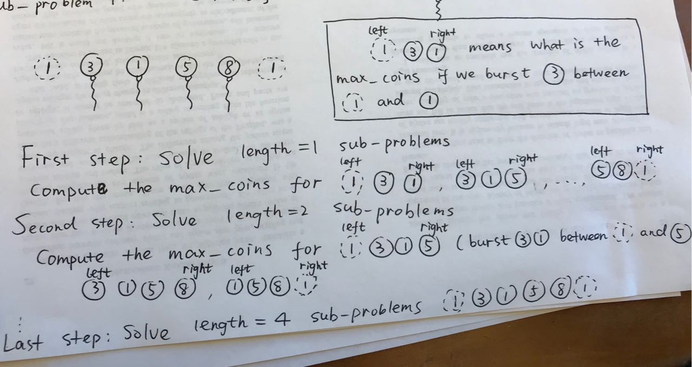

312. Burst Balloons

Given `n` balloons, indexed from `0` to `n-1`. Each balloon is painted with a number on it represented by array `nums`. You are asked to burst all the balloons. If the you burst balloon `i` you will get `nums[left] * nums[i] * nums[right]` coins. Here `left` and `right` are adjacent indices of `i`. After the burst, the `left` and `right` then becomes adjacent.

Find the maximum coins you can collect by bursting the balloons wisely.

**Note:**

* You may imagine `nums[-1] = nums[n] = 1`. They are not real therefore you can not burst them.
* `0 ≤ n ≤ 500, 0 ≤ nums[i] ≤ 100`

**Example:**
```
Input: [3,1,5,8]
Output: 167 
Explanation: nums = [3,1,5,8] --> [3,5,8] -->   [3,8]   -->  [8]  --> []
             coins =  3*1*5      +  3*5*8    +  1*3*8      + 1*8*1   = 167
```

# Submissions
---

[How to Solve the Burst Balloons Problem like a Piece of Cake](https://medium.com/@resiloc/how-to-solve-the-burst-balloons-problem-like-a-piece-of-cake-6121f365b1f)

**Solution 1: (DFS) TLE Error**
```
34 / 70 test cases passed.
```
```python
import functools
class Solution:
    def maxCoins(self, nums: List[int]) -> int:
        def index(nums, i):
            n = len(nums)
            if i >=0 and i < n:
                return nums[i]
            return 1
        
        @functools.lru_cache(None)
        def dfs(seq):
            n = len(seq)
            if n == 0:
                return 0
            if n == 1:
                return seq[0]
            if n == 2:
                max_coins = seq[0]*seq[1] + max(seq[0], seq[1])
                return max_coins
            max_coins = max([index(seq, i-1)*index(seq, i)*index(seq, i+1) + dfs(seq[:i]+seq[i+1:]) for i in range(n)])
            return max_coins
        
        return dfs(tuple(nums))
```

**Solution 2: (Divide and Conquer)**




```
Runtime: 980 ms
Memory Usage: 15.3 MB
```
```python
import functools
class Solution:
    def maxCoins(self, nums: List[int]) -> int:
        
        @functools.lru_cache(None)
        def dfs(seq, lower, upper):
            max_coins = 0
            for i in range(lower, upper+1):
                coins = seq[lower-1] * seq[i] * seq[upper+1]
                coins += dfs(seq, lower, i-1)
                coins += dfs(seq, i+1, upper)
                if coins > max_coins:
                    max_coins = coins
            return max_coins
        
        nums_ext = [1] + [num for num in nums if num != 0] + [1]
        N = len(nums_ext) - 2
        return dfs(tuple(nums_ext), 1, N)
```

**Solution 3: (DP, Bottom-up)**




```
Runtime: 440 ms
Memory Usage: 13.1 MB
```
```python
class Solution:
    def maxCoins(self, nums: List[int]) -> int:
        nums = [1] + [num for num in nums if num > 0] + [1]
        n = len(nums)
        dp = [[0]*n for _ in range(n)]
        
        for length in range(1, n-1):
            for left in range(0, n-1-length):
                right = left + length + 1
                for i in range(left+1, right):
                    dp[left][right] = max(dp[left][right], 
                                          nums[left]*nums[i]*nums[right] +
                                          dp[left][i] + dp[i][right])
        
        return dp[0][n-1]
```