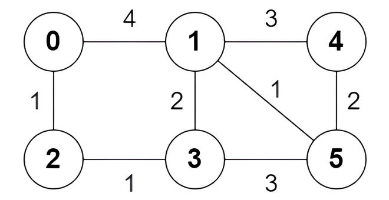

3123. Find Edges in Shortest Paths

You are given an undirected weighted graph of `n` nodes numbered from `0` to `n - 1`. The graph consists of `m` edges represented by a 2D array `edges`, where `edges[i] = [ai, bi, wi]` indicates that there is an edge between nodes `ai` and `bi` with weight `wi`.

Consider all the shortest paths from node `0` to node `n - 1` in the graph. You need to find a **boolean** array `answer` where `answer[i]` is `true `if the edge `edges[i]` is part of **at least** one shortest path. Otherwise, `answer[i]` is `false`.

Return the array `answer`.

Note that the graph may not be connected.

 

**Example 1:**


```
Input: n = 6, edges = [[0,1,4],[0,2,1],[1,3,2],[1,4,3],[1,5,1],[2,3,1],[3,5,3],[4,5,2]]

Output: [true,true,true,false,true,true,true,false]

Explanation:

The following are all the shortest paths between nodes 0 and 5:

The path 0 -> 1 -> 5: The sum of weights is 4 + 1 = 5.
The path 0 -> 2 -> 3 -> 5: The sum of weights is 1 + 1 + 3 = 5.
The path 0 -> 2 -> 3 -> 1 -> 5: The sum of weights is 1 + 1 + 2 + 1 = 5.
```

**Example 2:**


```
Input: n = 4, edges = [[2,0,1],[0,1,1],[0,3,4],[3,2,2]]

Output: [true,false,false,true]

Explanation:

There is one shortest path between nodes 0 and 3, which is the path 0 -> 2 -> 3 with the sum of weights 1 + 2 = 3.
```
 

**Constraints:**

* `2 <= n <= 5 * 10^4`
* `m == edges.length`
* `1 <= m <= min(5 * 10^4, n * (n - 1) / 2)`
* `0 <= ai, bi < n`
* `ai != bi`
* `1 <= wi <= 10^5
* There are no repeated edges.

# Submissions
---
**Solution 1: (Dijkstra, backtracking)**
```
Runtime: 375 ms
Memory: 160.48 MB
```
```c++
class Solution {
public:
    vector<bool> findAnswer(int n, vector<vector<int>>& edges) {
        vector<bool> res(edges.size());
        vector<vector<array<int, 2>>> al(n);
        for (int i = 0; i < edges.size(); ++i) {
            const auto &e = edges[i];
            al[e[0]].push_back({e[1], i});
            al[e[1]].push_back({e[0], i});
        }
        priority_queue<pair<int, int>, vector<pair<int, int>>, greater<>> pq;
        vector<int> path(n, INT_MAX);    
        pq.push({0, 0});
        path[0] = 0;
        while(!pq.empty()) {
            auto [len, i] = pq.top(); pq.pop();
            if (len == path[i])
                for (auto [j, e] : al[i])
                    if (len + edges[e][2] < path[j]) {
                        path[j] = len + edges[e][2];
                        pq.push({path[j], j});
                    }
        }
        pq.push({path[n - 1], n - 1}); // backtrack
        while (!pq.empty()) {
            auto [len, i] = pq.top(); pq.pop();
            for (auto [j, e] : al[i]) {
                if (len - edges[e][2] == path[j]) {
                    res[e] = true;
                    pq.push({path[j], j});
                }
            }
        }
        return res;
    }
};
```

**Solution 2: (Dijkstra, backtracking)**
```
Runtime: 132 ms, Beats 92.50%
Memory: 202.30 MB, Beats 53.11%
```
```c++
class Solution {
public:
    vector<bool> findAnswer(int n, vector<vector<int>>& edges) {
        int m = edges.size(), i, a, b, _w, nw;
        vector<vector<array<int, 3>>> g(n);
        priority_queue<array<int, 2>, vector<array<int, 2>>, greater<>> pq;
        vector<pair<int, vector<array<int, 2>>>> dist(n, {INT_MAX, {}});
        queue<int> q;
        vector<bool> visited(n);
        vector<bool> ans(m);
        for (i = 0; i < m; i ++) {
            a = edges[i][0];
            b = edges[i][1];
            _w = edges[i][2];
            g[a].push_back({b, _w, i});
            g[b].push_back({a, _w, i});
        }
        pq.push({0, 0});
        dist[0].first = 0;
        while (pq.size()) {
            auto [w, u] = pq.top();
            pq.pop();
            if (w > dist[n - 1].first) {
                break;
            }
            for (auto &[v, dw, j]: g[u]) {
                nw = w + dw;
                if (nw < dist[v].first) {
                    dist[v].first = nw;
                    dist[v].second = {{u, j}};
                    pq.push({nw, v});
                } else if (nw == dist[v].first) {
                    dist[v].second.push_back({u, j});
                }
            }
        }
        q.push(n - 1);
        visited[n - 1] = true;
        while (q.size()) {
            auto u = q.front();
            q.pop();
            for (auto &[v, j]: dist[u].second) {
                ans[j] = true;
                if (!visited[v]) {
                    visited[v] = true;
                    q.push(v);
                }
            }
        }
        return ans;
    }
};
```
