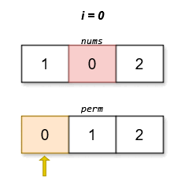
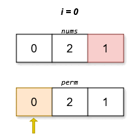

3149. Find the Minimum Cost Array Permutation

You are given an array `nums` which is a **permutation**  of `[0, 1, 2, ..., n - 1]`. The score of any permutation of `[0, 1, 2, ..., n - 1]` named `perm` is defined as:

`score(perm) = |perm[0] - nums[perm[1]]| + |perm[1] - nums[perm[2]]| + ... + |perm[n - 1] - nums[perm[0]]|`

Return the permutation `perm` which has the **minimum** possible score. If multiple permutations exist with this score, return the one that is 
**lexicographically smallest** among them.

 

**Example 1:**


```
Input: nums = [1,0,2]

Output: [0,1,2]

Explanation:


The lexicographically smallest permutation with minimum cost is [0,1,2]. The cost of this permutation is |0 - 0| + |1 - 2| + |2 - 1| = 2.
```

**Example 2:**


```
Input: nums = [0,2,1]

Output: [0,2,1]

Explanation:


The lexicographically smallest permutation with minimum cost is [0,2,1]. The cost of this permutation is |0 - 1| + |2 - 2| + |1 - 0| = 2.
```
 

**Constraints:**

* `2 <= n == nums.length <= 14`
* `nums` is a permutation of `[0, 1, 2, ..., n - 1]`.

# Submissions
---
**Solution 1: (DP with Tracking)**

We can start with any number. The cost does not change if we rotate the result array; only the order matter, not the position.

We start from zero, and run DFS. We memoize the best result in the dp array for:

* the previous number (p)
* used numbers (mask).

In addition to the minimum cost, we also need to track the value that produced the best result in val[p][mask].

Finally, we reconstruct the array one-by-one, starting with val[0][1], and updating the previous value and mask as we go.

```
Runtime: 113 ms
Memory: 30.89 MB
```
```c++
int val[14][16384], dp[14][16384];
class Solution {
    int dfs(unsigned int mask, int p, vector<int>& nums) {
        if (popcount(mask) == nums.size())
            return abs(p - nums[0]);
        if (dp[p][mask] == 0) {
            dp[p][mask] = INT_MAX;
            for (int n = 1; n < nums.size(); ++n)
                if (((1 << n) & mask) == 0) {
                    int res_n = abs(p - nums[n]) + dfs(mask + (1 << n), n, nums);
                    if (res_n < dp[p][mask]) {
                        dp[p][mask] = res_n;
                        val[p][mask] = n;    
                    }
                }
        }
        return dp[p][mask];
    }
public:
    vector<int> findPermutation(vector<int>& nums) {
        memset(dp, 0, sizeof(dp));
        dfs(1, 0, nums);
        vector<int> res{0};
        for (uint mask = 1; popcount(mask) < nums.size(); mask += (1 << res.back()))
            res.push_back(val[res.back()][mask]);
        return res;
    }
};
```
