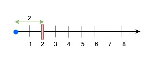
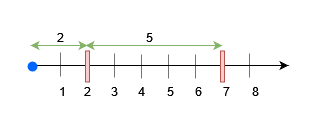

3161. Block Placement Queries

There exists an infinite number line, with its origin at `0` and extending towards the positive x-axis.

You are given a 2D array `queries`, which contains two types of queries:

* For a query of type 1, `queries[i] = [1, x]`. Build an obstacle at distance x from the origin. It is guaranteed that there is no obstacle at distance x when the query is asked.
* For a query of type 2, `queries[i] = [2, x, sz]`. Check if it is possible to place a block of size `sz` anywhere in the range `[0, x]` on the line, such that the block entirely lies in the range `[0, x]`. A block cannot be placed if it intersects with any obstacle, but it may touch it. Note that you do not actually place the block. Queries are separate.

Return a boolean array `results`, where `results[i]` is `true` if you can place the block specified in the `i`th query of type 2, and `false` otherwise.

 

**Example 1:**


```
Input: queries = [[1,2],[2,3,3],[2,3,1],[2,2,2]]

Output: [false,true,true]

Explanation:


For query 0, place an obstacle at x = 2. A block of size at most 2 can be placed before x = 3.
```

**Example 2:**


```
Input: queries = [[1,7],[2,7,6],[1,2],[2,7,5],[2,7,6]]

Output: [true,true,false]

Explanation:


Place an obstacle at x = 7 for query 0. A block of size at most 7 can be placed before x = 7.
Place an obstacle at x = 2 for query 2. Now, a block of size at most 5 can be placed before x = 7, and a block of size at most 2 before x = 2.
```

**Constraints:**

* `1 <= queries.length <= 15 * 104`
* `2 <= queries[i].length <= 3`
* `1 <= queries[i][0] <= 2`
* `1 <= x, sz <= min(5 * 104, 3 * queries.length)`
* The input is generated such that for queries of type 1, no obstacle exists at distance x when the query is asked.
* The input is generated such that there is at least one query of type 2.

# Submissions
---
**Solution 1: (Segment Tree)**
```
Runtime: 1042 ms
Memory: 363.60 MB
```
```c++
constexpr int MaxX = 50001;

class SegTree
{
public:
	SegTree(int _n)
	{
		n = _n;
		tree.resize(n * 4, 0);
	}

	int GetMax(int x) const
	{
		return GetRangeValueInternal(0, x, 1, 0, n - 1);
	}

	void UpdateValue(int index, int newValue)
	{
		UpdateValueInternal(index, newValue, 1, 0, n - 1);
	}

private:
	int GetRangeValueInternal(int left, int right, int nodeIndex, int nodeRangeLeftIndex, int nodeRangeRightIndex) const
	{
		if (left > right)
			return 0;

		if (left == nodeRangeLeftIndex && right == nodeRangeRightIndex)
			return tree[nodeIndex];

		int rangeMid = (nodeRangeLeftIndex + nodeRangeRightIndex) / 2;
		int leftV = GetRangeValueInternal(left, min(right, rangeMid), nodeIndex * 2, nodeRangeLeftIndex, rangeMid);
		int rightV = GetRangeValueInternal(max(left, rangeMid + 1), right, nodeIndex * 2 + 1, rangeMid + 1, nodeRangeRightIndex);
		return max(leftV, rightV);
	}

	void UpdateValueInternal(int index, int newValue, int nodeIndex, int nodeRangeLeftIndex, int nodeRangeRightIndex)
	{
		if (nodeRangeLeftIndex == nodeRangeRightIndex)
		{
			tree[nodeIndex] = newValue;
			return;
		}

		int mid = (nodeRangeLeftIndex + nodeRangeRightIndex) / 2;
		int leftChild = nodeIndex * 2;
		int rightChild = leftChild + 1;
		if (index <= mid)
		{
			UpdateValueInternal(index, newValue, leftChild, nodeRangeLeftIndex, mid);
		}
		else
		{
			UpdateValueInternal(index, newValue, rightChild, mid + 1, nodeRangeRightIndex);
		}
		tree[nodeIndex] = max(tree[leftChild], tree[rightChild]);
	}

	int n;
	vector<int> tree;
};

class Solution {
public:
    vector<bool> getResults(vector<vector<int>>& queries) {
        SegTree seg(MaxX);
		set<int> obs;
        // Consider the max x and 0 as existing obstacles
		obs.insert(0);
		obs.insert(MaxX);

		vector<bool> ans;
		for (auto& q : queries)
		{
			int x = q[1];
			if (q[0] == 1)
			{
                // x will never already exist in obs, so the returned itr will
                // always be r of the existing gap and l will be the prevous one
				auto itr = obs.upper_bound(x);
				int r = *itr;
				int l = *(--itr);
				obs.insert(x);
				seg.UpdateValue(x, x - l);
				seg.UpdateValue(r, r - x);
			}
			else
			{
				int sz = q[2];
                // First check the segment tree for the max gap before x
				bool isValid = seg.GetMax(x) >= sz;
                // But if we don't find one,
                // then we should also check the gap which x falls into
                // as there is the space from [l,x] which is not accounted for
                // in the segment tree if no obstable exists at x
				if (!isValid)
				{
					auto itr = obs.lower_bound(x);
					if (*itr != x)
					{
                        int l = *(--itr);
						isValid = (x - l) >= sz;
					}
				}
				ans.push_back(isValid);
			}
		}

		return ans;
    }
};
```
