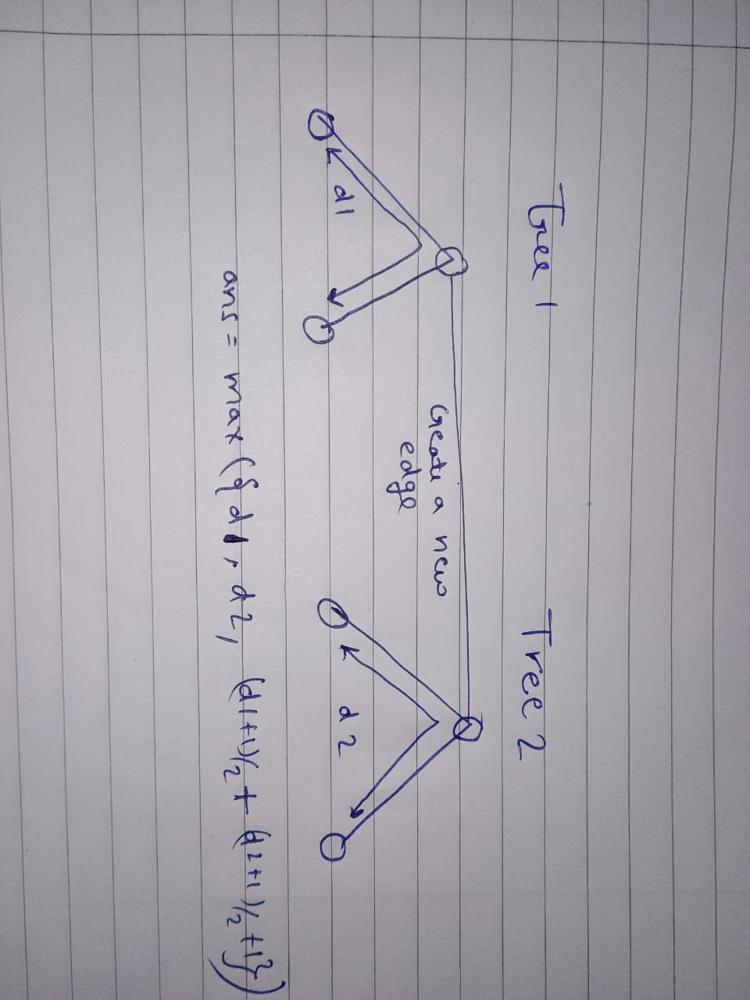

3203. Find Minimum Diameter After Merging Two Trees


There exist two **undirected** trees with `n` and `m` nodes, numbered from `0` to `n - 1` and from `0` to `m - 1`, respectively. You are given two 2D integer arrays `edges1` and `edges2` of lengths `n - 1` and `m - 1`, respectively, where `edges1[i] = [ai, bi]` indicates that there is an edge between nodes `ai` and `bi` in the first tree and `edges2[i] = [ui, vi]` indicates that there is an edge between nodes `ui` and `vi` in the second tree.

You must connect one node from the first tree with another node from the second tree with an edge.

Return the **minimum** possible **diameter** of the resulting tree.

The **diameter** of a tree is the length of the longest path between any two nodes in the tree.

 

**Example 1:**


```
Input: edges1 = [[0,1],[0,2],[0,3]], edges2 = [[0,1]]

Output: 3

Explanation:

We can obtain a tree of diameter 3 by connecting node 0 from the first tree with any node from the second tree.
```

**Example 2:**


```
Input: edges1 = [[0,1],[0,2],[0,3],[2,4],[2,5],[3,6],[2,7]], edges2 = [[0,1],[0,2],[0,3],[2,4],[2,5],[3,6],[2,7]]

Output: 5

Explanation:

We can obtain a tree of diameter 5 by connecting node 0 from the first tree with node 0 from the second tree.
```
 

**Constraints:**

* `1 <= n, m <= 105`
* `edges1.length == n - 1`
* `edges2.length == m - 1`
* `edges1[i].length == edges2[i].length == 2`
* `edges1[i] = [ai, bi]`
* `0 <= ai, bi < n`
* `edges2[i] = [ui, vi]`
* `0 <= ui, vi < m`
* The input is generated such that `edges1` and `edges2` represent valid trees.

# Submissions
---
**Solution 1: ()**

__Intuition__
First Find diameter of both trees and connect an edge between the mid points of two diameter. The merged tree will be the minimum diameter possible after merging two trees.
See the picture for better understanding.



__Complexity__
Time complexity: O(n+m)
Space complexity: O(n+m)

```
Runtime: 658 ms
Memory: 303.85 MB
```
```c++
class Solution {
    int solve(vector<vector<int>> &adj, int st, int &farn)
    {
        int n = adj.size();
        farn = st;
        vector<int> dis(n, -1);
        helper(adj, st, 0, farn,dis);
        return dis[farn];
    }

    void helper(vector<vector<int>> &dp, int node, int distance, int &farn,vector<int> &dis)
    {
        dis[node] = distance;
        if (distance > dis[farn])
            farn = node;
        for (auto it : dp[node])
            if (dis[it] == -1)
                helper(dp, it, distance + 1, farn,dis);
    }
public:
    int minimumDiameterAfterMerge(vector<vector<int>>& edges1, vector<vector<int>>& edges2) {
        int n = edges1.size();
        int m = edges2.size();
        vector<vector<int>> adj1(n + 1);
        vector<vector<int>> adj2(m + 1);
        for (auto &it : edges1)
        {
            adj1[it[1]].push_back(it[0]);
            adj1[it[0]].push_back(it[1]);
        }
        for (auto &it : edges2)
        {

            adj2[it[1]].push_back(it[0]);
            adj2[it[0]].push_back(it[1]);
        }

        int far1 = 0;
        solve(adj1, 0, far1);
        int diameter1 = solve(adj1, far1, far1);

        int far2 = 0;
        solve(adj2, 0, far2);
        int diameter2 = solve(adj2, far2, far2);

        // cout<<diameter1<<" "<<diameter2<<" ";
        return max({(diameter1 + 1) / 2 + (diameter2 + 1) / 2 + 1, diameter1, diameter2});
    }
};
```
