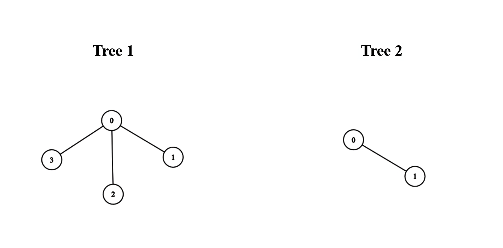

3203. Find Minimum Diameter After Merging Two Trees


There exist two **undirected** trees with `n` and `m` nodes, numbered from `0` to `n - 1` and from `0` to `m - 1`, respectively. You are given two 2D integer arrays `edges1` and `edges2` of lengths `n - 1` and `m - 1`, respectively, where `edges1[i] = [ai, bi]` indicates that there is an edge between nodes `ai` and `bi` in the first tree and `edges2[i] = [ui, vi]` indicates that there is an edge between nodes `ui` and `vi` in the second tree.

You must connect one node from the first tree with another node from the second tree with an edge.

Return the **minimum** possible **diameter** of the resulting tree.

The **diameter** of a tree is the length of the longest path between any two nodes in the tree.

 

**Example 1:**


```
Input: edges1 = [[0,1],[0,2],[0,3]], edges2 = [[0,1]]

Output: 3

Explanation:

We can obtain a tree of diameter 3 by connecting node 0 from the first tree with any node from the second tree.
```

**Example 2:**


```
Input: edges1 = [[0,1],[0,2],[0,3],[2,4],[2,5],[3,6],[2,7]], edges2 = [[0,1],[0,2],[0,3],[2,4],[2,5],[3,6],[2,7]]

Output: 5

Explanation:

We can obtain a tree of diameter 5 by connecting node 0 from the first tree with node 0 from the second tree.
```
 

**Constraints:**

* `1 <= n, m <= 105`
* `edges1.length == n - 1`
* `edges2.length == m - 1`
* `edges1[i].length == edges2[i].length == 2`
* `edges1[i] = [ai, bi]`
* `0 <= ai, bi < n`
* `edges2[i] = [ui, vi]`
* `0 <= ui, vi < m`
* The input is generated such that `edges1` and `edges2` represent valid trees.

# Submissions
---
**Solution 1: (BFS)**
```
Runtime: 439 ms
Memory: 325.48 MB
```
```c++
class Solution {
    vector<vector<int>> buildAdjList(int size, vector<vector<int>>& edges) {
        vector<vector<int>> adjList(size);
        for (auto edge : edges) {
            adjList[edge[0]].push_back(edge[1]);
            adjList[edge[1]].push_back(edge[0]);
        }
        return adjList;
    }

    // Function to find the diameter of a tree using two BFS calls
    int findDiameter(int n, vector<vector<int>>& adjList) {
        // First BFS to find the farthest node from any arbitrary node (e.g., 0)
        auto [farthestNode, _] = findFarthestNode(n, adjList, 0);

        // Second BFS from the farthest node to determine the diameter
        auto [_, diameter] = findFarthestNode(n, adjList, farthestNode);
        return diameter;
    }

    // BFS helper function to find the farthest node and its distance from the
    // source
    pair<int, int> findFarthestNode(int n, vector<vector<int>>& adjList,
                                    int sourceNode) {
        queue<int> nodesQueue;
        vector<bool> visited(n, false);
        // Push source node into the queue
        nodesQueue.push(sourceNode);
        visited[sourceNode] = true;

        int maximumDistance = 0, farthestNode = sourceNode;

        // Explore neighbors
        while (!nodesQueue.empty()) {
            int size = nodesQueue.size();
            for (int i = 0; i < size; ++i) {
                int currentNode = nodesQueue.front();
                nodesQueue.pop();
                // Update farthest node
                // The farthest node is the last one that was popped out of the
                // queue.
                farthestNode = currentNode;

                for (int neighbor : adjList[currentNode]) {
                    // Explore neighbors
                    if (!visited[neighbor]) {
                        visited[neighbor] = true;
                        nodesQueue.push(neighbor);
                    }
                }
            }
            if (!nodesQueue.empty()) maximumDistance++;
        }
        return {farthestNode, maximumDistance};
    }
public:
    int minimumDiameterAfterMerge(vector<vector<int>>& edges1, vector<vector<int>>& edges2) {
        // Calculate the number of nodes for each tree
        int n = edges1.size() + 1;
        int m = edges2.size() + 1;

        // Build adjacency lists for both trees
        vector<vector<int>> adjList1 = buildAdjList(n, edges1);
        vector<vector<int>> adjList2 = buildAdjList(m, edges2);

        // Calculate the diameters of both trees
        int diameter1 = findDiameter(n, adjList1);
        int diameter2 = findDiameter(m, adjList2);

        // Calculate the longest path that spans across both trees
        int combinedDiameter =
            ceil(diameter1 / 2.0) + ceil(diameter2 / 2.0) + 1;

        // Return the maximum of the three possibilities
        return max({diameter1, diameter2, combinedDiameter});
    }
};
```

**Solution 2: (Depth First Search)**
```
Runtime: 260 ms
Memory: 299.22 MB
```
```c++
class Solution {
    // Helper function to build an adjacency list from an edge list
    vector<vector<int>> buildAdjList(int size, vector<vector<int>>& edges) {
        vector<vector<int>> adjList(size);
        for (auto& edge : edges) {
            adjList[edge[0]].push_back(edge[1]);
            adjList[edge[1]].push_back(edge[0]);
        }
        return adjList;
    };

    // Helper function to find the diameter of a tree
    // Returns the diameter and the depth of the node's subtree
    pair<int, int> findDiameter(vector<vector<int>>& adjList, int node,
                                int parent) {
        int maxDepth1 = 0,
            maxDepth2 =
                0;  // Tracks the two largest depths from the current node
        int diameter = 0;  // Tracks the diameter of the subtree

        for (int neighbor :
             adjList[node]) {  // Iterate through neighbors of the current node
            if (neighbor == parent)
                continue;  // Skip the parent to avoid cycles

            // Recursively calculate the diameter and depth of the neighbor's
            // subtree
            auto [childDiameter, depth] = findDiameter(adjList, neighbor, node);

            // Update the maximum diameter of the subtree
            diameter = max(diameter, childDiameter);

            depth++;  // Increment the depth to include the edge to this
                      // neighbor
            // Update the two largest depths from the current node
            if (depth > maxDepth1) {
                maxDepth2 = maxDepth1;
                maxDepth1 = depth;
            } else if (depth > maxDepth2) {
                maxDepth2 = depth;
            }
        }

        // Update the diameter to include the path through the current node
        diameter = max(diameter, maxDepth1 + maxDepth2);

        return {diameter, maxDepth1};
    }
public:
    int minimumDiameterAfterMerge(vector<vector<int>>& edges1, vector<vector<int>>& edges2) {
        // Calculate the number of nodes for each tree (number of edges + 1)
        int n = edges1.size() + 1;
        int m = edges2.size() + 1;

        // Build adjacency lists for both trees
        vector<vector<int>> adjList1 = buildAdjList(n, edges1);
        vector<vector<int>> adjList2 = buildAdjList(m, edges2);

        int diameter1 =
            findDiameter(adjList1, 0, -1).first;  // Start DFS for Tree 1
        int diameter2 =
            findDiameter(adjList2, 0, -1).first;  // Start DFS for Tree 2

        // Calculate the diameter of the combined tree
        // This accounts for the longest path spanning both trees
        int combinedDiameter =
            ceil(diameter1 / 2.0) + ceil(diameter2 / 2.0) + 1;

        // Return the maximum diameter among the two trees and the combined tree
        return max({diameter1, diameter2, combinedDiameter});
    }
};
```

**Solution 3: (Topological Sorting)**
```
Runtime: 255 ms
Memory: 296.18 MB
```
```c++
class Solution {
    // Helper function to build an adjacency list from an edge list
    vector<vector<int>> buildAdjList(int size, vector<vector<int>>& edges) {
        vector<vector<int>> adjList(size);
        for (auto& edge : edges) {
            adjList[edge[0]].push_back(edge[1]);
            adjList[edge[1]].push_back(edge[0]);
        }
        return adjList;
    };

    // Function to find the diameter of a tree using topological sorting
    int findDiameter(int n, vector<vector<int>>& adjList) {
        queue<int> leavesQueue;
        vector<int> degrees(n);
        // Initialize the degree of each node and add leaves (nodes with degree
        // 1) to the queue
        for (int node = 0; node < n; node++) {
            degrees[node] =
                adjList[node].size();  // Degree is the number of neighbors
            if (degrees[node] == 1) {
                leavesQueue.push(node);
            }
        }

        int remainingNodes = n;
        int leavesLayersRemoved = 0;

        // Process the leaves until there are 2 or fewer nodes remaining
        while (remainingNodes > 2) {
            int size = leavesQueue.size();  // Get the number of leaves to
                                            // remove in this iteration
            remainingNodes -= size;
            leavesLayersRemoved++;

            // Remove the leaves from the queue and update the degrees of their
            // neighbors
            for (int i = 0; i < size; i++) {
                int currentNode = leavesQueue.front();
                leavesQueue.pop();

                // Process the neighbors of the current leaf
                for (int neighbor : adjList[currentNode]) {
                    degrees[neighbor]--;  // Decrease the degree of the neighbor
                    if (degrees[neighbor] == 1) {
                        leavesQueue.push(
                            neighbor);  // If the neighbor becomes a leaf, add
                                        // it to the queue
                    }
                }
            }
        }

        // If exactly two nodes remain, return the diameter as twice the number
        // of layers of leaves removed + 1 (as the diameter will include the
        // final connecting edge)
        if (remainingNodes == 2) return 2 * leavesLayersRemoved + 1;

        return 2 * leavesLayersRemoved;
    }
public:
    int minimumDiameterAfterMerge(vector<vector<int>>& edges1, vector<vector<int>>& edges2) {
        // Calculate the number of nodes for each tree (number of edges + 1)
        int n = edges1.size() + 1;
        int m = edges2.size() + 1;

        // Build adjacency lists for both trees
        vector<vector<int>> adjList1 = buildAdjList(n, edges1);
        vector<vector<int>> adjList2 = buildAdjList(m, edges2);

        // Calculate the diameter of both trees
        int diameter1 = findDiameter(n, adjList1);
        int diameter2 = findDiameter(m, adjList2);

        // Output the diameters for debugging (can be removed in production
        // code)
        cout << diameter1 << " " << diameter2 << "\n";

        // Calculate the longest path that spans across both trees.
        int combinedDiameter =
            ceil(diameter1 / 2.0) + ceil(diameter2 / 2.0) + 1;

        return max({diameter1, diameter2, combinedDiameter});
    }
};
```

**Solution 4: (Topological Sort)**
```
Runtime: 261 ms
Memory: 296.29 MB
```
```c++
class Solution {
    pair<int,int> topological(vector<vector<int>> &g) {
        int n = g.size(), i, k = n, u, sz, level = 0;
        vector<int> indeg(n);
        queue<int> q;
        pair<int,int> rst;
        for (i = 0; i < n; i ++) {
            indeg[i] = g[i].size();
            if (indeg[i] == 1) {
                q.push(i);
            }
        }
        while (k > 2) {
            sz = q.size();
            k -= sz;
            for (i = 0; i < sz; i ++) {
                u = q.front();
                q.pop();
                for (auto v: g[u]) {
                    indeg[v] -= 1;
                    if (indeg[v] == 1) {
                        q.push(v);
                    }
                }
            }
            level += 1;
        }
        if (q.size() == 2) {
            return {level+1, level};
        } else {
            return {level, level};
        }
    }
public:
    int minimumDiameterAfterMerge(vector<vector<int>>& edges1, vector<vector<int>>& edges2) {
        int n = edges1.size(), m = edges2.size(), i, p1, p2;
        vector<vector<int>> g(n+1), g2(m+1);
        for (i = 0; i < n; i ++) {
            g[edges1[i][0]].push_back(edges1[i][1]);
            g[edges1[i][1]].push_back(edges1[i][0]);
        }
        for (i = 0; i < m; i ++) {
            g2[edges2[i][0]].push_back(edges2[i][1]);
            g2[edges2[i][1]].push_back(edges2[i][0]);
        }
        auto [r11, r12] = topological(g);
        auto [r21, r22] = topological(g2);
        return max({r11+r12, r21+r22, r11 + r21 + 1});
    }
};
```

