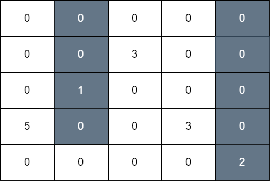
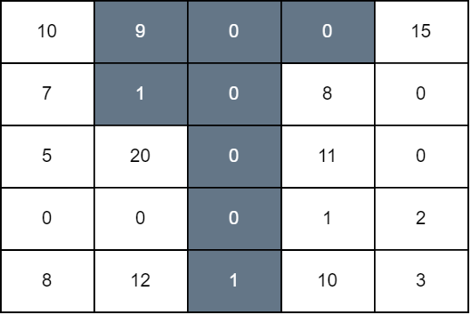

3225. Maximum Score From Grid Operations

You are given a 2D matrix grid of size `n x n`. Initially, all cells of the grid are colored white. In one operation, you can select any cell of indices `(i, j)`, and color black all the cells of the `j`th column starting from the top row down to the `i`th row.

The grid score is the sum of all `grid[i][j]` such that cell `(i, j)` is white and it has a horizontally adjacent black cell.

Return the **maximum** score that can be achieved after some number of operations.

 

**Example 1:**
```
Input: grid = [[0,0,0,0,0],[0,0,3,0,0],[0,1,0,0,0],[5,0,0,3,0],[0,0,0,0,2]]

Output: 11

Explanation:
```

```
In the first operation, we color all cells in column 1 down to row 3, and in the second operation, we color all cells in column 4 down to the last row. The score of the resulting grid is grid[3][0] + grid[1][2] + grid[3][3] which is equal to 11.
```

**Example 2:**
```
Input: grid = [[10,9,0,0,15],[7,1,0,8,0],[5,20,0,11,0],[0,0,0,1,2],[8,12,1,10,3]]

Output: 94

Explanation:
```

```
We perform operations on 1, 2, and 3 down to rows 1, 4, and 0, respectively. The score of the resulting grid is grid[0][0] + grid[1][0] + grid[2][1] + grid[4][1] + grid[1][3] + grid[2][3] + grid[3][3] + grid[4][3] + grid[0][4] which is equal to 94.
```
 

**Constraints:**

* `1 <= n == grid.length <= 100`
* `n == grid[i].length`
* `0 <= grid[i][j] <= 10^9`

# Submissions
---
**Solution 1: (DP, prefix sum)**

__Intuition__
The problem requires us to maximize the score, which depends on the sum of the values of white cells adjacent to black cells. To achieve this, we must strategically choose which columns to color and up to which rows to maximize the sum of white cells adjacent to black cells.

__Approach__
The solution uses dynamic programming (DP) to keep track of the maximum score that can be achieved up to each cell in the grid. The DP table dp stores intermediate results for each cell, and we also use maxPrefix and maxSuffix tables to store the maximum values of prefixes and suffixes to efficiently update the DP table.

DP Table Initialization:

Initialize a DP table dp of size (n+1)×(n+1) with all values set to negative infinity except for the base case dp[i][0] = 0 for all i.
Prefix Sum Calculation:

For each column, calculate the prefix sums to facilitate efficient range sum calculations.
prefixSum[row] contains the sum of all elements in the current column from the top to the row-th row.
Max Prefix and Suffix Initialization:

Initialize maxPrefix and maxSuffix tables to store the maximum values of prefixes and suffixes of the DP table to efficiently calculate the maximum score for each cell.
DP Table Update:

For each cell (row, col), update the DP table using the values from maxPrefix and maxSuffix.
maxPrefix helps in finding the maximum score when coloring up to the current row from the left.
maxSuffix helps in finding the maximum score when coloring down to the current row from the right.
Final Result:

The maximum value in the first row of the DP table gives the maximum score that can be achieved.

__Explanation__
Initialization: The DP table dp is initialized with negative infinity for most cells, except the base case dp[i][0] = 0 for all i, indicating no operations performed initially.
Prefix Sum Calculation: For each column, the prefix sums are calculated to quickly get the sum of values from the top to any row.
Max Prefix and Suffix Initialization: These tables help in quickly finding the maximum score possible for each cell by storing the maximum values of prefixes and suffixes.
DP Table Update: For each cell, update the DP table using the maximum values from maxPrefix and maxSuffix, ensuring that the maximum score is efficiently calculated.
Final Result: The maximum value in the first row of the DP table gives the final result, which is the maximum score achievable.

__Complexity__
Time complexity:
O(N^3)

Space complexity:
O(N^2)

```
Runtime: 322 ms
Memory: 315.41 MB
```
```c++
class Solution {
public:
    long long maximumScore(vector<vector<int>>& grid) {
        const int MAX_SIZE = 109; // Maximum size of the grid plus extra space
        const long long INF = LLONG_MAX; // Represents infinity for comparison

        vector<vector<long long>> dp(MAX_SIZE, vector<long long>(MAX_SIZE, -INF)); // DP table to store intermediate results
        vector<vector<long long>> maxPrefix(MAX_SIZE, vector<long long>(MAX_SIZE, 0)); // Stores max prefix sums
        vector<vector<long long>> maxSuffix(MAX_SIZE, vector<long long>(MAX_SIZE, 0)); // Stores max suffix sums
        vector<long long> prefixSum(MAX_SIZE, 0); // Prefix sums for columns

        int n = grid.size();

        // Initialize DP table
        for (int i = 0; i <= n; ++i) {
            dp[i][0] = 0; // Base case
            for (int j = 1; j <= n; ++j) {
                dp[i][j] = -INF; // Initialize with negative infinity
            }
        }

        // Process each column of the grid
        for (int col = 0; col < n; ++col) {
            // Calculate prefix sums for current column
            prefixSum[0] = 0;
            for (int row = 1; row <= n; ++row) {
                prefixSum[row] = prefixSum[row - 1] + grid[row - 1][col];
            }

            // Initialize maxPrefix and maxSuffix for current column
            for (int row = 0; row <= n; ++row) {
                maxPrefix[row][0] = dp[row][0];
                for (int k = 1; k <= n; ++k) {
                    maxPrefix[row][k] = max(maxPrefix[row][k - 1], dp[row][k]);
                }
                maxSuffix[row][n + 1] = 0;
                for (int k = n; k >= 0; --k) {
                    maxSuffix[row][k] = max(maxSuffix[row][k + 1], dp[row][k] + (row < k ? prefixSum[k] - prefixSum[row] : 0));
                }
            }

            // Update DP table based on current column
            for (int row = 0; row <= n; ++row) {
                for (int k = 0; k <= n; ++k) {
                    dp[row][k] = max(maxPrefix[k][row] + (k < row ? prefixSum[row] - prefixSum[k] : 0), maxSuffix[k][row + 1]);
                }
            }
        }

        // Find the maximum value in the DP table
        long long maxScore = -INF;
        for (int i = 0; i <= n; ++i) {
            maxScore = max(maxScore, dp[0][i]);
        }

        return maxScore;
    }
};
```
